# Alisa's book of LLMs（本地留档）

> **原文**：<https://alisawuffles.notion.site/alisa-s-book-of-llms> —— Notion 公开页面，作者 Alisa Liu
> **抓取时间**：2026-09-24
> **抓取方式**：Notion 公开页 `loadCachedPageChunkV2` 接口 → Markdown（脚本 `fetch_alisa_book.py`）
> **规模**：1180 个 block、151 个独立公式块、12 张图片（已下载到 `images/alisa-book/`）
> **版权**：第三方教材原文，仅作个人学习留档：未翻译、未核验，请勿转载或以任何形式公开分发。

## 待学习 TODO

- [ ] 通读一遍，标出与当前 infra 主线（MoE、并行策略、推理引擎、RLHF）直接相关的章节
- [ ] 精读 Transformer 与并行/分布式两章，把 151 个公式逐个推一遍，对照本仓库已有笔记
- [ ] 核对 12 张图片与正文位置一一对应，公式在本地预览里渲染正常（Hugo 用 MathJax）
- [ ] 把有复用价值的章节重写成自己的中文笔记（保留推导与出处），不做原文搬运
- [ ] 与已有笔记互链：DeepSeek Infra Stack、vLLM 阅读导引、MoE / 算子主题

---

<!-- TOC -->


- [Neural net basics](#neural-net-basics)
  - [Multi-layer perceptrons](#multi-layer-perceptrons)
  - [Activation functions](#activation-functions)
  - [Gradients](#gradients)
  - [Backpropagation](#backpropagation)
  - [Optimizers](#optimizers)
  - [Learning rate](#learning-rate)
- [Mathy things](#mathy-things)
  - [Information theory](#information-theory)
  - [Numerical stability and other tricks](#numerical-stability-and-other-tricks)
  - [Basic statistics](#basic-statistics)
  - [Gradient flow through sampling](#gradient-flow-through-sampling)
  - [Theoretical CS](#theoretical-cs)
- [The modern transformer LM](#the-modern-transformer-lm)
  - [Architecture](#architecture)
  - [Implementation notes](#implementation-notes)
  - [Accounting](#accounting)
    - [Model parameters](#model-parameters)
    - [Model activations](#model-activations)
    - [FLOPs in forward pass](#flops-in-forward-pass)
    - [FLOPs in backward pass](#flops-in-backward-pass)
    - [Inference memory use](#inference-memory-use)
    - [Train memory use](#train-memory-use)
  - [Attention](#attention)
  - [RMSNorm](#rmsnorm)
  - [SwiGLU FFN](#swiglu-ffn)
  - [RoPE](#rope)
- [Inference](#inference)
  - [Batching & packing](#batching-packing)
  - [Speculative decoding](#speculative-decoding)
  - [KV cache](#kv-cache)
    - [Reducing KV cache size](#reducing-kv-cache-size)
  - [Sampling strategies](#sampling-strategies)
  - [Flash Attention](#flash-attention)
- [Scaling laws](#scaling-laws)
- [GPUs](#gpus)
- [Other architectures](#other-architectures)
  - [RNNs](#rnns)
    - [Vanilla RNN](#vanilla-rnn)
    - [LSTM](#lstm)
    - [vs. transformers](#vs-transformers)
  - [State space models](#state-space-models)
- [Post-training](#post-training)
  - [policy gradients](#policy-gradients)
  - [PPO](#ppo)
  - [RLHF](#rlhf)
  - [GRPO](#grpo)
  - [DPO](#dpo)
- [Precision](#precision)
- [Parallelism](#parallelism)
  - [Background: core collective operations](#background-core-collective-operations)
  - [Data parallelism](#data-parallelism)
  - [Pipeline parallelism](#pipeline-parallelism)
  - [Tensor parallelism](#tensor-parallelism)
- [Multimodality](#multimodality)

## Neural net basics
### Multi-layer perceptrons
- **multi-layer perceptron**: fully-connected network with an input layer, at least one hidden layer, and an output layer
  - often used synonymously with “feed-forward network” even though FFN is technically a broader category where information flows in one direction
- a single neuron computes a weighted sum of its inputs, adds a bias, and passes the result through an activation function
  - $\mathbf x\in\mathbb R^n$ is the input vector (activations from the previous layer)
  - $\mathbf w\in\mathbb R^n$ is the weight vector (edge weights leading into the neuron)
  - $b\in\mathbb R$ is the bias
  - $f$ is the activation function

  $$
  y=f\left(\sum_{i=1}^n w_i x_i+b\right)=f(\mathbf w^\top\mathbf x +b)
  $$

- a layer with $n_\text{in}$ inputs and $n_\text{out}$ neurons can be computed through matrix multiplication
  - so $\mathbf x\in\mathbb R^{n_\text{in}}$ (column vector)
  - stack all the weight vectors into a single weight matrix $W\in\mathbb R^{n_\text{out}\times n_\text{in}}$
    - each row is the weights going into a single neuron
  - stack biases into vector $\mathbf b\in\mathbb R^{n_\text{out}}$
  - output hidden state will have shape $\mathbf h\in\mathbb R^{n_\text{out}}$

  $$
  \mathbf h=f(W\mathbf x+\mathbf b)
  $$

- in practice, we process a batch of $m$ inputs at once!
  - in this case, we arrange inputs as rows of a matrix $X \in\mathbb R^{m\times n_\text{in}}$
  - conventionally change $W$ to have shape $\mathbb R^{n_\text{in}\times n_\text{out}}$
    - each column is the weights going into a single neuron
  - the layer then becomes
    $$
    H=f(XW+\mathbf b)
    $$

    - where $\mathbf b$ is broadcast to have shape $m\times n_\text{out}$

>
> in math notation, a linear layer takes $X\in\mathbb R^{m\times n_\text{in}}$ and applies $W\in\mathbb R^{n_\text{in}\times n_\text{out}}$ as $XW+b$.
>
> in PyTorch, the weight matrix `W` is actually stored as $n_\text{out}\times n_\text{in}$. the forward pass transposes `W`, computing `X @ W.T` $(m, n_\text{in})\times (n_\text{in},n_\text{out})$. the transpose is free because it only changes the stride. this is so that the gradients for $W$ naturally comes out as $n_\text{out}\times n_\text{in}$, matching the shape of $W$.
>

- let’s do the backprop for $Z=XW+b$
  $$
  \frac{\partial L}{\partial X}=\frac{\partial L}{\partial Z}W^\top\quad (m,n_\text{out})\times (n_\text{out},n_\text{in})=(m,n_\text{in})\\[1em]
  \frac{\partial L}{\partial W}=X^\top\frac{\partial L}{\partial Z}\quad (n_\text{in}, m)\times (m,n_\text{out})=(n_\text{in},n_\text{out})
  $$

  - the same bias $\mathbf b\in\mathbb R^{n_\text{out}}$ is added to every sample, and each sample produces its own gradient for $\mathbf b$
    - these gradients thus accumulate

    $$
    \frac{\partial L}{\partial b_j}=\sum_{i=1}^m\frac{\partial L}{\partial z_{ij}}\cdot\frac{\partial z_{ij}}{\partial b_j}=\sum_{i=1}^m\frac{\partial L}{\partial z_{ij}}\cdot 1=\sum_{i=1}^m\frac{\partial L}{\partial z_{ij}}
    $$

  - the most intuitive way to see this
    - we know that $\partial L/\partial X$ (if $X$ is a single example) is $\partial L/\partial Z \cdot W^\top (n_\text{in})$
    - when $X$ has a batch dimension, we know we are looking for output with shape $(m,n_\text{in})$
    - each row $i$ of $Z$ depends only on row $i$ of $X$ (the batch examples don’t interact)
    - so we can just stack the gradients for each row
  - in general, derive Jacobian for a single example (which is clean, 2-dimensional)
    - if the tensor is shared across the batch (like $W$), then the batch dimension is summed out → contract (matmul where the batch dim is the inner dimension)
    - if the tensor is not shared (like $X$, activations), the batch dimension is preserved → stack (matmul with batch dim on the inside)
  - note the PyTorch implementation with $Z=XW^\top$ with $W\in\mathbb R^{n_\text{out}\times n_\text{in}}$ looks like this
    $$
    \frac{\partial L}{\partial X}=\frac{\partial L}{\partial Z} W\quad (m,n_\text{out})\times (n_\text{out}, n_\text{in})=(m,n_\text{in})\\[1em]
    \frac{\partial L}{\partial W}=\left(\frac{\partial L}{\partial Z}\right)^\top X\quad (n_\text{out}, m)\times (m,n_\text{in})=(n_\text{out},n_\text{in})
    $$


### Activation functions
- **sigmoid** $\sigma(x)\in(0,1)$
  $$
  \sigma(x)=\frac{1}{1+e^{-x}}
  $$

  - good for interpreting outputs as probabilities
  - not used for hidden layers in neural nets
    - vanishing gradients since the derivative is $\sigma(x)(1-\sigma(x)) \leq 0.25$
    - not zero-centered, so downstream gradients for a single node are either all positive or all negative (depending on the upstream grad)
- **tanh** $\in(-1,1)$
  $$
  \tanh(x)=\frac{e^x-e^{-x}}{e^x+e^{-x}}=2\sigma(2x)-1
  $$

  - derivative peaks at 1.0 (for $x=0$), can still vanish
  - $\tanh^\prime$ factors only ever shrink, since $\tanh^\prime(z)=1-\tanh^2(x)\in(0,1]$
- **softmax** → probability distribution
  $$
  \text{softmax}(\mathbf x)_i=\frac{e^{x_i}}{\sum_j e^{x_j}}
  $$

  - with temperature
    $$
    \text{softmax}(\mathbf x/T)_i=\frac{e^{x_i/T}}{\sum_j e^{x_j/T}}
    $$

- **ReLU** $\in(0, \infty)$
  $$
  \operatorname{ReLU}(x)=\max(x,0)
  $$

  - derivative is 1 for $x>0$, 0 for $x<0$
  - dying ReLUs: if a pre-activation becomes permanently negative (i.e., negative for every input), it receives zero gradient forever
    - a fraction of network can go dead during training
- **Leaky ReLU** $\in(-\infty,\infty)$
  $$
  \text{LeakyReLU}(x)=\begin{cases}x&\text{if }x>0\\\alpha x&\text{if }x\leq0\end{cases}
  $$

  - fixes the dying ReLU problem
- **Swish** (smooth, non-monotonic)
  $$
  \text{Swish}(x)=x\cdot\sigma(x)
  $$

- **GLU** uses one linear projection to produce the “content” [left], and another to produce the gate [right]
  $$
  \text{GLU}(x)=xW_1\odot\sigma(xW_2)
  $$

- **SwiGLU** plugs Swish in as the activation function inside GLU
  $$
  \text{SwiGLU}(x)=(x W_1)\odot \text{Swish}(xW_2)
  $$


- without non-linearities, neural nets can’t do anything more than a linear transform
  - extra layers can be compiled down to a single linear transform $W_1 W_2x=Wx$
  - without non-linearities, adding more layers doesn’t give any more representational power
  - with more layers that include non-linearities, they can approximate any complex function!
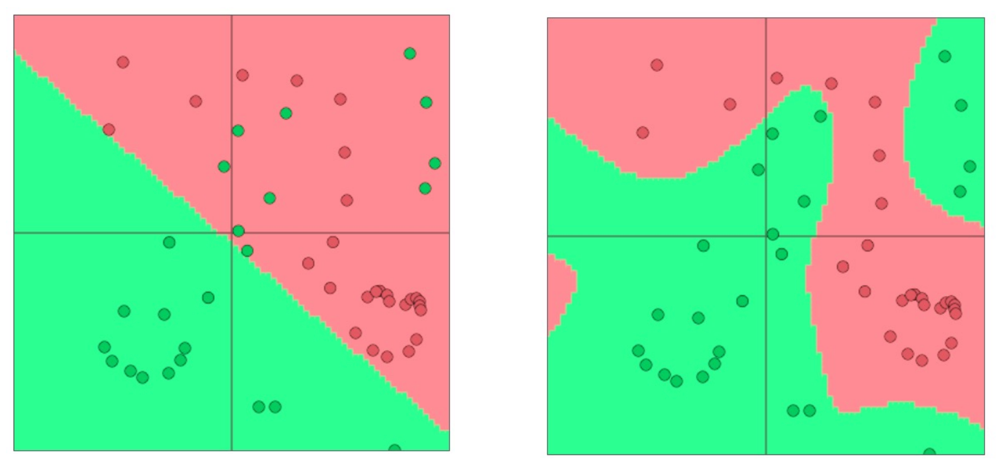


### Gradients
- the derivative on a variable tells you the sensitivity of the whole expression to its value
  - if $\partial f/\partial x=3$, then changing $x$ by a small $h$ would lead to a change of $\sim 3h$ on $f(x)$

  $$
  \frac{df(x)}{dx}=\frac{f(x+h)-f(x)}{h}
  $$

- the gradient $\nabla f$ is the vector of partial derivatives
- given a function with $m$ outputs and $n$ inputs, the **Jacobian** is an $m\times n$ matrix of partial derivatives
  $$
  f(\mathbf{x})=[f_1(x_1,...,x_n),...,f_m(x_1,...,x_n)]\\[1em]
  \frac{\partial f}{\partial x}=\begin{bmatrix}\frac{\partial f_1}{\partial x_1}&\cdots &\frac{\partial f_1}{\partial x_n}\\
  \vdots&\ddots&\vdots\\
  \frac{\partial f_m}{\partial x_1}&\cdots&\frac{\partial f_m}{\partial x_n}\end{bmatrix}
  $$

- given a function with $n$ inputs and a scalar output, the **Hessian** is an $n\times n$ matrix of second partial derivatives, where $H_{ij}=\frac{\partial^2 f}{\partial x_i\partial x_j}$
  - the Hessian of a loss function tells you about the curvature of the loss landscape
- chain rule
  - for composition of one-variable functions, we multiply the derivatives
    $$
    x=3y, y=x^2\\[1em]
    \frac{dz}{dx}=\frac{dz}{dy}\frac{dy}{dx}=3\cdot 2x=6x
    $$

  - for functions with multiple variables, we multiply the Jacobians
    $$
    \mathbf h=f(\mathbf z), \mathbf z=\mathbf W\mathbf x+\mathbf b\\[1em]
    \frac{\partial\mathbf h}{\partial\mathbf x}=\frac{\partial\mathbf h}{\partial\mathbf z}\frac{\partial\mathbf z}{\partial\mathbf x}=\cdots
    $$


- neural network setup
  $$
  \begin{align*}\mathbf x&\in\mathbb{R}^d\\
  \mathbf h&=f(\mathbf W\mathbf x+\mathbf b)\in\mathbb{R}^k & \mathbf W\in\mathbb{R}^{k\times d},\mathbf b\in\mathbb{R}^k\\
  \mathbf s&=\mathbf u^\intercal\mathbf h\in\mathbb{R} & \mathbf u\in\mathbb{R}^k\end{align*}
  $$

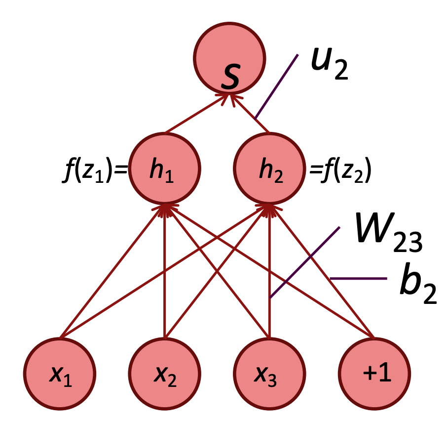


- for element-wise activation function $\mathbf h=f(\mathbf z)$ where $\mathbf h,\mathbf z\in\mathbb{R}^n$, what is ${\partial\mathbf h}/{\partial\mathbf z}$?
  $$
  \left(\frac{\partial \mathbf h}{\partial \mathbf z}\right)_{ij}=\frac{\partial h_i}{\partial z_j}=\frac{\partial}{\partial z_j}f(z_i)=\begin{cases}f'(z_i)&\text{if }i=j\\0&\text{otherwise}\end{cases}
  $$

  - Jacobian is a diagonal matrix

  $$
  \frac{\partial\mathbf h}{\partial \mathbf z}=\begin{bmatrix}f'(z_1)&&\\
  &\ddots&\\
  &&f'(z_n)\end{bmatrix}=\operatorname{diag}(f'(\mathbf z))
  $$

- useful Jacobians
  $$
  \frac{\partial}{\partial \mathbf x}(\mathbf W\mathbf x+\mathbf b)=\begin{bmatrix}\ddots&&\\&\frac{\partial z_i}{\partial x_j}\\&&\ddots\end{bmatrix}=\begin{bmatrix}\ddots&&\\&W_{ij}\\&&\ddots\end{bmatrix}=\mathbf W\\[1em]
  \frac{\partial}{\partial \mathbf b}(\mathbf W\mathbf x+\mathbf b)=\mathbf I\\[1em]
  \frac{\partial}{\partial \mathbf z} f(\mathbf z)=\operatorname{diag}(f'(\mathbf z))\\[1em]
  \frac{\partial}{\partial \mathbf u}(\mathbf u^\intercal\mathbf h)=\mathbf h^\intercal
  $$

- other helpful derivatives
  $$
  \begin{align*}
  \frac{d}{dx} \frac 1x &=-\frac{1}{x^2}\\
  \frac{d}{dx} e^x &= e^x\\
  \frac{d}{dx} \sigma(x) &= (1-\sigma(x))\sigma(x)\quad\text{[using quotient rule]}\\
  \frac{d}{dx}\log x &= \frac 1x\\
  \frac{d}{dx}\tanh(x) &= 1-\tanh^2(x)
  \end{align*}
  $$

  - how to get derivative of sigmoid
    $$
    \begin{align*}
    \frac{d}{dx}\sigma(x) &= \frac{d}{dx}(1+e^{-x})^{-1} \\
    &=(1+e^{-x})^{-2}\cdot e^{-x}&\text{chain rule}\\
    &= \frac{e^{-x}}{(1+e^{-x})^2}\\
    &= \frac{1}{1+e^{-x}}\cdot\frac{e^{-x}}{1+e^{-x}}\\
    &=\sigma(x)\cdot(1-\sigma(x))
    \end{align*}
    $$

- derivative of Swish
  $$
  \begin{align*}
  \frac{\partial}{\partial x}\text{Swish}(x)&=\frac{\partial}{\partial x}x\cdot\sigma(x)\\
  &=\sigma(x)+x\cdot\sigma'(x)&\text{product rule}\\
  &=\sigma(x)+x\cdot\sigma(x)(1-\sigma(x))&\text{derivative of sigmoid}\\
  &=\sigma(x)+x\sigma(x)-x\sigma(x)^2\\
  &=\sigma(x)+\text{Swish}(x)(1-\sigma(x))
  \end{align*}
  $$

- gradient of softmax + CE loss
  - let $\mathbf z\in\mathbb R^{\mathcal V}$ be the logits indexed by $i\in\{1,…,\mathcal V\}$, and $\mathbf p\in\mathbb R^{\mathcal V}$ be the post-softmax probabilities

  $$
  p_i=\frac{e^{z_i}}{\sum_je^{z_j}}
  $$

  - CE loss gradient $\partial L/\partial \mathbf p$
    - $L=-\log p_t$, where $t$ is the correct class
    - gradient is
      $$
      \frac{\partial L}{\partial p_i}=\begin{cases}-\frac{1}{p_t}&\text{if }i=t\\0&\text{otherwise}\end{cases}
      $$

      $$
      \frac{\partial L}{\partial \mathbf p}=\begin{bmatrix}0&\cdots&-\frac{1}{p_t}&\cdots &0\end{bmatrix}\in\mathbb R^{\mathcal V}
      $$

    - use chain rule to express $\partial L/\partial\mathbf z$ in terms of $\partial \mathbf p/\partial\mathbf z$
      - most of the terms vanish, because $\frac{\partial L}{\partial p_i}$ is only non-zero for $i=t$

      $$
      \frac{\partial L}{\partial z_i}=\sum_{j}\frac{\partial L}{\partial p_j}\frac{\partial p_j}{\partial z_i}=-\frac{1}{p_t}\frac{\partial p_t}{\partial z_i}
      $$

      $$
      \frac{\partial L}{\partial\mathbf z}=\frac{\partial L}{\partial\mathbf p}\frac{\partial\mathbf p}{\partial\mathbf z}=\begin{bmatrix}0&\cdots&-\frac{1}{p_t}&\cdots &0\end{bmatrix}\begin{bmatrix}\frac{\partial p_1}{\partial z_1}&\cdots&\frac{\partial p_1}{\partial z_{\mathcal V}}\\&\ddots&\\\frac{\partial p_{\mathcal V}}{\partial z_1}&\cdots&\frac{\partial p_{\mathcal V}}{\partial z_{\mathcal V}}\end{bmatrix}=-\frac{1}{p_t}\frac{\partial p_t}{\partial z_i}\in\mathbb R^{\mathcal V}
      $$

  - now let’s calculate the softmax gradient $\partial \mathbf p/\partial\mathbf z$
    $$
    \frac{\partial\mathbf p}{\partial\mathbf z}=\begin{bmatrix}\frac{\partial p_1}{\partial z_1}&\cdots&\frac{\partial p_1}{\partial z_{\mathcal V}}\\&\ddots&\\\frac{\partial p_{\mathcal V}}{\partial z_1}&\cdots&\frac{\partial p_{\mathcal V}}{\partial z_{\mathcal V}}\end{bmatrix}\in\mathbb R^{\mathcal V\times\mathcal V}
    $$

    $$
    \frac{\partial p_j}{\partial z_i}=
    \begin{cases}p_j(1-p_j)&\text{if }i=j\\
    -p_jp_i&\text{if }i\neq j
    \end{cases}
    $$

  - putting it all together to get $\partial L/\partial\mathbf z$
    - for the true token $(i=t)$

    $$
    \frac{\partial L}{\partial z_t}=-\frac{1}{p_t}\frac{\partial p_t}{\partial z_t}=-\frac{1}{p_t}\cdot p_t(1-p_t)=p_t-1
    $$

    - for all other tokens

    $$
    \frac{\partial L}{\partial z_i}=-\frac{1}{p_t}\cdot(-p_tp_i)=p_i
    $$

  - very clean result: $\partial L/\partial\mathbf z = \mathbf p - \operatorname{one\_hot}(t)$

### Backpropagation
- NN equations are represented as a computation graph
  - which parts of the function are thought of as “gates” is a matter of convenience, and in general are parts of the expression that have easy local gradients
- **backpropagation** can be thought of as gates communicating to each other (through the gradient signal) whether they want their outputs to increase or decrease (and how strongly) in order to decrease the loss
  - achieved through repeated applications of chain rule, which allows us to decompose each gradient into the upstream gradient (already computed) and the local gradient
- each node in the graph receives an upstream gradient and passes down a downstream gradient
  - each node has a local gradient (the gradient of its output w.r.t. its input)
  - downstream gradient = upstream gradient $\times$ local gradient

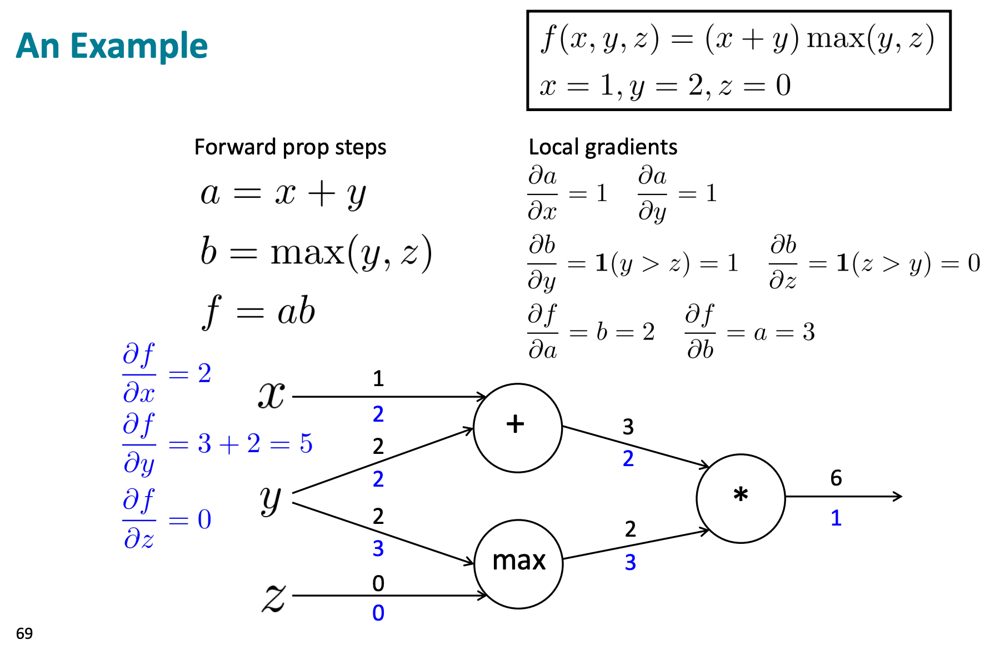

- gradients sum at outward branches
  - if $y$ is used in the computation of both $a$ and $b$, then $\frac{\partial f}{\partial y}=\frac{\partial f}{\partial a}\frac{\partial a}{\partial y}+\frac{\partial f}{\partial b}\frac{\partial b}{\partial y}$
- node intuitions
  - $+$ distributes the upstream gradient to each summand
  - $\max$ “routes” the upstream gradient to one of many input arguments
  - $\times$ switches the forward coefficients in the downstream gradient
- backprop
  - initialize output gradient as 1
  - visit nodes in reverse topological order: compute gradient w.r.t. each node using gradients w.r.t. successors
  - done correctly, the big-$O$ complexity of forward prop and backprop are the same
- automatic differentiation
  - the gradient computation can be automatically inferred from the symbolic expression of the forward prop
  - each node type needs to know how to compute its output and how to compute gradients w.r.t. inputs given gradients w.r.t. outputs
    - local gradient is written by the programmer
- manual gradient checking
  - for every parameter $x$, recompute $f$ for $x-h$ and $x+h$ and check that
    $$
    f'(x)\approx \frac{f(x+h)-f(x-h)}{2h}
    $$

- in the backwards pass, intermediate activations are needed
  - as a result, NNs typically store all intermediate activations during the forward pass
  - **activation / gradient checkpointing** trades compute for memory by storing only a subset of activations (the “checkpoints”) — if you need activations that weren’t saved, you recompute them on the fly by doing a partial forward pass from the nearest checkpoint
    - for a model with N layers checkpointed into K segments
      - memory goes from $O(N)$ to $O(K+N/K)$
      - backward compute goes from $O(N)$ to  $O(N + N*(K-1)/K)$
      - optimal choice is $K=\sqrt{N}$: $O(\sqrt{N})$ memory, $\sim O(2N)$ backward compute
- do for practice
  - calculating an explicit expression for $\partial f/\partial x$ would be extremely complex, but it’s completely unnecessary!
  - construct multiple intermediate variables in the forward pass, each of which is simple expression for which we know the local gradient

  $$
  f(x,y)=\frac{x+\sigma (y)}{\sigma(x)+(x+y)^2}
  $$

- backprop needs to start from a scalar because it computes $\partial L/\partial\theta$ for every parameter $\theta$, which is a single number per parameter — this only makes sense when $L$ is a scalar
  - when calling `.backward()` on a scalar, PyTorch implicitly seeds the backward pass with $\partial L/\partial L=1$
  - when we have per-token losses $\ell_1,…,\ell_n$ and define $L=\frac 1N\sum_i\ell_i$ (mean reduction), by the linearity of derivatives we have
    $$
    \frac{\partial L}{\partial\theta}=\frac 1N\sum_{i=1}^N\frac{\partial\ell_i}{\partial\theta}
    $$

    - so the gradient from the mean loss is exactly the mean of the gradients we’d get from backpropagating each $\ell_i$ individually
- upstream gradients always w.r.t. activations, gradients w.r.t. parameters are used for the update and end there, because parameters are leaf nodes in the computation graph
  ```python
  loss
    │  dL/dy2 (activation grad)
    ▼
  Layer 2 ──→ dL/dW2 (param grad, stored)
    │  dL/dy1 (activation grad)
    ▼
  Layer 1 ──→ dL/dW1 (param grad, stored)
    │  dL/dx  (activation grad — usually discarded)
    ▼
  input
  ```


### Optimizers
- vanilla SGD update
  $$
  \theta\leftarrow \theta-\eta g_t
  $$

- an **optimizer** determines the direction + magnitude of parameter updates
- for every parameter tensor, Adam keeps:
  1. the parameter itself ($\theta$)
  2. the gradient ($g$)
  3. first moment (momentum)
  4. second moment (variance)
- **Adam optimizer**
  $$
  \theta\leftarrow\theta-\eta\frac{\hat m}{\sqrt{\hat v}+\epsilon}
  $$

  - let $g$ be the gradient for the current step
  - first moment $m$ is the running mean of gradients
    $$
    m\leftarrow\beta_1 m+(1-\beta_1)g
    $$

    - result: if gradients have been pointing consistently in one direction, it moves more confidently that way
      - accumulate velocity over time, which helps you barrel through noisy gradients
  - second moment $v$ is the running mean of squared gradients
    $$
    v\leftarrow\beta_2 v+(1-\beta_2)g^2
    $$

    - result: different weights effectively get different learning rates — consistently large gradients → smaller steps
      - effectively normalizes gradients to be on the same scale
  - bias correction: corrects for initialization bias in the running averages early in training
    - time is for time step $t$ starting at 1 (otherwise, use $t+1$)

    $$
    \hat m_t=\frac{m_t}{1-\beta_1^t},\quad\hat v_t=\frac{v_t}{1-\beta_2^t}
    $$

  - the hyperparameters $\beta_1$ and $\beta_2$ control updates to the moment estimates
  - $m$ and $v$ are both initialized to $0$
  - so memory per parameter ≈ 4× parameter size
- **AdamW** modifies Adam by adding **weight decay** towards 0
  $$
  \theta\leftarrow\theta-\eta\frac{\hat m}{\sqrt{\hat v}+\epsilon}-\eta\lambda \theta
  $$

- initialize optimizer with model parameters, to tell the optimizer which values it will be optimizing, and the `lr` parameter, which determines the size of the update
- how do you determine whether something should be a LR schedule or an optimizer?
  - depends on the time step $t$ alone → probably LR schedule
  - ~requires per-parameter history → optimizer
- code looks like this
  - `params` is used to create parameter groups which each have their own hyperparams (e.g., different learning rates for different layers)
    - `torch.optim.AdamW(model.parameters())` creates a single parameter group
    - usually we don’t want weight decay on biases and LayerNorm params
      ```python
      torch.optim.AdamW([
          {'params': decay_params, 'weight_decay': 0.01},
          {'params': no_decay_params, 'weight_decay': 0.0},
      ])
      ```

  - `defaults` dict provides fallback values for any hyperparameter not explicitly specified in a parameter group
  - in practice it’s better to apply weight decay before the Adam update because weight decay depends on the parameter

```python
class AdamW(torch.optim.Optimizer):
    def __init__(self, params, lr, betas, eps, weight_decay):
        if lr < 0:
            raise ValueError(f"Invalid learning rate: {lr}")
        if not 0 < betas[0] < 1 or not 0 < betas[1] < 1:
            raise ValueError(f"Invalid beta values: {betas}")
        defaults = {"lr": lr, "betas": betas, "eps": eps, "weight_decay": weight_decay}
        super().__init__(params, defaults)

    def step(self):
        for group in self.param_groups:  # for every group of parameters
            lr = group["lr"]
            beta1, beta2 = group["betas"]
            eps = group["eps"]
            weight_decay = group["weight_decay"]
            for p in group["params"]:  # for every parameter in the group
                if p.grad is None:
                    continue
                state = self.state[p]

                # state initialization with 0s
                t = state.get("t", 0)
                m, v = state.get("m", torch.zeros_like(p.data)), state.get("v", torch.zeros_like(p.data))

                # weight decay
                p.data -= lr * weight_decay * p.data

                # Adam update
                grad = p.grad.data
                m = beta1 * m + (1 - beta1) * grad
                v = beta2 * v + (1 - beta2) * grad**2
                m_hat = m / (1 - beta1 ** (t + 1))
                v_hat = v / (1 - beta2 ** (t + 1))
                p.data -= lr * m_hat / (v_hat.sqrt() + eps)

                # update optimizer state
                state["t"] = t + 1
                state["m"] = m
                state["v"] = v
```

- **gradient clipping** constraints the size of the grad norm
  - computes global norm of *all *gradients
  - if max is exceeded, scale all parameters down by the same value to be below the max
  - prevents any individual step from being catastrophically large

### Learning rate
- warmup reduces primacy effect of early training examples

---

## Mathy things
### Information theory
- **cross entropy**
  $$
  \operatorname{CE}(p,q)=-\mathbb E_p[\log q]=-\sum_{x\in\mathcal X}p(x)\log q(x)
  $$

- **KL divergence**
  $$
  \operatorname{KL}(p\mid\mid q)=\sum_{x\in\mathcal X}p(x)(\log p(x)-\log q(x))
  $$

- **entropy**
  $$
  H(p)=-\sum_{x\in\mathcal X}p(x)\log p(x)
  $$

  - another common form given logits $x_i$
    $$
    H(p)=\log\sum_ie^{x_i}-\underbrace{\frac{\sum_ie^{x_i}x_i}{\sum_i e^{x_i}}}_{\mathbb E[x]}
    $$

- cross entropy between $p$ and $q$ is just KL between $p$ and $q$ plus the irreducible entropy of $p$
  $$
  \operatorname{CE}(p,q)=\operatorname{KL}(p\mid\mid q)+H(p)
  $$

  - proof
    $$
    \begin{align*}
    \operatorname{KL}(p\mid\mid q)&=\sum_{x\in\mathcal X}p(x)(\log p(x)-\log q(x))\\
    &=\sum_{x\in\mathcal X}p(x)\log p(x)-\sum_{x\in\mathcal X}p(x)\log q(x)\\
    &=-H(p)+\operatorname{CE}(p,q)
    \end{align*}
    $$

- **cross-entropy loss**
  - when the target distribution is 1-hot, the cross-entropy loss is the negative log likelihood of the next token

  $$
  \mathcal L(x)=-\sum_{t=1}^T\log p(x_t\mid x_{<t})
  $$

  - also equivalent to KL divergence
  - implementing the loss
    - if using `F.cross_entropy()`, logits and labels are shifted internally
      - `loss = F.cross_entropy(logits.view(-1, vocab_size), targets.view(-1), ignore_index=pad_idx)`

  ```python
  shift_logits = logits[:, :-1, :]
  shift_labels = input_ids[:, 1:]
  logprobs = F.log_softmax(shift_logits, dim=-1)
  token_logprobs = logprobs.gather(index=shift_labels.unsqueeze(-1), dim=-1).squeeze(-1)
  # build loss mask
  masked_logprobs = -token_logprobs * mask.float()
  return masked_logprobs.sum() / mask.sum()
  ```


### Numerical stability and other tricks
- in general, pay attention to
  - exp(x) for large x → overflow to $\infty$
  - log(x) for x near 0 → underflow to $-\infty$ ($\log(0)=-\infty$)
  - log(x) for x near 1 → precision issues ($\log(1) = 0$)
- computing `softmax(x)`
  - unstable because for large $x_i$, $\exp(x_i)$ will overflow
  - use the fact that *softmax is invariant to subtraction of a constant*
    $$
    \begin{align*}
    \text{softmax}(x)_i &= \frac{e^{x_i}}{\sum_j e^{x_j}}\\
    &= \frac{e^{x_i-c}\cdot e^c}{\sum_j e^{x_j-c}\cdot e^c}\\
    &= \frac{e^{x_i-c}\cdot e^c}{e^c\cdot \sum_j e^{x_j-c}}\\
    &= \frac{e^{x_i-c}}{\sum_j e^{x_j-c}}\\
    &=\text{softmax}(x-c)_i
    \end{align*}
    $$

  - subtracting $x_\text{max}$ from all $x_i$ ensures $x_i$ are not large (the largest exponent is $\exp(0)=1$), so the numerically stable implementation does this
    $$
    \text{softmax}(x)_i=\frac{e^{x_i-x_\text{max}}}{\sum_j e^{x_j-x_\text{max}}}
    $$

- computing `log(softmax(x))`
  - doing log-softmax directly is bad because log of inputs near 0 (low-probability classes) is unstable
  - use `x - logsumexp(x)` instead, which avoids materializing the tiny probability (and `logsumexp(x)` is stable)
  - these are equivalent

  $$
  \begin{align*}
  \log(\text{softmax}(x))_i &= \log \frac{e^{x_i}}{\sum_j e^{x_j}}\\
  &= \log e^{x_i}-\log\sum_j e^{x_j}\\
  &= x_i-\log\sum_j e^{x_j}
  \end{align*}
  $$

- computing `log(sum(exp(x)))`
  - why is it unstable?
    - for any large $x_i$, $\exp(x_i)$ will overflow to infinity
      - e.g., in float32, $x_i\approx 83$ will overflow
    - if all $x_i$ are negative very negative, then $\log(0)$ will underflow to $-\infty$
    - precision issue if the summation is close to 1, because $\log(1)$ is unstable
      - this is the problem we got in our distillation project
  - intuition: we want to make the values $x_i$ small, which we can do by subtracting a constant! then we just need to add back the constant at the end
  - `logsumexp(x)` is implemented like this
    $$
    \begin{align*}
    \log\sum_i e^{x_i}&=\log\sum_i\left(e^{x_i-x_\text{max}} \cdot e^{x_\text{max}}\right)\\
    &= \log \left(e^{x_\text{max}}\sum_i e^{x_i-x_\text{max}}\right)\\
    &=\log e^{x_\text{max}}+\log\sum_ie^{x_i-x_\text{max}}\\
    &= x_\text{max}+\log\sum_i e^{x_i-x_\text{max}}
    \end{align*}
    $$

    - the largest term is $e^0=1$ (for $x_i=x_\text{max}$), so no overflow
    - sum is at least 1, so we never compute $\log(0)$
- naively, computing the softmax requires two different passes to compute $x_\text{max}$ (used for stability) and then the denominator $\sum_j e^{x_j-x_\text{max}}$
  - stable softmax
    $$
    \text{softmax}(x)_i=\frac{e^{x_i-x_\text{max}}}{\sum_j e^{x_j-x_\text{max}}}
    $$

  - **online softmax trick**: fuse the computation of $x_\text{max}$ and the denominator $\sum_j e^{x_j-x_\text{max}}$ into a single pass
    - idea: we can calculate the denominator with the max-so-far and continuously rescale it for each new max-so-far
    - maintain
      - a running maximum $m_k=\max(x_1,...,x_k)$
      - a running (shifted) denominator $d_k=\sum_j e^{x_j-m_k}$
    - update rule: when we encounter $x_{k+1}$
      $$
      m_{k+1}\leftarrow\max(m_k,x_{k+1})\\
      d_{k+1}\leftarrow d_k\cdot e^{m_k-m_{k+1}}+e^{x_{k+1}-m_{k+1}}
      $$

    - to see why the update for $d_{k+1}$ is correct
      $$
      \begin{align*}
      d_{k+1}&=\sum_{j=1}^{k+1}e^{x_j-m_{k+1}}\\
      &= e^{x_{k+1}-m_{k+1}}+\sum_{j=1}^k e^{x_j-m_{k+1}}&\text{split off last term}\\
      &= e^{x_{k+1}-m_{k+1}}+\sum_{j=1}^k e^{x_j-m_k+m_k-m_{k+1}}&\text{algebraic manipulation}\\
      &= e^{x_{k+1}-m_{k+1}}+\sum_{j=1}^k e^{x_j-m_k}e^{m_k-m_{k+1}}\\
      &= e^{x_{k+1}-m_{k+1}}+e^{m_k-m_{k+1}}\underbrace{\sum_{j=1}^k e^{x_j-m_k}}_{d_k}&\text{pull out a constant}\\
      &= \underbrace{d_k\cdot e^{m_k-m_{k+1}}}_\text{rescaling of prev terms}+\underbrace{e^{x_{k+1}-m_{k+1}}}_\text{new term}&\text{express in terms of }d_k\text{, reorder}
      \end{align*}
      $$

      - note when the maximum doesn’t change, $m_k=m_{k+1}$ and the rescaling factor $e^{m_k-m_{k+1}}=1$
    - if the goal is to return the softmax, then we need to do one more pass over the logits to return $e^{x_i-m_S}/d_S$
- we can also use this to calculate a weighted sum given a stream of logits $x_i$ and values $v_i$
  $$
  o=\sum_ip_iv_i=\sum_i\frac{e^{x_i}}{\sum_j e^{x_j}}v_i=\frac{\sum_i e^{x_i}v_i}{\sum_i e^{x_i}}
  $$

  - for FlashAttention, $o$ corresponds to the attention output for each query $q$, where $x_i=q\cdot k_i$ and $v_i$ are value vectors
  - numerically stable version multiplies both the numerator and denominator by $e^{-x_\text{max}}$ (to avoid overflow issues with $e^{x_i}$)
    $$
    o=\frac{\sum_i e^{x_i-x_\text{max}}v_i}{\sum_i e^{x_i-x_\text{max}}}
    $$

  - in addition to $m_k$ and $d_k$, we maintain the running numerator $o_k\in\mathbb R^H$ ($H$ = dimension of each $v_i$, which is the head dimension in FlashAttention)
    $$
    o_k=\sum_{i=1}^ke^{x_i-m_k}v_i
    $$

    - the update uses the same idea as the update for $d_k$ (derivation looks the same as the one for $d_k$)
      $$
      o_k=o_k\cdot e^{m_k-m_{k+1}}+ \underbrace{e^{x_{k+1}-m_{k+1}}v_{k+1}}_\text{new term}
      $$

  - after processing all $N$ logits, we have $(m_N, d_N, o_N)$ and the true attention output is just $o_N/d_N$

>
> when we need to make an expression involving $e^{x}$ numerically stable, a standard tool is to multiply by $e^{-m}$ (where $m$ is a large number, commonly chosen to be $m=x_\text{max}$) and see what survives.
>

### Basic statistics
- $p$-value: probability of seeing data (at least this extreme) given the null hypothesis
  - crucially, it’s about the probability of the data given the null, not the probability of the null given the data
- are these groups different?
  - **Kolmogorov-Smirnov test**: given two groups of observations of a continuous variable, were they drawn from the same underlying distribution?
    - measures maximum vertical distance between the CDFs of two samples
  - **Chi-squared test**: given two groups of observations of a categorical variable, were they drawn from the same underlying distribution?
  - **T-test**: are the means of two groups of continuous observations different?
    - assumption: data is normally distributed
    - one-sample version: whether a group’s mean equals some value
    - two-sample version: whether two groups have the same mean
    - paired version: whether two measurements on the same items are systematically different
      - one-sample t-test in disguise
      - given per-example differences (where each diff is +1, 0, or -1), can test whether the differences are significantly different from 0
  - **ANOVA** (F-test): (generalization of the t-test to more than two groups) do any of these $k$ groups have different means?
  - **McNemar’s tests**: compares two classifiers on the same dataset
    - this is probably the best test for a standard setup with two models being evaluated on the same test set, where each example can be answered correctly or incorrectly
- are these variables related?
  - **Pearson correlation test**: tests where there is a linear relationship between two continuous variables
    - returns both a correlation coefficient $r$ and p-value for whether $r$ is significantly different from 0
    - misses non-linear relationships entirely (a perfect parabolic relationship → $r\approx 0$)
    - imagine a line being fit on a scatterplot
  - **Spearman correlation test**: same idea but measures monotonic associations
    - converts both variables to ranks (smallest value gets rank 1, etc.), then computes Pearson correlation on the ranks
    - the only thing that matters is *order*, not the specific values
  - Pearson versus Spearman
    - Pearson more sensitive to outliers, while Spearman robust to them
    - Pearson underestimates non-linear monotonic relationships
    - Pearson has cleaner interpretation
  - mutual information: captures any dependency between two variables, including non-linear ones
    - not really a statistical test

### Gradient flow through sampling
- **Gumbel-Max trick**
  - with logits $z_1,…,z_k$, you can sample from the corresponding categorical distribution by
    1. drawing independent noise values $g_1,…,g_k$ from $\operatorname{Gumbel}(0,1)$ distribution
    2. taking argmax from $(z_1+g_1,…,z_k+g_k)$
- **Gumbel-Softmax** replaces the argmax with a softmax: $\operatorname{softmax}((z_1+g_1,…,z_k+g_k)/\tau)$
  - softmax is differentiable everywhere!
  - high temperature → smooth gradients, low temperature → discrete samples
  - not about making something differentiable (the plain softmax already is), but instead makes it stochastic
  - plain softmax: $y = \operatorname{softmax}(\alpha)$
    - deterministic (always the same soft mixture)
  - true categorical sampling: $y=\operatorname{one\_hot}(\operatorname{sample}(\operatorname{softmax}(\alpha)))$
  - gumbel-softmax: $y=\operatorname{softmax}((\alpha+G)/\tau)$
    - stochastic (Gumbel noise)
    - approximately discrete (low temperature)
    - differentiable
    - you get exploration AND gradients!
- **straight-through estimator**: pretend $f$ was the identity function
  - forward: $y=f(x)$ (apply the non-differentiable funtion)
  - backward: $\frac{\partial\mathcal L}{\partial x}=\frac{\partial\mathcal L}{\partial y}$
    - pass the upstream gradient directly down as the downstream gradient
  - would be wrong is $f(x)$ is decreasing (signal is in the opposite direction)
  - but STE is usually applied to operations that are monotonically increasing (rounding, quantization, increasing step function)
    - direction is right, even if magnitude is wrong

### Theoretical CS
- a **regular language** is one that can be recognized with a **finite state machine** (also known as **finite automaton**)
  - deterministic finite automaton (DFA)
- a **context-free language** is one that can be recognized by a pushdown automaton — basically a finite state machine plus a stack
  - stack gives unbounded memory but can only be accessed via the top
  - programming language syntax is built from context-free languages (matched parentheses, nested function calls, balanced HTML tags, etc.)
- any finite language is trivially regular — you can enumerate all valid strings with enough states
- any DFA can be encoded by a ReLU RNN
  - given a DFA with
    - states $Q=\{q_1,…,q_k\}$
    - alphabet $\Sigma=\{\sigma_1,…,\sigma_m\}$
    - transition function $\delta:Q\times\Sigma\to Q$
    - start state $q_1$
    - accept state $F\subseteq Q$
  - build an RNN with hidden dimension $k$ that is a one-hot encoding of the state
  - need to construct $W_h\in\mathbb R^{k\times k}$, $W_x\in\mathbb R^{k\times m}$, $b\in\mathbb R^k$
  - for each transition $\delta(q_i,\sigma_k)=q_j$, set $(W_h)_{ji}=1$, $(W_x)_{jk}=1$, $b_j=-1$

---

## The modern transformer LM
### Architecture
| **dimension** | **symbol** |
| :-- | :-- |
| number of sequences in the batch | B |
| number of layers | L |
| sequence length (number of tokens to generate) | T |
| sequence length (provided context) | S |
| vocab size | V |
| hidden dimension | D |
| head dimension | H |
| MLP hidden dimension, generally F = 4D | F |
| number of query heads, N * H = D | N |
| number of key/value heads, K < N in GQA | K |
| group size in GQA = N // K | G |


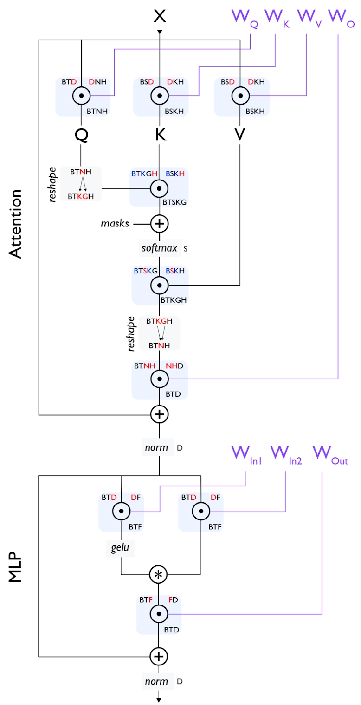


**token embedding**

- embedding matrix $\mathbf W_e\in\mathbb R^{V\times D}$, initial hidden states $\mathbf X^{(0)}\in\mathbb R^{B\times S\times D}$

$$
\mathbf X^{(0)}=\mathbf {W}_e[\text{tokens}]
$$

**layer loop (for **$\ell\in[0,…,L-1]$**)**

- RMSNorm divides every element of $\mathbf X^{(\ell)}$ by the RMS of $\mathbf X^{(\ell)}$ (so that the hidden state has unit RMS) then multiplies by learned rescaling parameter $\gamma$
  $$
  \bar{\mathbf X}^{(\ell)}=\frac{\mathbf X^{(\ell)}}{\text{RMS}(\mathbf X^{(\ell)})+\epsilon}\odot\gamma_{\text{attn}}^{(\ell)}\\[1em]
  \operatorname{RMS}(\mathbf X)=\sqrt{\frac 1D\sum_{i=1}^D x_i^2}
  $$

- each head projects $\mathbf {X}^{(\ell)}$ using $W^{(\ell)}_Q\in\mathbb R^{D\times D}$, $W^K\in\mathbb R^{D\times KH}$, $W^{(\ell)}_V\in\mathbb R^{D\times KH}$ (where $H=D/N$) into the head’s lower-dimensional subspace
  $$
  \mathbf Q=\bar {\mathbf X}\mathbf W_Q\in\mathbb R^{B\times T\times D},\quad\mathbf K=\bar {\mathbf X}\mathbf W_K\in\mathbb R^{B\times S\times D},\quad\mathbf V=\bar {\mathbf X}\mathbf W_V\in\mathbb R^{B\times S\times D}
  $$

  - [optional] QK norm: RMSNorm is applied to the query and key vectors to control the magnitude of the vectors going into the dot product
- reshape to expose head dimension $D\to N\times H$, and $K\cdot H\to K\times H$, then transpose the sequence length ($S$ or $T$) and head dim ($N$ or $K$) dimensions
  $$
  \mathbf Q\in\mathbb R^{B\times T\times D}\to \mathbb R^{B\times N\times T\times H}\\
  \mathbf K\in\mathbb R^{B\times S\times (K\cdot H)}\to \mathbb R^{B\times K\times S\times H}\\
  \mathbf V\in\mathbb R^{B\times S\times (K\cdot H)}\to \mathbb R^{B\times K\times S\times H}
  $$

- expand $K$, $V$ for GQA
  $$
  \mathbf K\in\mathbb R^{B\times K\times S\times H}\to \mathbb R^{B\times N\times S\times H}\\
  \mathbf V\in\mathbb R^{B\times K\times S\times H}\to\mathbb R^{B\times N\times S\times H}
  $$

- apply RoPE at each position $m$ by rotating a query vector $\mathbf q_m\in\mathbf R^H$ (or key vector $\mathbf k_m$) by $\mathbf R_m$
  - for dimension pair $i$ (corresponding to indices $(2i, 2i+1)$ from $\mathbf q_m$), we rotate by angle $m\theta_i$ where $\theta_i=\Theta^{-\frac{2i}{H}}$
  - the hyperparameter $\Theta$ controls the base rotation frequency and $H$ is the head dimension
    $$
    \mathbf R_m=\begin{bmatrix}
    \ddots&&\\
    &\mathbf R_m^{(i)}&\\
    &&\ddots\\
    \end{bmatrix}\in\mathbb R^{H\times H}\quad\text{where}\quad \mathbf R_m^{(i)}=\begin{bmatrix}
    \cos(m\theta_i)&-\sin(m\theta_i)\\
    \sin(m\theta_i)&\cos(m\theta_i)\\
    \end{bmatrix}
    $$


  $$
  \mathbf q_m\leftarrow \mathbf R_m \mathbf q_m, \quad\mathbf k_m\leftarrow \mathbf R_m \mathbf k_m, 
  $$

- calculate attention scores
  - we divide by the head dimension $H$ because otherwise dot products will scale with $\sqrt H$
    - large inputs to softmax → peakier distributions → resistant to updates

    $$
    \mathbf A=\frac{\mathbf Q\mathbf K^\top}{\sqrt H}\in\mathbb R^{B\times N\times T\times S}
    $$

  - apply causal mask
    $$
    \mathbf A_{ij}\leftarrow \begin{cases} \mathbf A_{ij}&\text{if }j\leq i\\
    -\infty&\text{if }j>i
    \end{cases}
    $$

  - apply softmax
    $$
    \mathbf A=\operatorname{softmax}(\mathbf A)=\frac{\exp(\mathbf A_{ij})}{\sum_{k=1}^S \exp(\mathbf A_{ik})}
    $$

- get attention output from weighted sum of values
  $$
  \mathbf O=\mathbf A\mathbf V\in\mathbb R^{B\times N\times T\times H}
  $$

- reshape
  $$
  \mathbf O\in\mathbb R^{B\times N\times T\times H}\to\mathbb R^{B\times T\times D}
  $$

- apply output projection $W^{(\ell)}_O\in\mathbb R^{D\times D}$ to mix output from different heads
  $$
  \mathbf O_\text{proj}=\mathbf O\mathbf W_O
  $$

- residual connection
  $$
  \mathbf X^{(\ell)} \leftarrow\mathbf X^{(\ell)}+\mathbf O_\text{proj}
  $$


**feed forward network**

- RMSNorm
  $$
  \bar{\mathbf X}^{(\ell)}=\frac{\mathbf X^{(\ell)}}{\text{RMS}(\mathbf X^{(\ell)}) + \epsilon}\odot\gamma_{\text{ffn}}^{(\ell)}
  $$

- gate and up projections [expansion] using $\mathbf W^{(\ell)}_\text{up}\in\mathbb R^{D\times F}$, $\mathbf W^{(\ell)}_\text{gate}\in\mathbb R^{D\times F}$
  $$
  \mathbf U=\bar {\mathbf X}\mathbf W_\text{up}\\
  \mathbf G=\bar {\mathbf X}\mathbf W_\text{gate}
  $$

- SwiGLU activation
  $$
  \operatorname{Swish}(\mathbf G)=\mathbf G\odot\sigma(\mathbf G)=\mathbf G\odot\frac{1}{1+e^{-\mathbf G}}\\[1em]
  \mathbf H=\operatorname{Swish}(\mathbf G)\odot\mathbf U\in\mathbb R^{B\times T\times F}
  $$

- down projection using $\mathbf W_\text{down}^{(\ell)}\in\mathbb R^{F\times D}$
  $$
  \mathbf F=\mathbf H\mathbf W_\text{down}
  $$

- residual connection
  $$
  \mathbf X^{(\ell+1)} =\mathbf X^{(\ell)}+\mathbf F
  $$


**final layer norm**

- final norm
  $$
  \mathbf X_\text{final}=\frac{\mathbf X^{(L)}}{\text{RMS}(\mathbf X^{(L)}) + \epsilon}\odot\gamma_{\text{final}}
  $$


**unembedding**

- project onto vocab dimension using $\mathbf W_u\in\mathbb R^{D\times V}$
  $$
  \mathbf Z=\mathbf X_\text{final}\mathbf W_u\in\mathbb R^{B\times T\times V}
  $$


### Implementation notes
- `scores.masked_fill(~mask, -torch.inf)` for making the pre-softmax attention scores
  - assuming convention where `mask` is `True` for positions that *can *be attended to
  - `tensor.masked_fill(mask, value)` fills `tensor` with `value` where `mask` is `True`
- RoPE
  - we want to cache $\cos(m\theta_i)$ and $\sin(m\theta_i)$ for every (position, index) pair $(m,i)$
    - we can do this upon initialization

    ```python
    positions = torch.arange(max_seq_len, device=device)  # shape (max_seq_len)
    thetas = self.theta ** (-torch.arange(0, d_k, 2, device=device) / d_k)  # shape (d_k // 2)
    angles = positions.unsqueeze(-1) * thetas.unsqueeze(0)
    ```

  - in practice, instead of doing a bunch of 2x2 matmuls, we express the rotation in dot products
    - extract the even and odd indices of $\mathbf Q$, $\mathbf K$ by reshaping the final head dimension $H$ into $(H/2,2)$
      ```python
      x_pairs = x.reshape(*x.shape[:-1], -1, 2)
      x_even = x_pairs[..., 0]
      x_odd = x_pairs[..., 1]
      ```

    - calculate all the even and odd positions in the rotated matrix
      ```python
      x_out_even = x_even * cos - x_odd * sin
      x_out_odd = x_even * sin + x_odd * cos
      ```

    - then interleave by stacking them side by side and flattening
      - `torch.stack()` adds a new dimension

      ```python
      torch.stack([x_out_even, x_out_odd], dim=-1).flatten(start_dim=-2)
      ```

- attention looks like this
  - need `.reshape()` to expand `d_model` ($D$) into `num_heads x head_dim` ($N\times H$)
  - need `qkv.unbind()` to split queries, keys, vectors [optional depending on implementation]
  - need `.transpose()` to swap `num_heads` and `seq_len` dimensions for attention computation
  - after getting `output`, need to `.transpose()` and `.reshape()` again to recover original shape

  ```python
  batch_size, seq_len, _ = x.shape
  
  x_norm = self.norm(x)
  
  qkv = self.qkv_proj(x_norm)  # (batch, seq_len, 3 * d_model)
  
  qkv = qkv.reshape(batch, seq_len, 3, self.num_heads, self.head_dim)
  q, k, v = qkv.unbind(dim=2)  # (batch, seq_len, num_heads, head_dim)
  q = q.transpose(1, 2)  # (batch, num_heads, seq_len, head_dim)
  k = k.transpose(1, 2)  # (batch, num_heads, seq_len, head_dim)
  v = v.transpose(1, 2)  # (batch, num_heads, seq_len, head_dim)
  
  causal_mask = torch.tril(torch.ones(seq_len, seq_len)).bool()
  output = scaled_dot_product_attention(q, k, v, mask)  # (batch, num_heads, seq_len, head_dim)
  
  output = output.transpose(1, 2)  # (batch, seq_len, num_heads, head_dim)
  output = output.reshape(batch, seq_len, d_model)  # (batch, seq_len, d_model)
  output = self.out_proj(output)  # (batch, seq_len, d_model)
  
  return x + output
  ```

  - attention part looks like this
    ```python
    def scaled_dot_product_attention(q, k, v, mask):
        """
        k, q: (batch_size, ..., seq_len, d_k)
        v: (batch_size, ..., seq_len, d_v)
        returns o (batch_size, ..., seq_len, d_v)
        """
        d_k = q.shape[-1]
        scores = (q @ k.transpose(-2, -1)) / math.sqrt(d_k)
        scores = scores.masked_fill(~mask, -torch.inf)
        return softmax(scores, dim=-1) @ v
    ```


### Accounting
#### Model parameters
- embedding: $(V,D)$
- attention is $2D^2+2DKH\approx 4D^2$ (for $N=K$ in standard multi-head attention)
  - $Q$ is $(D, D)$
  - $K$ is $(D,KH)$
  - $V$ is $(D,KH)$
  - $O$ is $(D,D)$
- FFN is $3DF$
  - up projection is $(D,F)$
  - gate projection is $(D,F)$
  - down projection is $(F,D)$
- layer norm is $2D$ at each layer (plus the final norm)
  - pre-attention and pre-FFN layernorm each has $D$ parameters ($\gamma$ for each dimension in $D$)
- unembedding: $(V,D)$
- total: $2VD+L(4D^2+2D+3DF)\approx 2VD+12LD^2$ (for $F=8D/3$)
  - total model parameters is $2VD+12LD^2$

#### Model activations
- attention activations: $6BSD+BNS^2$
  - layer norm input is $(B,S,D)$
  - layer norm output is $(B,S,D)$
  - Q, K, V outputs are $(B,S,D)$, $(B,S,KH)$, $(B,S,KH)$
  - attention scores is $(B,N,S, S)$
  - attention output is $(B,S,D)$
- FFN activations: $2BSD+2BSF\approx 8BSD$ (for $F=8/3D$)
  - layer norm input is $(B,S,D)$
  - output of gate/up projections is $(B,S,F)$ each
  - output of down projection is $(B,S,D)$
- per-layer activations is $14BSD+BNS^2$

#### FLOPs in forward pass
- assume prefill stage (so $S=T$)
- attention is $8BSD^2+4BS^2D$ per layer
  - $Q$ projection is $(B,S,D)\times(D,D)$ → $2BSD^2$ FLOPs
  - $K$ projection is $(B,S,D)\times (D,KH)$ → $2BSDKH\approx 2BSD^2$ (for $K=N$)
  - $V$ projection is $(B,S,D)\times (D,KH)$ → $2BSDKH\approx 2BSD^2$ (for $K=N$)
  - $QK^\top$ is $(B,N,S,H)\times(B,N,H,S)$ → $2BNS^2H=2BS^2D$ (since $D=NH$)
  - $AV$ is $(B,N,S,S)\times (B,N,S,H)$ → $2BS^2D$
  - $O$ projection is $(B,S,D)\times(D,D)$ → $2BSD^2$ FLOPs
- FFN is $6BSDF\approx16BSD^2$ (for $F=8D/3$) per layer
  - up projection is $(B,S,D)\times (D,F)$ → $2BSDF$
  - gate projection is $(B,S,D)\times (D,F)$ → $2BSDF$
  - down projection is $(B,S,F)\times (F,D)$ → $2BSDF$
- per layer total: $8BSD^2+4BS^2D+16BSD^2=2BSD(12D+2S)$
- unembedding layer is $2BSDV$
  - unembedding is $(B,S,D)\times (D,V)$ → $2BSDV$
- full forward pass is $2LBSD(12D+2S)+2BSDV\approx 2BSD(12LD+2LS+V)$

#### FLOPs in backward pass
- generally assumed to be 2$\times$ the FLOPs of the forward pass
  - compute gradient w.r.t. both the parameters and the input, each one matmul
    - the gradient w.r.t. the input $\partial L/\partial X$ is the incoming gradient for the previous layer

#### Inference memory use
- total memory use at inference time: model weights + KV cache + peak activations
  - number of parameters in model: $2VD + 12LD^2$
    ```python
    num_params = sum(p.numel() for p in model.parameters())
    ```

  - KV cache size: $B\cdot S\cdot (KH)\cdot L\cdot 2$
    - $B$ = batch size
    - $S$ = sequence length
    - $K$ = number of KV heads
    - $H$ = head dimension
    - $L$ = number of layers
    - 2 for K and V
  - activations: $O(BNS^2 + BSF)$ in prefill, $O(BNS+BF)$ in decode
    - `torch.inference_mode()` frees memory immediately, so it’s just about peak memory in a single layer
    - input is $B\times S\times D$ in prefill, $B\times T\times D$ in decode
    - with FlashAttention, the $S\times S$ matrix is never materialized → attention becomes $O(S)$ instead
    - peak activations
      - $B\cdot S\cdot D$ = input to layer
      - $B\cdot S\cdot 3\cdot D$ = K, Q, V vectors
      - $B\cdot N \cdot S^2$ = attention matrix (without FlashAttention)
        - $S\times S$ matrix for each example in the batch and each query head
      - $B\cdot S\cdot F$ = FFN intermediate
    - activations scale quadratically with sequence length $S$ w/o FA, linearly with FA
- at small batch sizes + sequence lengths, weights dominate
- in prefill stage
  - at long sequence lengths (large $S$), $S^2$ attention term in activation dominates
- at large batch sizes (large $B$), both KV cache and activations grow

#### Train memory use
- total memory use at training time: model weights + optimizer states + gradients + activations
  - $P$ model parameters
    - FP32 master weights [full or mixed precision] → $4P$
    - BF16 transient copy for forward pass [mixed precision] → $2P$
  - $2P$ optimizer states (first and second moment)
    - Adam states in FP32 [mixed precision] → $8P$
  - $P$ gradients
    - FP32 → $4P$
      - even in mixed precision, gradients are computed in BF16 but accumulated in FP32
  - activations
    - often the dominant piece: depends on $B$, $S$, $D$, $L$
    - $14BSD+BNS^2$ activations per layer (without flash attention)
      - with flash attention, the second term becomes $BNS$ and activation memory scales with $BS$ (total number of tokens)
    - needed to compute gradients during the backward pass, can be reduced with gradient checkpointing

### Attention
- standard attention is $O(n^2)$
- KV cache becomes independent of sequence length
  - once a token falls outside your window, you can just throw it away
- **sliding window**: each token only attends to the last $W$ tokens, so compute is $O(nW)$ instead of $O(n^2)$
  - $n$ tokens each doing $O(W)$ work (attending to $W$ keys/values)
- **sparse attention**
- interleave local attention with global attention

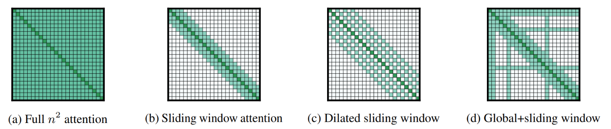

### RMSNorm
- normalization stabilizes training by preventing exploding/vanishing gradients
  - uniform scaling too restrictive: different features may need different magnitudes
  - $\gamma$ combines stability of normalization with per-dimension variation in magnitude
- $\gamma\in\mathbb R^D$ is learned per-dimension rescaling
  - normalization step forces the hidden state to have unit RMS, which destroys any learned scale information
- $\gamma$ gives the network back per-feature control over magnitude
  - $\gamma_i>1$ → amplify dimension $i$
  - $\gamma_i<1$ → suppress dimension $i$
  - $\gamma_i\approx 0$ → kill dimension $i$

### SwiGLU FFN
- both $\mathbf G$ and $\mathbf U$ contribute content
  - $\mathbf U$ provides one learned representation, and $\mathbf G$ provides another (self-gated by its own confidence)

### RoPE
- RoPE only rotates the query and key vectors, not the values
  - position information only needs to affect which tokens attend to each other, not what information gets passed
- for query vector $\mathbf q$ at position $m$ and key vector $\mathbf k$ at position $n$, we want dot product $\mathbf q\cdot\mathbf k$ to only depend on the *relative* position $m-n$
  - we want $f$ such that the dot product $\langle f(\mathbf q,m),f(\mathbf k, n)\rangle$ is a function $g$ that encodes information only in relative form, e.g.,
    $$
    \langle f(\mathbf q,m),f(\mathbf k, n)\rangle=g(\mathbf q,\mathbf k,n-m)
    $$

  - RoPE embeddings are one such solution with
    $$
    f(\mathbf x,m)=R_{m\theta}\mathbf x\\
    g(\mathbf q,\mathbf k,n-m)=\mathbf q^\top R_{(n-m)\theta}\mathbf k
    $$

    - proof
      $$
      \begin{align*}
      \langle R_{m\theta}\mathbf q,R_{n\theta}\mathbf k\rangle&=(R_{m\theta}\mathbf q)^\top R_{n\theta}\mathbf k\\
      &=\mathbf q^\top R_{m\theta}^\top R_{n\theta}\mathbf k\\
      &=\mathbf q^\top R_{-m\theta}R_{n\theta}\mathbf k
      &\text{because }R_\alpha^\top=R_{-\alpha}\\
      &=\mathbf q^\top R_{(n-m)\theta}\mathbf k&\text{because } R_\alpha R_\beta=R_{\alpha+\beta}
      \end{align*}
      $$

- inner product decays with increasing distance
- for 2D vector $\mathbf x=[x_1,x_2]$, rotation by angle $\theta$ is
  $$
  R_\theta=\begin{bmatrix}\cos\theta&-\sin\theta\\\sin\theta&\cos\theta\end{bmatrix}
  $$

  - for position $m$ and head dimension index $i$, we rotate by $m\theta_i$
    $$
    R_{m\theta}\mathbf x=\begin{bmatrix}
    x_1\cos(m\theta_i)-x_2\sin(m\theta_i)\\
    x_2\sin(m\theta_i)+x_2\cos(m\theta_i)\\
    \end{bmatrix}
    $$

- for $H$-dimensional embedding, we partition it into $H/2$ pairs and apply independent rotations to each pair with different frequencies
  - $\Theta$ is RoPE’s only hyperparameter, typically 10,000 (called `rotary_base` in HF)
    - defines the longest distance the model can natively distinguish
    - a full rotation is completed when $m\theta_i=2\pi$ ⇒ $m=\frac{d\pi}{\theta_i}$
      - the slowest (smallest) $\theta_i$ is $\Theta^{-1}$ → $m=d\pi\Theta$
      - so slowest pair completes a full circle over $2\pi\Theta$ positions
  - for each dimension pair $i$, $\theta_i$ is
    $$
    \theta_i=\Theta^{-2i/H}
    $$

    - this provides exponential spacing (same design choice as sinusoidal positional encodings from the original transformer)
      - log uniform spread of frequencies → covers scales effectively
    - low-frequency pairs (large $i$ → small $\theta_i$) rotate slowly → change very little between adjacent positions → encode long-range information
    - high-frequency pairs (small $i$ → large $\theta_i$) rotate quickly → adjacent positions differ a lot → enable local discrimination
- the full rotation matrix (for a single position) is block-diagonal, with each $2\times 2$ block handling one pair of dimensions
  $$
  \mathbf R_m=\begin{bmatrix}
  \ddots&&\\
  &\mathbf R_m^{(i)}&\\
  &&\ddots\\
  \end{bmatrix}
  $$

- we can reformulate this with complex numbers
  - treat each pair $[x_{2i},x_{2i+1}]$ as a complex number $z=x_{2i}+ix_{2i+1}$
  - rotation by angle $\theta$ is equivalent to multiplication by $e^{i\theta}$
    - Euler’s theorem: $e^{i\theta}=\cos\theta+i\sin\theta$
      $$
      \begin{align*}
      z e^{i\theta}&=(a+bi)(\cos\theta+i\sin\theta)&\text{Euler's Theorem}\\
      &=(a\cos\theta-b\sin\theta)+i(a\sin\theta+b\cos\theta)
      \end{align*}
      $$

    - this is equivalent to applying the rotation matrix in the complex plane
      $$
      \begin{bmatrix}\cos\theta&-\sin\theta\\\sin\theta&\cos\theta\end{bmatrix}\begin{bmatrix}a\\b\end{bmatrix}
      $$

- in practice rather than constructing the full rotation matrix, we do element-wise multiplications
  $$
  \begin{bmatrix} x_1\\x_2\end{bmatrix}\odot
  \begin{bmatrix}
  \cos(m\theta)\\
  \cos(m\theta)
  \end{bmatrix}+\begin{bmatrix} -x_2\\x_1\end{bmatrix}\odot
  \begin{bmatrix}\sin(m\theta)\\\sin(m\theta)\end{bmatrix}
  $$


---

## Inference
- **latency** is the time it takes to complete a single request, measured in seconds
- **throughput** is how many tokens (or requests) we can process per unit time across all requests, measured in tokens/second

### Batching & packing
- **traditional batching**: collect $N$ requests, process them together, wait for all to finish, then collect the next batch
  - if one sequence generates 500 tokens and another generates 10, the short one sits idle waiting
- **continuous batching**: as soon as one sequence finishes, you immediately slot a new request into its place without waiting for the whole batch
  - the batch is always full
- **selective batching**: cleverly mix sequences that are in prefill and generation phase
  - idea: prefill is compute-heavy whereas decode is memory-bound
- **sequence packing**: concatenate examples up to the max sequence length, using attention masks to prevent cross-contamination
- **token-budget batching**: batch examples into batches such that the total number of tokens in a batch (after padding to the max seqlen within that batch) does not exceed a certain budget
  - usually done in finetuning
  - this makes sense because GPU memory is determined by `batch_size x sequence_length`

### Speculative decoding
- **speculative decoding** exploits the fact that prefill is faster than generation
- generate $K$ tokens from draft model $q$
- evaluate those tokens with target model $p$
  - accept each draft token $x$ with probability
    $$
    \min\left(1,\frac{p(x)}{q(x)}\right)
    $$

    - if $p(x)>q(x)$, we definitely take it
  - if rejected, sample from adjusted distribution $\max(0, p(x)-q(x))$ after renormalization
    - starting at the first rejected token
  - one token is always sampled from the teacher since we get those next-token logits “for free” when scoring the draft tokens
- P(emitting token $x$) = P(draft $x$) * P(accept $x$) + P(sampled token rejected) * P(sample $x$)
  - case 1 (first term): $x$ is accepted from the draft
    $$
    q(x)\cdot\min\left(1,\frac{p(x)}{q(x)}\right)=\min(q(x),p(x))
    $$

  - case 2 (second term): $x$ is chosen after rejection
    - probability of drafting and rejecting a draft token $x'$:
      - 0 if $p(x')>q(x')$
      - otherwise
        $$
        q(x')\cdot\left(1-\frac{p(x')}{q(x')}\right)=q(x')-p(x')
        $$

    - so the total probability of rejection is
      $$
      \begin{align*}
      P(\text{rejection})&=\sum_{x'}\max(0,q(x')-p(x'))\\
      &=\sum_{x'}\max(0,p(x')-q(x'))
      \end{align*}
      $$

      - the second step follows bc both $p$ and $q$ sum to 1
    - when we reject, we sample from
      $$
      \frac{\max(0,p(x)-q(x))}{\sum_{x'}\max(0,p(x')-q(x'))}
      $$

    - so the probably of getting $x$ after rejection is
      $$
      \sum_{x'}\max(0,p(x')-q(x'))\cdot \frac{\max(0,p(x)-q(x))}{\sum_{x'}\max(0,p(x')-q(x'))}=\max(0,p(x)-q(x))
      $$

  - combining both cases
    $$
    \min(q(x),p(x))+\max(0,p(x)-q(x))=p(x)
    $$


### KV cache
- single-token forward pass with cache
  - cache should have dimension `(batch, num_heads, max_seq_len, head_dim)`
  - in practice we store the cache inside the self attention module with `self.kv_cache`

  ```python
  # Pre-allocate cache based on max_seq_len
  kv_cache = [
      {
          'k': torch.zeros(batch, num_heads, max_seq_len, head_dim, device='cuda', dtype=torch.float16),
          'v': torch.zeros(batch, num_heads, max_seq_len, head_dim, device='cuda', dtype=torch.float16),
      }
      for _ in range(num_layers)
  ]
  
  # For attention, use cache[:, :, :position+1, :] as keys/values
  
  def forward_with_cache(model, new_token, kv_cache, position):
      """
      Instead of processing full sequence, process just the new token
      and reuse cached K, V from previous positions.
      """
      # Embed just the new token
      x = model.embed(new_token)  # (batch, 1, d_model)
      
      for layer_idx, layer in enumerate(model.layers):
          q, k, v = layer.qkv_proj(x).chunk(3, dim=-1)
          
          # Update cache
          kv_cache[layer_idx]['k'][:, :, position, :] = k.squeeze(2)
          kv_cache[layer_idx]['v'][:, :, position, :] = v.squeeze(2)
          
          # Attend over all cached positions
          k_full = kv_cache[layer_idx]['k'][:, :, :position+1, :]
          v_full = kv_cache[layer_idx]['v'][:, :, :position+1, :]
          
          x = attention(q, k_full, v_full)
          x = layer.ffn(x)
      
      return model.lm_head(x)
  ```


#### Reducing KV cache size
**lower dimension of KV cache**

- in standard **multi-head attention** (MHA) transformer attention, KV cache scales as `num_layers × num_heads × seq_len × head_dim × 2 (K and V)`
- in **multi-query attention** (MQA), all heads share the same K and V, but each head has its own Q
  - KV cache shrinks by a factor of `num_heads`
  - inference is much faster and more memory-efficient
- in **group-query attention** (GQA), heads are divided into groups, each group shares K and V
  - middle ground between MHA and MQA
- MQA and GQA shares KV across heads, so we lose some representational capacity per head
- **multi-head latent attention** (MLA) introduced in DeepSeek v2
  - instead of keeping keys and values with shape `(seq_len, num_heads × head_dim)` in the KV cache, cache a smaller latent vector `(seq_len, latent_dim)`
  - then at each decoding step, project the latent KVs back up to full size
- MLA keeps a separate KV per head but compresses them into a shared latent space
  - adds some extra compute at inference time (the projection from latent to KV)
  - MLA not compatible with RoPE

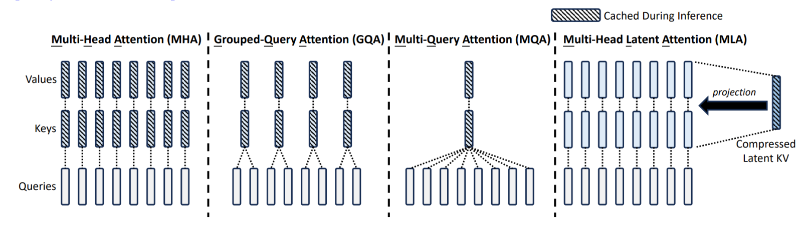

- **cross-layer attention** shares KV across layers

**local attention**

- standard attention is $O(n^2)$, using local attention makes KV cache independent of sequence length
  - once a token falls outside your window, you can just throw it away

### Sampling strategies
```python
def sample(logits, temperature=1.0, top_k=None, top_p=None):
    logits = logits / temperature
    
    if top_k is not None:
        values, indices = torch.topk(logits, top_k)
        logits = torch.full_like(logits, float('-inf'))
        logits.scatter_(-1, indices, values)
    
    if top_p is not None:
        sorted_logits, sorted_indices = torch.sort(logits, descending=True)
        cumulative_probs = torch.cumsum(F.softmax(sorted_logits, dim=-1), dim=-1)
        
        # Remove tokens with cumulative prob above threshold
        sorted_mask = cumulative_probs > top_p
        sorted_mask[..., 1:] = sorted_mask[..., :-1].clone()
        sorted_mask[..., 0] = False
        
        indices_to_remove = sorted_mask.scatter(-1, sorted_indices, sorted_mask)
        logits = logits.masked_fill(indices_to_remove, float('-inf'))
    
    probs = F.softmax(logits, dim=-1)
    return torch.multinomial(probs, num_samples=1)
```

### Flash Attention
- standard attention
  - the memory problem is that `attn_weights` is `(batch, num_heads, seq_len, seq_len)`
    - with `seq_len` = 8192 and 32 heads in FP16, that's 8192² × 32 × 2 bytes ≈ 4GB

  ```python
  import torch
  import torch.nn.functional as F
  import math
  
  def standard_attention(q, k, v):
      # q, k, v are all (batch, num_heads, seq_len, head_dim)
      
      scale = math.sqrt(q.size(-1))
      
      # Materialize full N×N attention matrix
      attn_weights = torch.matmul(q, k.transpose(-2, -1)) / scale  # (batch, num_heads, seq_len, seq_len)
      attn_weights = F.softmax(attn_weights, dim=-1)
      
      output = torch.matmul(attn_weights, v)  # (batch, num_heads, seq_len, head_dim)
      return output
  ```

  - why standard attention is memory bound: the $N\times N$ attention matrix is written to HBM, read back (to compute softmax), written again, read again (to actually use)
- **flash attention** computes attention in blocks using online softmax trick, keeping intermediate results in fast SRAM rather than writing the full attention matrix to GPU main memory
  - reduces activation memory for attention from $O(n^2)$ to $O(n)$
  - faster because memory bandwidth isn’t the bottleneck
  - enable at inference time with `model.to_bettertransformer()` or `attn_implementation="flash_attention_2"` in `from_pretrained()`

  ```python
  def flash_attention(q, k, v):
      # Same input shapes: (batch, num_heads, seq_len, head_dim)
      
      # PyTorch picks the best backend automatically (Flash Attention, memory-efficient, or math)
      output = F.scaled_dot_product_attention(q, k, v, is_causal=True)
      return output
  ```

- FlashAttention never materializes the full $N\times N$ matrix, and instead computes attention in tiles small enough to fit in SRAM
- conceptually
  1. load a block of $Q$ (say, 64 rows)
  2. load a block of K and V (say, 64 columns)
  3. compute that tile of attention scores, apply softmax, multiply by V — all in SRAM
  4. write only the final output to HBM
  5. repeat for all tiles
- since every (batch, head) combination is completely independent, you have `batch × num_heads` parallel workers working on each `m  × head_dim` tile of Q, K, V where `m` is the tile size
- *Flash Attention is an exact, not approximate, method*
- how to use Flash Attention
  - `is_causal=True` flag is fused into the kernel efficiently rather than materializing a mask matrix

  ```python
  def flash_attention(q, k, v):
      # Same input shapes: (batch, num_heads, seq_len, head_dim)
      
      # PyTorch picks the best backend automatically (Flash Attention, memory-efficient, or math)
      output = F.scaled_dot_product_attention(q, k, v, is_causal=True)
      return output
  ```


---

## Scaling laws
- maximal update parameterization ($\mu P$)
  - core problem: hyperparameters found at small scale don’t generalize to larger scale
  - standard parameterization → different layers have updates of inconsistent magnitudes as width changes
  - $\mu P$ adjusts initialization and learning rates per-layer so that the *magnitude *of updates relative to weights stays constant across widths
  - primarily adjusts width scaling
- fit learning rate to compute
  $$
  \text{LR}(C)=\beta C^{-\alpha}\implies\log\text{LR}(C)=\log\beta-\alpha\log C
  $$

- fit loss to compute
  - we need irreducible loss term $\mathcal L_\infty$ (entropy of the data) because otherwise, as $C\to\infty$, $\mathcal L\to 0$

  $$
  \mathcal L(C)=\mathcal L_\infty+\beta C^{-\alpha}\implies \log(\mathcal L(C)-\mathcal L_\infty)=\log\beta-\alpha\log C
  $$

- how do we fit the equation? using least squares
  - least squares is the objective of minimizing the squared residuals
    - ordinary (or linear) least squares and non-linear least squares
  - linear least-squares has a closed-form solution
    - for $y=X\beta$, the closed-form solution is $\beta=(X^\top X)^{-1}X^\top y$
  - non-linear least-squares is solved by iterative refinement
    $$
    S=\sum_i(y_i-f(x_i))^2
    $$


---

## GPUs
- **high bandwidth memory** (HBM) is the main GPU memory
  - slow memory from the GPU’s perspective
  - either 40GB or 80GB for an A100
- **static RAM** (SRAM) is the small, fast, on-chip memory
  - ~20MB total on an A100

---

## Other architectures
### RNNs
#### Vanilla RNN
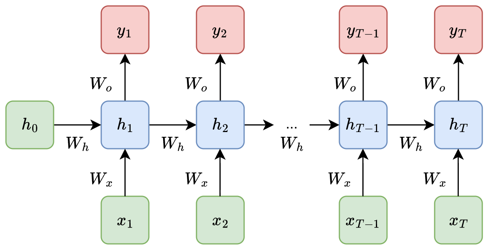

- at each step $t$, process $x\in\mathbb R^D$ and previous hidden state $h_{t-1}\in\mathbb R^H$ to produce the next hidden state $h_t$ ($D$ is input size, $H$ is hidden size)continuous
  - weight matrices $W_x\in\mathbb R^{H\times D}$, $W_h\in\mathbb R^{H\times H}$

  $$
  h_t=\tanh(W_{x}x_t+W_{h}h_{t-1}+b)\\
  y_t=W_\text{out} h_t+b_\text{out}
  $$

  - weights shared across time steps
- the reason behind vanishing gradients
  - let $z_t=W_xx_t+W_hh_{t-1}+b$

  $$
  \frac{\partial h_t}{\partial h_{t-1}}=\operatorname{diag}(\tanh'(z_t)) W_h
  $$

  - $\tanh^\prime$ only shrinks, since $\tanh^\prime\in(0,1]$
  - repeated applications of $W$ either leads to vanishing or exploring gradients

#### LSTM
- LSTM uses cell state $c_t$ with forget, input, output gates
  - inputs at each step: previous hidden state $h_{t-1}$, previous cell state $c_{t-1}$, current input $x_t$
  - **forget gate**: what to erase from cell state

  $$
  f_t=\sigma(W_f\cdot [h_{t-1}, x_t]+b_f)
  $$

  - **input gate**: what new information to write
    $$
    i_t=\sigma(W_i\cdot[h_{t-1},x_t]+b_i)
    $$

  - cell state
    $$
    \tilde c_t=\tanh(W_c\cdot[h_{t-1},x_t]+b_c)
    $$

  - cell state update: forget some information from the old cell state $c_{t-1}$, and add some information from the new cell state $\tilde c_t$
    $$
    c_t=f_t\odot c_{t-1}+i_t\odot\tilde c_t
    $$

  - **output gate**: what to expose as the new hidden state
    $$
    o_t=\sigma(W_o\cdot[h_{t-1},x_t]+b_o)
    $$

  - new hidden state
    $$
    h_t=o_t\odot\tanh(c_t)
    $$

- as long as $f_t$ stays near 1, gradients can travel backwards many timesteps without vanishing
- cell state is memory, hidden state is working output
  - flows along the highway, touching only elementwise multiplications & additions, no  matmuls or non-linearities
  - information added or removed only through gates
- hidden state $h_t=o_t\cdot \tanh(c_t)$ is a filtered view of the cell state
  - plays two roles
    - cell’s output to the outside
    - cell’s query into itself on the next step, because gates at $t+1$ are computed from $h_t$ (not $c_t$)
- separation of cell state and hidden state is what makes LSTMs work
  - RNN tries to make a single vector serve as both long-term memory and current output
- GRU is a simplified version with two gates, reset and update

#### vs. transformers
- gradients from a *distant *time step can’t influence an *earlier* time step’s processing
- RNNs vs transformers
  - attention gives direct / $O(1)$ path between any two tokens, doesn’t depend on the distance between tokens
    - each token directly looks at every other token
    - whereas in an RNN, information from token 1 has to survive through all the intermediate hidden states to reach token 100
    - helps long-range dependencies
  - attention computes all pairwise relationships at once

### State space models
- equation underlying SSMs
  - $u_k$ is a 1D input signal
  - $x_k$ is an $N$-D latent state

  $$
  x_k=A x_{k-1}+B u_k
  $$

- SSMs are $O(n)$ and parallel during training, then $O(1)$ and sequential during inference
  - in contrast, transformers are parallel but have $O(n^2)$ attention, and RNNs are $O(n)$ but sequential
- Mamba makes $B$, $C$, and $\Delta$ functions of the input
  $$
  B_k=f_B(u_k)\\
  C_k=f_C(u_k)\\
  \Delta_k=f_\Delta(u_k)
  $$

  - selectively incorporate information via $B$
  - selectively read from state via $C$
  - control the timescale via $\Delta$

---

## Post-training
### policy gradients
- notation
  - action $a_t\in\mathcal V$: next-token at time step $t$
  - state $s_t$: text prefix $(s_0,a_0,…,a_{t-1})$ at time step $t$
  - $a_t\sim\pi_\theta(\cdot\mid s_t)$: LM policy
  - $s_0\sim p_0$: prompt $s_0$ sampled from start distribution over prompts
  - $\tau$: trajectory (finite-horizon), aka rollout, episode
  - $R(\tau)$: reward from trajectory $\tau$
- goal
  $$
  \text{maximize }J(\theta)=\mathbb E_{\tau\sim\pi_\theta} [R(\tau)]
  $$

- we can do this via gradient ascent
  $$
  \theta_{k+1}=\theta_k+\alpha\nabla_\theta J(\theta_k)
  $$

- **vanilla policy gradient** (aka **REINFORCE**): the gradient of the objective can be written as
  $$
  \nabla_\theta J(\theta)=\mathbb E_{\tau\sim\pi_\theta}\left[\sum_t\nabla_\theta\log\pi_\theta(a_t\mid s_t) R(\tau)\right]
  $$

  - this is basically the same update as SFT but data $\tau$ is sampled from the policy and the gradient is weighted by $R(\tau)$
    - if $R(\tau)$ is positive, we go in the direction of increasing $\log\pi_\theta(a_t\mid s_t)$ for each token $a_t$ in $\tau$
      - otherwise, we go in the opposite direction
    - the larger the magnitude of $R(\tau)$ is, the bigger the step we take
  - derivation of the gradient
    $$
    \begin{align*}
    \nabla_\theta J(\theta)&=\nabla_\theta\mathbb E_{\tau\sim\pi_\theta} [R(\tau)]\\
    &=\nabla_\theta\sum_\tau P(\tau\mid\theta)\,R(\tau)\\
    &=\sum_\tau\nabla_\theta P(\tau\mid\theta)\,R(\tau)\\
    &=\sum_\tau P(\tau\mid\theta)\nabla_\theta\log P(\tau\mid\theta)\,R(\tau)&\text{the log derivative trick: }\nabla P=P\,\nabla \log P\\
    &=\mathbb E_{\tau\sim\pi_\theta}\nabla_\theta\log P(\tau\mid\theta)\,R(\tau)\\
    &=\mathbb E_{\tau\sim\pi_\theta}\sum_t\nabla_\theta\log\pi_\theta(a_t\mid s_t)\, R(\tau)
    \end{align*}
    $$

- in practice, we estimate $\nabla_\theta J(\theta)$ by sampling a batch of $N$ rollouts $\tau^{(i)}$ from policy $\pi_\theta$ from starting state $s_0^{(i)}\sim p_0$
  $$
  \hat g=\frac 1N\sum_{i=1}^N\sum_{t=1}^T\nabla_\theta\log\pi_\theta(a_t^{(i)}\mid s_t^{(i)})(R(\tau^{(i)}))
  $$

- so-called policy gradient loss is just a scalar `pg_loss` such that `pg_loss.backward()` produces gradients equivalent to the approximate policy gradient $\hat g$
  $$
  L(\theta)=\frac 1N\sum_{i=1}^N\sum_{t=1}^T\log\pi_\theta(a_t^{(i)}\mid s_t^{(i)})(R(\tau^{(i)}))
  $$

  - it is not a loss in the canonical sense: $L(\theta)$ doesn’t tell us how good our policy is, it’s just a device for producing the correct gradient
  - there is no fixed objective since it’s constructed from data sampled under the current policy

**baselined policy gradient**

- the problem with the vanilla policy gradient is that it is a very high-variance estimate
  - suppose that we have an easy prompt, so all responses get a positive reward
    - without a baseline all responses get reinforced, including the bad ones in the batch!
      - on average over training this is okay, but it leads to very noisy updates
    - if we (for example) use the *average* reward as a baseline, then below-average responses don’t get reinforced
- **baselined policy gradient**: subtract a baseline function $b(s_t)$ from $R(\tau)$ in the gradient estimate
  $$
  \nabla_\theta J(\theta)=\mathbb E_{\tau\sim\pi_\theta}\left[\sum_{t=0}^T\nabla_\theta\log\pi_\theta(a_t\mid s_t) (R(\tau)-b(s_t))\right]
  $$

  - as long as $b(s_t)$ is a function of only the state $s_t$ (and not $a_t$), it won’t introduce bias to the estimate of $\nabla J(\theta)$
  - we want $b(s_t)$ to be correlated with $R(\tau)$, so that $R(\tau)-b(s_t)$ is small → less noisy gradients
  - this doesn’t change the objective we’re optimizing, only how we estimate the gradient of the objective
- why is the baselined policy gradient an unbiased estimate of the policy gradients?
  - we will show that the baseline term $B$ has an expected value of 0

  $$
  B=\mathbb E_{\tau\sim\pi_\theta}\left[\sum_{t=0}^T\nabla_\theta\log\pi_\theta(a_t\mid s_t)b(s_t)\right]
  $$

  - let $X_t=\nabla_\theta\log\pi_\theta(a_t\mid s_t)b(s_t)$, so we rewrite
    $$
    B=\mathbb E_{\tau\sim\pi_\theta}\sum_{t=0}^T X_t
    $$

  - first move the expectation inside the sum
    $$
    B=\sum_{t=0}^T\mathbb E_{\tau\sim\pi_\theta} X_t
    $$

    - before: for each trajectory, sum the $X_t$’s over time steps $t$, then average over sampled trajectories
    - now: for each time step $t$, average $X_t$ over sampled trajectories, then sum those averages
  - averaging $X_t$ over full trajectories is the same as average $X_t$ over just $(s_t,a_t)$, because $X_t$ depends on only $(s_t,a_t)$ (the rest of the trajectory doesn’t matter for $X_t$)
    - then we factor the joint expectation over $(s_t,a_t)$ into expectation over $a_t$ given $s_t$ in expectation over $s_t$

    $$
    B=\sum_{t=0}^T\mathbb E_{s_t,a_t} X_t=\sum_{t=0}^T\mathbb E_{s_t}\left[\mathbb E_{a_t\mid s_t} X_t\right]
    $$

  - now we use the definition of $X_t$
    $$
    \begin{align*}
    \mathbb E_{a_t\mid s_t} X_t&=\mathbb E_{a_t\mid s_t}\nabla_\theta\log\pi_\theta (a_t\mid s_t)\,b(s_t)\\
    &= b(s_t)\,\mathbb E_{a_t\mid s_t}\nabla_\theta\log\pi_\theta (a_t\mid s_t)&\text{because }b\text{ doesn't depend on }a_t\text{!}\\
    &= b(s_t)\,\sum_{a_t}\pi_\theta(a_t\mid s_t)\nabla_\theta\log\pi_\theta(a_t\mid s_t)\\
    &= b(s_t)\,\sum_{a_t}\nabla_\theta\pi_\theta(a_t\mid s_t)&\text{the log derivative trick again}\\
    &=b(s_t)\nabla_\theta\sum_{a_t}\pi_\theta(a_t\mid s_t)\\
    &= b(s_t)\nabla_\theta 1&\text{sum of probabilities of all actions is 1}\\
    &= b(s_t)\cdot 0\\
    &= 0
    \end{align*}
    $$

    - note that we can only pull $b(s_t)$ out of the expectation over $a_t\mid s_t$ because $b$ only depends on $s_t$, which allows us to use the fact that $\sum_a\pi(a\mid s_t)=0$
  - plugging this back in, we get
    $$
    B=\sum_{t=0}^T\mathbb E_{s_t}[0]=0
    $$

- a very common choice for the baseline function (used by PPO) is $V_\psi(s_t)$, which estimates the *expected* reward given the partial sequence $s_t$
  $$
  \nabla_\theta J(\theta)=\mathbb E_{\tau\sim\pi_\theta}\left[\sum_{t=0}^T\nabla_\theta\log\pi_\theta(a_t\mid s_t) (R(\tau)-V_\psi(s_t))\right]
  $$

  - this is unbiased because $V_\psi$ depends only on the state
  - the signal for each token: did the final reward exceed or fall short of what looked likely at this point in the generation?
    - a token that turns a bad-looking response (small $V_\psi(s_t)$) into a good one (high $R(\tau)$) gets more credit
  - connection to advantage
    - $R(\tau)$ is a single sample of the **Q function** $Q^\pi(s_t,a_t)$ (the expected reward following policy $\pi$ given this action and state)
    - $V_\psi(s_t)$ is an estimate of the **value function** $V^\pi(s_t)$ (the expected reward given just this state, $V^\pi(s)=\sum_{a\sim\pi(\cdot\mid s)}Q^\pi(s,a)$)
    - so $R(\tau)-V_\psi(s_t)$ is an estimate of $Q^\pi(s,a)-V^\pi(s)=A^\pi(s,a)$, the **advantage function**, i.e., how much better action $a$ is than expected from state $s$
      - in particular, it’s a **Monte Carlo estimate** of the advantage as it uses a single sample $\tau$’s reward $R(\tau)$ to estimate $Q^\pi$
- baseline functions generally all try to estimate $\mathcal V^\pi(s_t)$, the expected return from the current state
  - learned value function [above]
  - RLOO: sample $G$ responses per prompt, the baseline for a prompt is the average of the *other *rewards (very similar to GRPO except for the inclusion of $i$ and the normalization by std)
  - batch estimate (REINFORCE++): use the mean reward in the batch

**off-policy policy gradient**

- the problem with on-policy policy gradient is that we need to do inference from the policy for every gradient step, even though the policy is probably not changing that much
- in off-policy learning, we sample rollouts from a policy different from the one we are optimizing
  - generally use rollouts from a previous version of the policy $\pi_{\theta_\text{old}}$ to optimize the current policy $\pi_\theta$
- use a **surrogate objective** $\mathcal J^\text{surrogate}$
  $$
  \mathcal J^\text{surrogate}(\theta)=\mathbb E_{\tau\sim\pi_{\theta_\text{old}}}\left[\sum_{t=1}^T\underbrace{\frac{\pi_\theta(a_t\mid s_t)}{\pi_{\theta_\text{old}}(a_t\mid s_t)}}_{r_t}\, R(\tau)\right]
  $$

  - the fraction $r_t=\pi_\theta/\pi_{\theta_\text{old}}$ is a reweighting term in the style of importance sampling
    - background on importance sampling: if we want $\mathbb E_{x\sim p} f(x)$ but only have samples $x\sim q$, then we can rewrite
      $$
      \mathbb E_{x\sim p}\,f(x)=\mathbb E_{x\sim q}\,\left[\frac{p(x)}{q(x)}f(x)\right]
      $$

      - intuitively, if $x$ more likely under $p$ than under $q$, then that sample counts more, and vice versa
  - note that this optimizes a different objective from the original $\mathcal J(\theta)$!
  - the *true* off-policy estimate just rewrites $\mathcal J(\theta)$ with importance sampling, but it has terrible variance because of the product of ratios
    $$
    \mathcal J(\theta)=\mathbb E_{\tau\sim\pi_{\theta_\text{old}}}\left[\frac{P(\tau\mid\theta)}{P(\tau\mid\theta_\text{old})}\,R(\tau)\right]=\mathbb E_{\tau\sim\pi_{\theta_\text{old}}}\left[\prod_{t=1}^T\frac{\pi_\theta(a_t\mid s_t)}{\pi_{\theta_\text{old}}(a_t\mid s_t)}\,R(\tau)\right]
    $$

    - $\mathcal J^\text{surrogate}$ essentially replaces the product with a sum of per-timestep terms
- $\mathcal J^\text{surrogate}$ leads to the following **off-policy policy gradient**
  $$
  \nabla_\theta \mathcal J^\text{surrogate}(\theta)=\mathbb E_{\tau\sim\pi_{\theta_\text{old}}}\left[\sum_t\frac{\pi_\theta(a_t\mid s_t)}{\pi_{\theta_\text{old}}(a_t\mid s_t)}\,\nabla_\theta\log\pi_\theta(a_t\mid s_t)\, R(\tau)\right]
  $$

  - to see why this is true, note that only the numerator of $r_t$ depends on $\theta$, then apply log derivative trick
  - in practice we estimate it via where $N$ = number of rollouts per batch

  $$
  \hat g_\text{off-policy}=\frac 1N\sum_{i=1}^N\sum_{t=1}^T\frac{\pi_\theta(a_t^{(i)}\mid s_t^{(i)})}{\pi_{\theta_\text{old}}(a_t^{(i)}\mid s_t^{(i)})}\nabla_\theta\log\pi_\theta(a_t^{(i)}\mid s_t^{(i)})R(\tau^{(i)})
  $$


### PPO
- introduced the clipping mechanism for importance weights $r_t=\frac{\pi_\theta(a_t\mid s_t)}{\pi_{\theta_\text{old}}(a_t\mid s_t)}$
  - the regular surrogate objective is
    $$
    \mathcal J^\text{surrogate}(\theta)=\mathbb E_{\tau\sim\pi_{\theta_\text{old}}}\left[\sum_tr_tA_t\right]
    $$

    - PPO uses the value function as the baseline, so following convention we replace $R(\tau)$ in the policy gradient with the per-timestep advantage $A_t=R(\tau)-V_\psi(s_t)$
  - the **clipped surrogate objective** clips $r_t$ to stay within $[1-\epsilon,1+\epsilon]$

  $$
  \mathcal J^\text{CLIP}(\theta)=\mathbb E_{\tau\sim\pi_{\theta_\text{old}}}\left[\sum_t\min(r_tA_t,\text{clip}(r_t,1-\epsilon,1+\epsilon)A_t)\right]
  $$

- clipping maintains stability when taking many gradient steps on a single batch of rollouts
  - gives up unbiasedness in exchange for more stable update
  - the clipped objective is a good approximation as long as you haven’t moved too far from $\pi_{\theta_\text{old}}$
- the four cases where clipping is used
  - when $r_t>1+\epsilon$ and $A_t>0$, we use $(1+\epsilon)A_t$
    - $\nabla\mathcal J(\theta)$ doesn’t depend on $\theta$ → gradient is 0
    - we’ve already increased the probability of $a_t$ substantially relative to the old policy — stop pushing a good action further
  - when $r_t<1-\epsilon$ and $A_t<0$, we use $(1-\epsilon)A_t$
    - gradient is also 0
    - stop pushing a bad action further down
  - when $r_t>1+\epsilon$ and $A_t<0$, we use $r_tA_t$
    - $\nabla\mathcal J(\theta)$ does depend on $\theta$ [see off-policy policy gradient]
    - note that this means $r_t$ is allowed to be $>1+\epsilon$ — this makes sense because $A<0$ so it is a bad token, so we let the token get pushed down
    - clipping is asymmetrical: it only activates when the policy is already moving in the direction the advantage encourages, but doesn’t prevent you from correcting a mistake
  - when $r_t<1-\epsilon$ and $A_t>0$, we use $r_tA_t$
    - $\nabla\mathcal J(\theta)$ does depend on $\theta$ [see off-policy policy gradient]
- PPO collects a batch of trajectories from the current policy, then takes multiple gradient steps using the clipped surrogate objective

### RLHF
- introduces a KL penalty to prevent $\pi_\theta$ from drifting too far from $\pi_\text{ref}$
  $$
  \mathcal J^\text{RLHF}(\theta)=\mathbb E_{\tau\sim\pi_\theta}\left[R(\tau)-\beta D_{\text{KL}}(\pi_\theta\mid\mid\pi_\text{ref})\right]
  $$

- in practice, the KL penalty is computed per-token and folded into the per-token reward
- how reward models are trained
  - Bradley-Terry model says that the probability that $y_w$ is preferred over $y_l$ is
    $$
    P(y_w\succ y_l)=\frac{\exp(R(x,y_w))}{\exp(R(x,y_w))+\exp(R(x,y_l))}=\sigma(R(x,y_w)-R(x,y_l))
    $$

  - train LM with classification head to maximize
    $$
    \mathcal L(\varphi)=-\log P(y_w\succ y_l)
    $$

    - this is just the binary cross-entropy loss $-(y\log p+(1-y)\log(1-p))$ with true label always $y=1$ and $p=P(y_w\succ y_l)$ under Bradley-Terrey

### GRPO
- GRPO replaces the reward $R(\tau)$ with the advantage of $\tau$ relative to a group of sampled trajectories
  - note: it doesn’t cleanly count as a baseline choice because it also divides $R(\tau)-b(s_t)$ by a normalization factor
  - for a set of rollouts $\{o^{(i)}\}_{i=1}^G$ for question $q$, each consisting of tokens $o^{(i)}_1,…,o^{(i)}_T$
    - compute rewards $\mathbf r = \{r^{(i)}\}_{i=1}^G$ for each sampled output using $R(q,o^{(i)})$
    - the group-relative advantage estimate $A^{(i)}$ is
      $$
      A^{(i)}=\frac{r^{(i)}-\text{mean}(\mathbf r)}{\text{std}(\mathbf r)}
      $$

      - the advantage $A^{(i)}$ is the same for every token in the response
  - the objective is
    $$
    \mathcal J^\text{GRPO-CLIP}(\theta)=\frac 1G\sum_{i=1}^G\frac 1T\sum_{t=1}^T\min\left(r_tA^{(i)},\operatorname{clip}(r_t,1-\epsilon,1+\epsilon)A^{(i)}\right)
    $$

    - where $r_t$ is the same per-token probability ratio (convention here is to use $o_t$ instead of $a_t$)
      $$
      r_t=\frac{\pi_\theta(o_t\mid s_t)}{\pi_{\theta_\text{old}}(o_t\mid s_t)}
      $$

  - simplifies PPO by removing the need for a critic (value function) by computing advantages relative to a group of samples
- GRPO combines three ideas
  - off-policy policy gradient using $\pi_{\theta_\text{old}}$: $\mathcal J^\text{surrogate}(\theta)=\mathbb E_{\tau\sim\pi_{\theta_\text{old}}}\left[\sum_tr_tR(\tau)\right]$
  - the clipping mechanism [PPO]: $\mathcal J^\text{CLIP}(\theta)=\mathbb E_{\tau\sim\pi_{\theta_\text{old}}}\left[\sum_t\min(r_t R(\tau),\text{clip}(r_t,1-\epsilon,1+\epsilon)R(\tau))\right]$
  - computing advantages $A^{(i)}$ with group normalization [DeepSeek R1]: $\mathcal J^\text{GRPO-CLIP}(\theta)=\frac 1G\sum_{i=1}^G\frac 1T\sum_{t=1}^T\min\left(r_tA^{(i)},\operatorname{clip}(r_t,1-\epsilon,1+\epsilon)A^{(i)}\right)$
- algorithm
  - policy model $\pi_\theta\leftarrow\pi_{\theta_\text{init}}$
  - for each step (`n_grpo_steps`)
    - sample a batch $\mathcal D_b$ from $\mathcal D$
    - update the old policy model $\pi_{\theta_\text{old}}\leftarrow\pi_\theta$
    - sample $G$ outputs $\{o^{(i)}\}_{i=1}^G\sim\pi_{\theta_\text{old}}(\cdot\mid q)$ for each question $q\in\mathcal D_b$
    - compute rewards $\{r^{(i)}\}_{i=1}^G$ for each sampled output using $R(q,o^{(i)})$
    - compute $A^{(i)}$ through group-relative advantage estimation
    - for each train step (`n_train_steps_per_rollout_batch`)
      - update the policy model $\pi_\theta$ by maximizing the GRPO objective
  - update $r_\varphi$ through continuous training using a replay mechanism
- GRPO effectively computes an empirical baseline instead of a learned one
  - instead of learning to predict expected reward, just measure it by sampling
  - uses more compute ($G$ completions per prompt) but less memory (no need to store value network)
- Dr. GRPO fixes two problems with GRPO
  - in GRPO when $\text{std}(\mathbf r)$ is small (question is too easy or too hard), reward is amplified → more important to optimize that group
    - bias that upweighs problems that are too easy or too hard
  - in GRPO, reward is normalized by rollout length $\frac{1}{\lvert o_i\rvert}$
    - among correct responses, short length → larger gradient → reinforced more strongly
    - among incorrect responses, long length → smaller gradient → under-penalized
      - model learns that if it can’t get an answer right, then just produce a really long answer

### DPO
- the KL-regularized objective $\mathcal J^\text{RLHF}$ has a closed-form optimal solution
  $$
  \pi^*(y\mid x)=\frac{1}{Z(x)}\pi_\text{ref}(y\mid x)\exp\left(\frac1\beta R(y)\right)
  $$

  - rearranging
    $$
    R(y)=\beta\log\frac{\pi^*(y\mid x)}{\pi_\text{ref}(y\mid x)}+\beta\log Z(x)
    $$

- DPO loss is just the negative log likelihood of the observed preferences
  $$
  \mathcal L^\text{DPO}(\theta)=-\mathbb E_{(x,y_w,y_l)}\left[\log\sigma\left(\beta\log\frac{\pi_\theta(y_w\mid x)}{\pi_\text{ref}(y_w\mid x)}-\beta\log\frac{\pi_\theta(y_l\mid x)}{\pi_\text{ref}(y_l\mid x)}\right)\right]
  $$


## Precision
- **mixed precision** training
  - master weights in FP32
  - BF16 copy of weights for forward/backward pass
  - activations computed in BF16
  - gradients computed in BF16 and accumulated into FP32
    - this avoids the problem of adding a small gradient to a large weight
    - BF16 has more precision near 0, so it can represent a small gradient of 0.0001 but not the updated weight of 1.0001
    - we just need accumulated gradients to land in FP32, individual gradients are often tiny compared to the weight
    - `.grad` on each parameter lives in the same dtype as the parameter, so individual grads are cast to FP32
- intuition
  - matmuls are tolerant of rounding noise, so BF16 for forward/backward is fine
  - master weights in FP32 necessary because individual grads are tiny
- activations are harder to quantize than weights
- precision options
  - FP32: full precision (4 bytes)
  - FP16: half the memory (2 bytes)
  - BF16: same memory as FP16 but better numerical stability (larger dynamic range)
  - INT8: quarter the memory of FP32, requires quantization (1 byte)
  - INT4: even smaller
- data loading
  - `memmap` avoids loading the entire data into memory at once
- load model in BF16
  - when using HF `.from_pretrained()` to load model
    - `torch_dtype=torch.bfloat16` for BF16, recommended choice
      - weights and activations both in BF16
    - `load_in_8bit=True` for quantization, uses `LLM.int8()`
      - weights in INT8, activations in FP16
      - provides memory savings via weight compression
      - not the same as full INT8 compute due to activations being in higher precision
  - `model.half()` or `model.to(torch.bfloat16)` converts a model to FP16
    ```python
    model = MyModel()
    model.load_state_dict(torch.load('model.pt'))
    model = model.half()
    ```

  - all weights in BF16 and operations run in BF16
  - in practice, running everything in BF16 is fine for inference
- `torch.autocast()` does automatic mixed precision
  - weights stay in FP32, operations selectively use BF16 or FP32
    - manages precision for each operation, but doesn’t manage master weights
    - more memory than loading entire model in BF16 but potentially more stable
  - matmul in FP16 (tolerates lower precision), softmax in FP32 (needs precision for numerical stability), layernorm in FP32 (reductions need precision)
  - useful when model is in FP32 and we can’t easily convert it, or we see numerical issues with pure BF16
  - `dtype` specifies the “lower precision” type

  ```python
  with torch.autocast(device_type='cuda', dtype=torch.bfloat16):
      output = model(x)
  ```

- to use `bitsandbytes`, replace `nn.Linear` with `bnb.nn.Linear8bitLt` or `bnb.nn.Linear4bit`
  ```python
  def replace_linear_with_8bit(model):
      """Replace all nn.Linear with bnb.nn.Linear8bitLt"""
      for name, child in model.named_children():
          if isinstance(child, nn.Linear):
              # Create quantized replacement
              new_layer = bnb.nn.Linear8bitLt(
                  child.in_features,
                  child.out_features,
                  bias=child.bias is not None,
                  has_fp16_weights=False,
              )
              # Copy weights (they'll be quantized when moved to CUDA)
              new_layer.weight = bnb.nn.Int8Params(
                  child.weight.data,
                  requires_grad=False,
              )
              if child.bias is not None:
                  new_layer.bias = nn.Parameter(child.bias.data)
              
              setattr(model, name, new_layer)
          else:
              # Recurse into child modules
              replace_linear_with_8bit(child)
      
      return model
  
  # Usage
  model = MyTransformer()
  model.load_state_dict(torch.load('model.pt'))
  model = replace_linear_with_8bit(model)
  model = model.to('cuda')  # quantization happens here
  ```


## Parallelism
- **data parallelism** splits up the batch across devices, whereas **model parallelism** splits up the computation for a single forward pass across devices
  - FSDP shards parameters across ranks for memory efficiency, but every rank still computes the full forward pass by all-gathering parameters right before they’re needed
- limitations of data parallelism
  - requires $M<B$, which is not necessarily good because we don’t want $B$ to be larger than the “critical batch size”
  - models still may not fit on one device (even ZeRO stage 3 doesn’t reduce the activation memory per device)
- **strong scaling**: increasing the number of chips for training leads to proportional increase in throughput (FLOPs/second)
- DP scales throughput, TP/PP scale model memory, SP scales activation memory
- 5D parallelism
  - **data parallelism** (DP): split batch of data across devices
  - **tensor parallelism** (TP): split different layers/stages of the model across devices
  - **pipeline parallelism** (TP): split individual layers/weight matrices across devices
  - **sequence parallelism** (SP): split the input sequence length across devices
  - **expert parallelism** (EP): distribute different experts in a MoE model across devices

### Background: core collective operations
- **broadcast** (one to all, same data): one GPU has the data and sends an identical copy to every other GPU
- **all-gather** (all to all): each GPU has a piece of data, every GPU gets full collection
  - *removes* sharding along an axis
    $$
    \operatorname{AllGather}_Y:\mathbf A[I,J_Y]\rightarrow \mathbf A[I,J]
    $$

- **reduce-scatter**: each GPU has unreduced data, combine via reduction, result sharded across GPUs
  - very similar to all-gather but instead of retaining each shard, we sum them together
  - *adds* sharding along an axis

  $$
  \operatorname{ReduceScatter}_{Y,J}:\mathbf A[I,J]\{U_Y\}\rightarrow \mathbf A[I,J_Y]
  $$

- **all-reduce**: every GPU has unreduced data, combine via reduction, every GPU gets final result
  $$
  \operatorname{AllReduce}_Y\mathbf A[I,J]\{U_Y\}\rightarrow A[I, J]
  $$


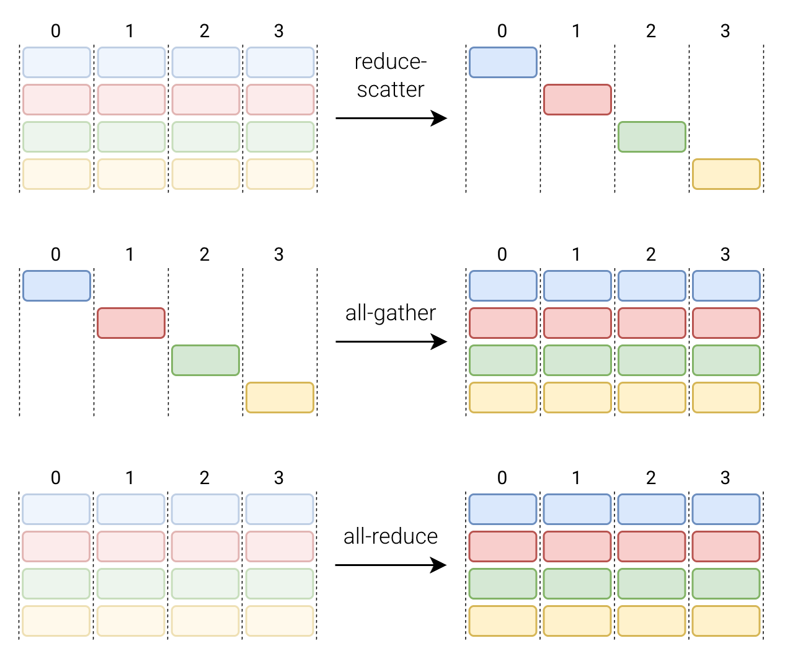

- ring all-reduce: reduce-scatter + all-gather (each process communicates with two neighbors) [[animation](https://www.youtube.com/watch?v=CQ-cOykh0sY)]
  - at the beginning, each GPU has unreduced data
  - reduce-scatter: combine the data via reduction, each GPU has a reduced subset
    - does all the arithmetic, none of the redundant copying
  - all-gather: every GPU gets the full collection of reduced subsets
    - does all the copying, none of the arithmetic
- for all-gather, reduce-scatter and all-reduce, the communication time depends only on the size of the array and the bandwidth, *not *the number of devices over which our array is sharded!
- reduce-scatter and all-gather are used in each other’s backward pass
  - all-gather in the forward → reduce-scatter in the backward
    - all-gather broadcasts the same chunk to every device, where they participate in different downstream computations
    - upstream gradients sum at outward branches (if $x=a+b$, then $\partial f/\partial x=\partial f/\partial a \cdot\partial a/\partial x + \partial f/\partial a\cdot \partial a/\partial x$)
    - this is exactly a reduce-scatter: sum all upstream gradients onto device where it came from
    - fan-out in the forward → sum in the backward
  - reduce-scatter in the forward → all-gather in the backward
    - reduce-scatter sums many inputs into one chunk
    - in the backward, a summation node copies the upstream gradient to each summand
    - this is exactly all-gather: broadcast each chunk’s gradient back to its contributors
    - sum in the forward → fan out in the backward
- this means backward of all-reduce is another all-reduce!

**partitioning notation**

- mesh has axes named $(X, Y)$ and matrix $A$ has axes $(I, J)$
- $I_X$: split rows of $A$ across columns of device mesh
  - partition axis $I$ of $A$ (rows) along $X$ mesh axis (along each row)
- $I_Y$: split rows of $A$ across rows of device mesh
- $J_Y$: split columns of $A$ across rows of device mesh
- $J_X$: split columns of $A$ across columns of device mesh
- $I_{XY}$: split rows of $A$ across all devices in flattened $XY$ mesh
- $I$: don’t split up rows of $A$
- a mesh dimension not appearing means that data is replicated along that dimension
  - $Y$ doesn’t appear: each column contains the same data
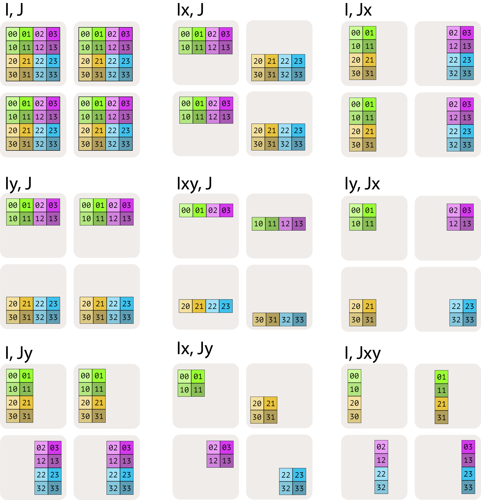


- nice property of matmul: when matrix multiplicands are written in terms of blocks, the product can be written in terms of block matmuls
- four matmul cases
  - case 1: neither matrix has a sharded contracting dimension
    $$
    \mathbf A[I_X,J]\cdot \mathbf B[J, K_Y]\rightarrow \mathbf C[I_X, K_Y]
    $$

    

    - requires no communication
    - perform local block matrix multiplies
    - output is naturally sharded in the desired way
  - case 2: either $A$ or $B$ has a sharded contracting dimension
    $$
    \mathbf A[I,J_X]\cdot \mathbf B[J, K]\rightarrow \mathbf C[I,K]
    $$

    - all-gather the shards of $A$ so every device has a full copy, then multiply against $B$

    $$
    \operatorname{AllGather}_X[I, J_X]\rightarrow \mathbf A[I, J]\\
    \mathbf A[I,J]\cdot\mathbf B[J, K]\rightarrow\mathbf C[I,K]
    $$

  - case 3: both $A$ and $B$ have sharded contracting dimensions
    $$
    \mathbf A[I,J_X]\cdot \mathbf B[J_X, K]\rightarrow\mathbf C[I,K]
    $$

    - the matmul is possible but each device only represents a partial sum of the desired product
      - each device along $X$ dimension has a different partial sum
      - we use the notation $C[I,K]\{U_X\}$ to mean unreduced along $X$ mesh axis
    - do the final summation using an all-reduce across the $X$ axis
      $$
      \operatorname{AllReduce}_XC[I,K]\{U_X\}\rightarrow C[I,K]
      $$

      - results in each device having the same fully-summed value
  - case 4: both $A$ and $B$ have non-contracting dimension sharded along the same axis

### Data parallelism
**naive data parallelism (DDP)**

- split examples within a $B$-sized batch across $M$ devices and exchange gradients
- steps
  1. run forward pass on local micro-batch
  2. compute grads for all params
  3. *all-reduce* gradients across GPUs so each GPU has the averaged G
  4. each GPU independently updates all params
    - each GPU does identical work in this step
- when model fits on a single device, we should always use this
- communication hapens only on the backward pass
- allows arbitrarily increasing batch size over more and more devices

**ZeRO stage 1: shard optimizer states**

- each device holds $1/M$ of the Adam vectors, and only updates the parameters that it has optimizers for
- steps
  1. run forward pass on local micro-batch
  2. compute grads for all params
  3. *reduce-scatter* gradients: each GPU has reduced gradients for its subset of parameters
  4. each GPU updates their subset of params using its subset of optimizer states
  5. *all-gather* the updated parameters
- because one all-reduce has the same cost as reduce-scatter + all-gather, this incurs no additional communication overhead, making it free memory wins

**ZeRO stage 2: shard optimizer states + gradients**

- also shard gradients so each device only holds $1/M$ of the gradients
- steps
  1. run forward pass on local micro-batch
  2. as each layer’s gradients are computed, they’re immediately *reduce-scattered*. each GPU keeps only its subset of gradients and frees the rest.
  3. each GPU updates their subset of params using its subset of optimizer states
  4. *all-gather* the updated parameters

**ZeRO stage 3: shard optimizer states + gradients + parameters (FSDP)**

- also shards parameters so each device only holds $1/N$ of the parameters
- *all-gather* parameters for each layer just in time, use them, then discard
- can train models that don’t fit on one GPU
- ZeRO stages 1,2,3 all have the same communication cost

### Pipeline parallelism
- if we did model parallelism naively, we would move each layer to a different GPU, and move the hidden states to the right GPU before each layer (this is bad, we didn’t improve our throughput)
- proper async pipeline parallelism
  ```python
  from torch.distributed.pipeline.sync import Pipe
  
  model = nn.Sequential(
      nn.Linear(512, 512).to('cuda:0'),
      nn.ReLU().to('cuda:0'),
      nn.Linear(512, 512).to('cuda:1'),
      nn.ReLU().to('cuda:1'),
  )
  
  model = Pipe(model, chunks=8)  # splits batch into 8 micro-batches
  output = model(x)
  ```


### Tensor parallelism
- FSDP and tensor parallelism can be effectively combined
  - sharding batch dimension $B$ reduces the size of all-gathers, and sharding FFN dimension $F$ reduces the communication overhead of FSDP

- for an MLP (two linear layers with activation in between), we do column parallel (for $W^\text{up}$) → activations → row parallel (for $W^\text{down}$)
  - split the first weight matrix column-wise
  - each device computes its shard and applies the activation locally
  - split the second weight matrix row-wise
  - each device computes a partial result, then *all-reduce* to sum
    - the key insight
      ```python
      y = h @ W2
        = [h_0, h_1] @ [W2_0]
                       [W2_1]
        = h_0 @ W2_0 + h_1 @ W2_1
        = y_0 + y_1
      ```

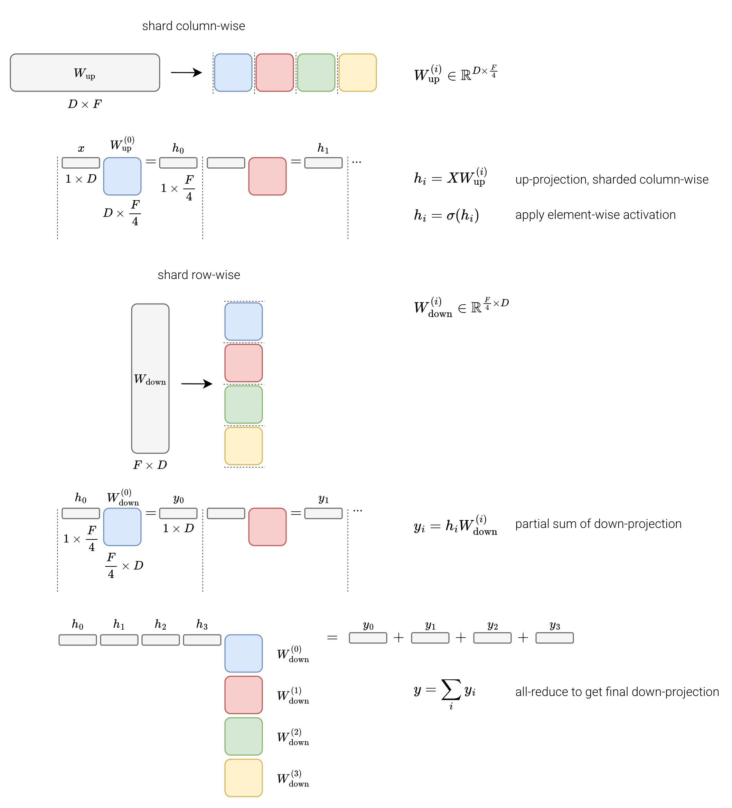


- any other sharding choice forces a collective in the middle
  - for a matmul $Y=XW$
    - column sharding of $W$ means each device computes a slice of the output, producing nicely sharded output
    - row sharding of $W$ means each devices computes a partial sum of the full output, needing reduction to finish
- for SwiGLU-style MLP, we column-shard both $W_\text{gate}$ and $W_\text{gate}$, keep element-wise product sharded on $F$, then row-shard $W_\text{down}$ and all-reduce at the end
- the code
  ```python
  class ColumnParallelLinear(nn.Module):
      def __init__(self, in_features, out_features, world_size, rank):
          super().__init__()
          self.out_features_per_rank = out_features // world_size
          self.rank = rank
  
          self.linear = nn.Linear(
  	          in_features,
  	          self.out_features_per_rank,
  	          bias=False,
  	          device=f"cuda:{rank}"
          )
      
      def forward(self, x):
          return self.linear(x)
  
  
  class RowParallelLinear(nn.Module):
      def __init__(self, in_features, out_features, world_size, rank):
          super().__init__()
          self.in_features_per_rank = in_features // world_size
          self.rank = rank
          
          self.linear = nn.Linear(
  		        self.in_features_per_rank,
  	          out_features,        
  	          bias=False,
  	          device=f"cuda:{rank}"
          )
      
      def forward(self, x):
          # x is partial: (batch, in_features_per_rank)
          # each GPU computes partial result
          partial = self.linear(x)
          
          # All-reduce to sum partial results across GPUs
          dist.all_reduce(partial, op=dist.ReduceOp.SUM)
          
          return partial
  
  
  class TensorParallelMLP(nn.Module):
      """
      column parallel -> activation -> row parallel requires only one all-reduce
      """
      def __init__(self, d_model, d_ff, world_size, rank):
          super().__init__()
          assert d_model % world_size == d_ff % world_size == 0
          self.fc1 = ColumnParallelLinear(d_model, d_ff, world_size, rank)
          self.fc2 = RowParallelLinear(d_ff, d_model, world_size, rank)
      
      def forward(self, x):
          x = self.fc1(x)      # (batch, seq, d_ff // world_size)
          x = nn.functional.silu(x)
          x = self.fc2(x)      # (batch, seq, d_model), all-reduced
          return x
  ```

- for attention, each device handles a subset of attention heads (since they are independent)
  - one all-reduce at the end (like the MLP)
  - attention heads are independent, so splitting by heads requires no communication during the attention computation!
  - column parallel (QKV) → computation → row parallel (output)

  ```python
  class TensorParallelAttention(nn.Module):
      def __init__(self, d_model, num_heads, world_size, rank):
          super().__init__()
          assert num_heads % world_size == 0
          self.rank = rank
          
          # Each GPU handles a subset of heads
          # QKV projection for local heads only
          self.qkv = ColumnParallelLinear(
              d_model, 
              3 * d_model,
              world_size,
              rank
          )
          self.out_proj = RowParallelLinear(
              d_model,
              d_model,
              world_size,
              rank
          )
      
      def forward(self, x):
          batch, seq_len, _ = x.shape
          
          # Project to local Q, K, V
          qkv = self.qkv(x)
          qkv = qkv.reshape(batch, seq_len, 3, self.num_heads_per_rank, self.head_dim)
          q, k, v = qkv.unbind(dim=2)
          
          # Attention on local heads
          q = q.transpose(1, 2)  # (batch, local_heads, seq_len, head_dim)
          k = k.transpose(1, 2)
          v = v.transpose(1, 2)
          
          attn_out = nn.functional.scaled_dot_product_attention(q, k, v)
          attn_out = attn_out.transpose(1, 2).reshape(batch, seq_len, -1)
          
          # Output projection with all-reduce
          return self.out_proj(attn_out)
  ```


## Multimodality
- Vision Transformer (ViT): turn image into a sequence of vectors, then run a standard transformer encoder
- LLaVA
  - model hidden dimension is $D=4096$, CLIP hidden dimension is 1024

  ```python
  Image [224, 224, 3]
      ↓ patchify
  Patches [256, 588]
      ↓ linear projection (independent)
  Patch embeddings [256, 1024]
      ↓ prepend CLS, add position embeddings
  Sequence [257, 1024]
      ↓ CLIP (transformer encoder with 24 layers)
  CLIP output [256, 1024]
      ↓ projection W applied independently per token
  Visual embeddings [256, 4096]
      ↓ concatenate with text embeddings [N, 4096]
  Full sequence [256 + N, 4096]
      ↓ LLM transformer
  ```


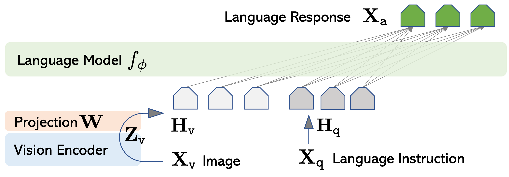

- LLaVA-NeXT dynamic resolution
  - split high-res images into multiple crops, encode each separately, and then concatenate
- Qwen2-VL
  - previously, input size is fixed (e.g., 224 x 224) → always 256 patches
    - learn absolute position embeddings of shape $[256, D]$
  - we were constrained to fixed-size images simply because we had a fixed number of learned position embeddings
  - now simply use 2D-rope
    - patch size is still fixed
    - position is encoded as (row, column) coordinates
    - RoPE generates positional encoding on-the-fly
    - lets models generalize to arbitrary resolutions and aspect ratios
- current paradigm
  - understanding: ViT encoder → features
  - generation: diffusion operating in pixel space
- CLIP
  - trained with contrastive learning
  - maximize similarity of text/image embeddings for the correct pairings
