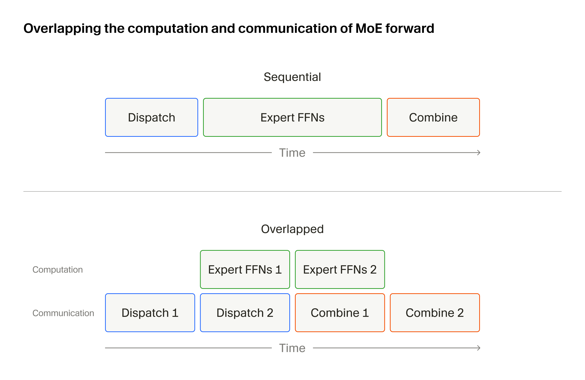
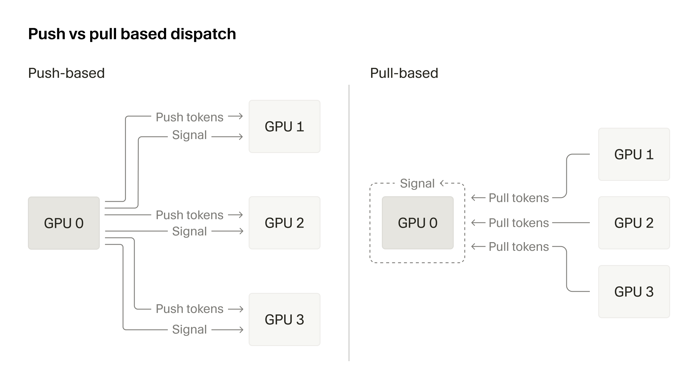
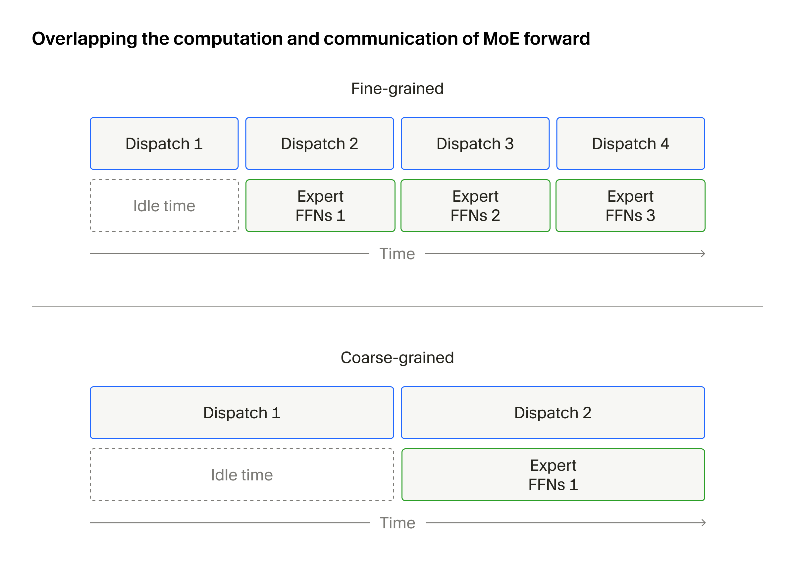
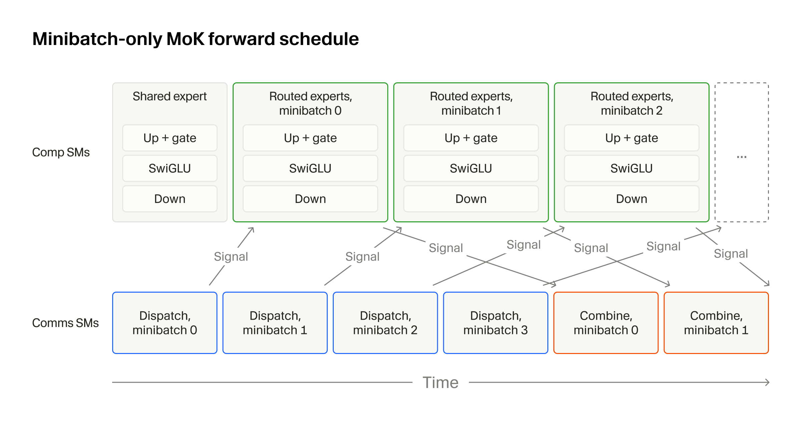
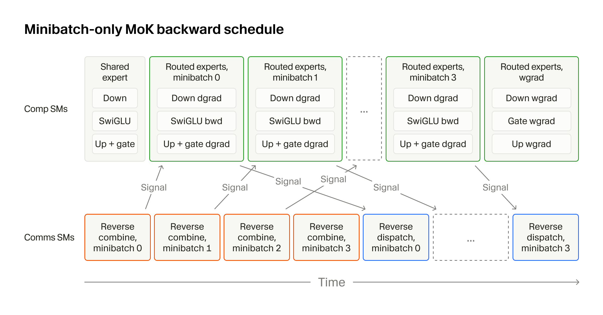
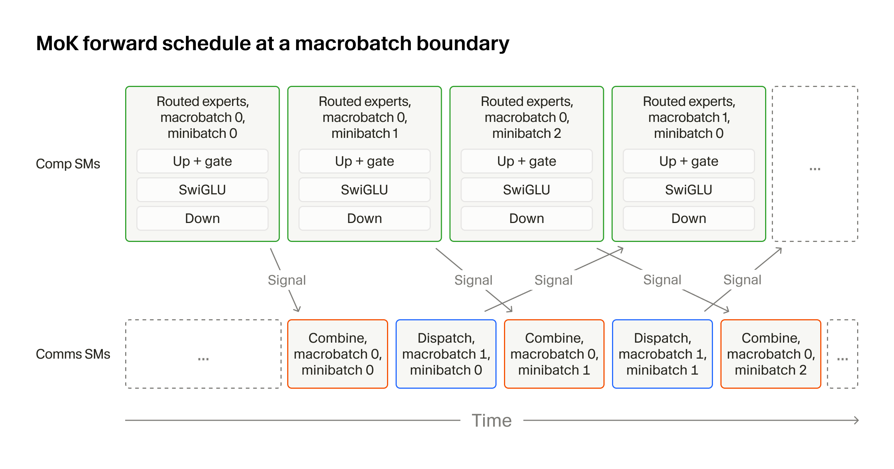

> 来源: https://cursor.com/cn/blog/mixture-of-kittens
> 日期: Aug 4, 2026
> 图片: 6 张（已下载至 images/ 目录）

Today, we're open-sourcing [Mixture-of-Kittens (MoK)](https://github.com/cursor/mixture-of-kittens), our production MoE training megakernel for NVL72s.

As we have scaled the training and inference of [Composer](/blog/composer-2), our agentic coding model, the mixture-of-experts layer has consistently remained the major bottleneck. Depending on the workload and training configuration, it can consume more than half of end-to-end training time.

MoK addresses that bottleneck by fusing all MoE communication and computation into a single, fully deterministic kernel. It now powers Composer training across tens of thousands of GPUs.

You can try MoK and explore the code on [GitHub](https://github.com/cursor/mixture-of-kittens). We look forward to your feedback and contributions.

MoK grew out of several earlier attempts to speed up the MoE layer. Over the past year, we wrote our own [MXFP8](/blog/kernels) and NVFP4 training kernels and developed the ["warp decode"](/blog/warp-decode) approach for MoE inference.

But those techniques optimized only the compute portion of the layer and assumed inter-GPU communication would be handled separately. In our production workloads, communication had become the limiting factor. That led us to redesign the full MoE layer from first principles, with communication built directly into the kernel.

In addition, our move to GB300 NVL72s changed the problem in two important ways. First, an NVL72 is a multi-node rack within a single NVLink domain, enabling fast, fine-grained overlap of computation and communication across all 72 GPUs.

Second, the integrated Grace CPUs (the "G" in GB300) tend to be slow relative to the GPUs. We found that GPU streams easily caught up to CPU-side work, causing the GPU to be completely idle during that time. So we have to aggressively minimize CPU work and CPU-GPU synchronization.

Our solution to this set of challenges is Mixture-of-Kittens (MoK), a highly optimized MoE training megakernel built from first principles for NVL72s. MoK fuses all MoE communication and computation into a single kernel, is fully deterministic, and achieves state-of-the-art performance against publicly available implementations.

In our production training stack across several NVL72 racks, MoK increased end-to-end tokens per second by 1.41x.

The rest of this post explains the key ideas behind MoK, including how we chose the right communication direction, structured the overlap between computation and communication, and eliminated CPU-GPU synchronization with ring token buffers. We also cover the megakernel design, determinism, MXFP8 support, and several other implementation details.

## Overlapping computation and communication in MoE

MoK targets DeepSeek-V3 (DSV3)-style MoE layers, which are widely used across open-weight models including GLM, Qwen, Kimi (up to K2.7), and DSV itself. These layers combine one shared expert with many routed experts, often hundreds.

For each token entering the MoE layer, a router projection selects the top-k routed experts and assigns a router weight to each one. Each selected expert then runs the standard feed-forward network computation, consisting of up and gate projections, a SwiGLU activation, and a down projection. The layer combines the outputs of the shared and routed experts using the router weights.

We use the following notation:

-   D = model dimension
-   I = expert intermediate dimension
-   E = set of routed top-k experts
-   Input token x∈RD
-   Router weights s∈R∣E∣
-   Expert weights Wup​∈RI×D, Wgate​∈RI×D, Wdown​∈RD×I

And the MoE layer computes:

MoE(x,s)=Eshared​(x)+i∈E∑​gi​Ei​(x)

where

Ei​(x)=Wdown(i)​(SiLU(Wgate(i)​x)⊙Wup(i)​x)andgi​=∑j∈E​sj​si​​

With expert parallelism (EP), we shard the routed experts and spread their weights across many GPUs, or ranks, and we call the number of ranks that collectively hold all expert weights the EP degree. For example, with 256 routed experts and an EP degree of 64, each rank holds 4 routed experts, plus the shared expert. As a result, tokens must be transferred across GPUs before and after the MoE layer, according to the router projection.

The most straightforward implementation of distributed MoE sends each token to the ranks holding its assigned experts (dispatch all-to-all), runs the FFN, returns the results to each token's original rank (combine all-to-all), and takes a weighted sum of the expert outputs. But because the communication can take as long as the computation itself, running the two sequentially is inefficient.

The standard remedy is to overlap dispatch/combine<sup>[1](#fn-1)</sup> communication with per-expert FFN through pipelining: transfer one chunk of tokens, compute FFN on it while overlapping transfer of the next chunk, and repeat. MoK is one variant of this scheme, with a set of novel, target-specific techniques that make it faster than existing baselines.





## Choosing the right communication direction

When sending tokens across GPUs, one can choose a push-based mechanism, where the GPU that owns the tokens actively stores them into the remote destination GPUs, or a pull-based mechanism, where the GPU that needs the tokens loads them from the remote source GPUs. Existing approaches often rely on push-based communication for scattering and gathering tokens across GPUs (e.g., DeepEP).

The common notion is that pushing saturates inter-GPU links better, since it involves less protocol communication, and thus it becomes the default choice. Our observation, however, is that each mechanism has its own tradeoffs, and choosing the right one for each communication operator matters for maximizing performance, for the following three reasons.

### Scheduling

To dispatch and combine tokens as fast as possible, the following conditions must hold:

1.  All NVLink lanes interconnecting the 72 GPUs in the rack must stay saturated. We cannot afford stretches of time where tokens travel over only a subset of (source → destination) lanes, so tokens must be selected such that each source rank's sends are spread evenly across all destination ranks at any given moment.
2.  Tokens sent to a rank should arrive ordered by that rank's local experts. If arrivals are unordered, the expert-grouped GEMMs wait longer for a full tile of tokens before the tensor core matrix multiplications can begin.
3.  There should be zero local copies. Tokens for an expert should land directly in contiguous memory, so the grouped GEMMs can start without reordering anything locally.
4.  The overhead of satisfying the above three conditions must stay minimal. We want to spend most of the time actually sending tokens, and very little time scheduling or searching for tokens to send.

With push-based dispatch, we need to produce a schedule table with columns `{src_index, dst_rank, dst_index}`, where `src_index` is the index into the local incoming activation buffer and `dst_index` is the location in the destination rank's memory where the token must land. The row index of this table will decide the order in which tokens are sent over NVLink. We want the rows of this table to cycle through `dst_rank` round-robin, so that every connected lane stays busy.

Among the rows targeting a given `dst_rank`, the `dst_index` values must be interleaved evenly across all source GPUs, and they must also follow increasing local expert order on that destination rank. Building this table involves multiple sorts, and each rank's schedule must account for every other rank's, since no two source ranks can write to the same `dst_index`.


| Schedule Idx | Src Idx | Dst Rank | Dst Idx |
|--------------|---------|----------|---------|
| 0            | 17      | 0        | 0       |
| 1            | 0       | 1        | 0       |
| 2            | 29      | 2        | 0       |
| 3            | 3       | 3        | 0       |
| …            | …       | …        | …       |

Push-based schedule: consecutive entries must interleave destination rank for full network saturation.


| Schedule Idx | Src Rank | Src Idx |
|--------------|----------|---------|
| 0            | 0        | 0       |
| 1            | 1        | 5       |
| 2            | 2        | 13      |
| 3            | 3        | 7       |
| …            | …        | …       |

Pull-based schedule: consecutive entries must interleave source rank for full network saturation.


With pull-based dispatch, the schedule table simplifies to two columns, `{src_rank, src_index}`, and the row index of the table directly corresponds to the token index in the local destination buffer.

In theory, the number of rows in the table and in the destination buffer would match (which would require large memory allocation; more on this in a later section). No sorting is needed here. We walk over the router projection results, and whenever we find a token that should land on the current rank, we write its source rank and index into our schedule. The algorithm looks as follows:


**Inputs:** routing tensor E∈{0,…,RL−1}R×N×K, where Er,i,k​ is the global index of the expert assigned to the k-th route of token i on source rank r; local rank c; experts per rank L


**Outputs:** token counts per local expert T∈NL, token counts per local expert and source rank M∈NL×R, region offsets S∈NL, schedule table Φ


T←0L​, M←0L×R​


**for** r=0 to R−1, i=0 to N−1, k=0 to K−1 **do**


e←Er,i,k​


**if** ⌊e/L⌋=c **then**


ℓ←e−cL


Tℓ​←Tℓ​+1; Mℓ,r​←Mℓ,r​+1


**end if**


**end for**


S0​←0


**for** ℓ=1 to L−1 **do**


Sℓ​←Sℓ−1​+Tℓ−1​


**end for**


C←0L×R​


**for** r=0 to R−1, i=0 to N−1, k=0 to K−1 **do**


e←Er,i,k​


**if** ⌊e/L⌋=c **then**


ℓ←e−cL; o←Cℓ,r​


p←∑r′=0R−1​min(Mℓ,r′​,o)+ ∣{r′:r′&lt;r∧Mℓ,r′​&gt;o}∣


ΦSℓ​+p​←(r,iK+k)


Cℓ,r​←Cℓ,r​+1


**end if**


**end for**


In practice, our schedule kernel implementing this algorithm takes less than 3% of the total MoE runtime, and runs fully on the device-side without any CPU-GPU communication.

We can also reuse this schedule as-is for combine by choosing push-based combine, simply reading `{src_rank, src_index}` as `{dst_rank, dst_index}`. In fact, we can build the schedule once and reuse it for all four communication operations across forward and backward, by choosing:

-   Pull-based forward dispatch
-   Push-based forward combine
-   Pull-based backward reverse-combine
-   Push-based backward reverse-dispatch

The schedule is only a few megabytes in the worst case, so we can keep it around for reuse without any memory pressure. An additional benefit is that this completely eliminates inter-GPU, multi-lane signaling, as explained later below.

### NVLink bandwidth utilization

As with any networking system, all user data (payload) being transferred over NVLink is sent with additional protocol metadata containing information about the source and destination, acknowledgements, etc., that depends on the networking protocol. While the details of the NVLink communication protocol are undisclosed, we can observe the data being sent on the link and reason about it carefully.

What we find is that push-based NVLink communication moves fewer total bytes (i.e., protocol metadata plus payload) and sends almost everything in one direction, so it achieves higher bandwidth utilization when all lanes are fully busy.

On the other hand, pull-based transfers move more bytes in total, but the protocol metadata is more split between both directions of the link. The puller first sends metadata one way, then receives more metadata plus the payload the other way.

We can verify this by writing a simple cross-GPU transfer kernel, and profiling it with NCU. For instance, in our microbenchmark sending one 256x256 BF16 tile (131,072B) over NVLink, we observe the following:


|      | Total    | Total RX          | Total TX          | Protocol RX | Protocol TX | Payload RX | Payload TX |
|------|----------|-------------------|-------------------|-------------|-------------|------------|------------|
| Push | 159.6 KB | 2.9 KB (1.84%)    | 155.6 KB (99.16%) | 2.7 KB      | 24.6 KB     | 0 KB       | 131.1 KB   |
| Pull | 172.0 KB | 147.5 KB (85.71%) | 24.6 KB (14.29%)  | 16.4 KB     | 24.6 KB     | 131.1 KB   | 0 KB       |


In the above table, RX refers to the receiving direction, while TX refers to the sending direction. We can see that push involves roughly 12.4 KB less bytes in total, ideally leading to better NVLink saturation overall. However, NVLink has separate lanes for each direction. To reach the bandwidth advertised in the NVLink spec (1.8 TB/s for fifth-generation NVLink on GB300), traffic must fully flow both ways. And, for a workload like MoE dispatch/combine, each transfer tends to be only a few kilobytes and imbalanced, leaving execution bubbles on the link.

Empirically, pull-based communication delivers up to 29% higher NVLink bandwidth utilization than push-based communication when dispatching tokens under expert imbalance, making it the better choice.

### Signalling

Signalling is necessary because the GPUs must know when dispatch/combine communication has completed. The GPUs can only begin operating on the received tokens after they receive a completion signal. It is important to minimize this signalling overhead, and choosing the right communication direction has a meaningful impact.

With push-based dispatch or pull-based combine, completion signals must cross between GPUs. Before an expert-grouped GEMM can begin, a rank must wait for signals from as many as 71 peers and flush memory across the rack by issuing a memory fence. In addition, the data is already sitting at the destination during the signal's transit time.

With pull-based dispatch and push-based combine, cross-GPU signalling disappears. Each rank issues a load, waits for the data to arrive, and can begin using it immediately. No multi-node synchronization is required. Also, only a single entity performs signalling, so the overhead does not grow with the degree of expert parallelism.

We found this signalling overhead to be quite large. In our multi-node microbenchmarks, push-based dispatch signalling incurs roughly 5.8x higher latency than pull-based dispatch signalling, at 103 µs versus 18 µs, and the cost accumulates quickly within a megakernel.

Based on these results, MoK uses pull-based forward dispatch, push-based forward combine, pull-based backward reverse-combine, and push-based backward reverse-dispatch.





## Properly structuring the computation-communication overlap

### Computation-communication granularity

Computation-communication granularity is the granularity at which computation and communication tasks signal each other of completion. It comes with an interesting trade-off.

At one extreme, communication can be very fine-grained. We send only enough tokens for the tensor cores to launch a full matrix-multiply-accumulate instruction, 256 on Blackwell, for instance, and continuously overlap each transfer with the matrix multiplications. [Comet](https://arxiv.org/abs/2502.19811) is a good example of this approach.

At the other extreme, communication can be coarse-grained. We send thousands or tens of thousands of tokens at once and wait for the full batch to arrive before beginning the tensor core operations. [DeepEP](https://github.com/deepseek-ai/DeepEP) is a good example here.

Our observation is that neither extreme is the right choice. The optimal point sits somewhere in the middle and depends on the workload.

If the communication is too fine-grained, the tensor cores never fully saturate. Nvidia tensor cores are heavily pipelined, bandwidth-optimized accelerators, and we want to keep feeding them rather than hitting a barrier wait every few MMA instructions.

If the communication is too coarse-grained, the tensor cores wait too long for the first round of tokens to arrive and for the final round of outputs to be combined.





We call the set of tokens we send each round a **minibatch**. MoK makes the minibatch size a tunable parameter so that it's easy to sweep possible configurations before running a workload.

A rough heuristic for choosing the optimal minibatch size is to consider how many waves each operator (e.g., expert-grouped GEMM) requires.

A wave is one round of concurrent execution across all SMs on the GPU. If a work is too small (e.g., an expert-grouped GEMM receives too few tokens), we get a partial wave, in which some SMs sit idle. Alternatively, we may see a tail effect, where the final wave occupies only a fraction of the SMs.

We find it useful to choose a minibatch size that gives each expert grouped-GEMM operator in the FFN at least two full waves. This works for two reasons: (1) a single full wave is enough to fully saturate the tensor cores; and (2) with two waves, the second wave's MMAs overlap with the first wave's epilogue and dependent operators (e.g., the SwiGLU activation or the next grouped GEMM), amortizing the tail effect.

Specifically, on Blackwell GPUs, fully utilizing the tensor cores for an M×N×K GEMM, where K is the reduction dimension, means each SM works on a 128×256 output tile, regardless of 1-SM or 2-SM MMA.

So given:

-   T: number of tokens per transfer (i.e., the minibatch size)
-   H: hidden dimension
-   I: expert intermediate dimension
-   C: number of SMs

We want each GEMM to produce enough tasks to fill at least two waves, while keeping the communication granularity as small as possible for maximum overlap. For the up and gate projections, which run simultaneously since neither depends on the other, this means:

128T​⋅2562I​≥2⋅C

For the down projection, which cannot run in parallel with other operators:

128T​⋅256H​≥2⋅C

Combining the two, the requirement we are looking for is:

T≥min(2I,H)2C⋅128⋅256​

For example, take Kimi 2.5, the base model for Composer 2.5, where H=7168 and I=2048. On Blackwell GPUs, C=148, so we get:

T≥2368

On our microbenchmark running MoK forward for Kimi 2.5 shapes, we observe the following, roughly matching the heuristics:


| T    | ms    |
|------|-------|
| 512  | 5.981 |
| 1024 | 4.669 |
| 1536 | 3.981 |
| 2048 | 3.666 |
| 2560 | 3.425 |
| 3072 | 3.447 |
| 3584 | 3.524 |
| 4096 | 3.473 |


### Scheduling the overlaps

Once the communication granularity is decided, the next question is how to schedule the different tasks (dispatch, combine, FFN) on GPUs so that the overlap happens efficiently. To do this, we employ the inter-SM overlapping technique, in which we assign some SMs to the expert FFNs (comp SMs) and some to dispatch/combine (comms SMs), and have the two groups signal each other through a local counter. This is possible because with Tensor Memory Accelerator (TMA) loads and stores, we can fully saturate NVLink bandwidth with [less than a third of the SMs](https://arxiv.org/abs/2511.13940).

We use inter-SM overlapping as our base strategy. In the MoE forward pass, the comms SMs begin the pull-based dispatch all-to-all and signal the comp SMs each time a full minibatch of tokens has arrived and is ready for computation. The comp SMs then run MLP-SwiGLU atomically on those tokens, and once everything through the down projection is complete, they signal the comms SMs that the tokens are ready for combine.

Comms SMs go through all of dispatch tasks before doing any combine all-to-all tasks, so many completion signals arrive from the comp SMs by the time comms SMs are done with dispatch. Comms SMs will then move on to the push-based combine while the comp SMs finish the FFNs for the last-arriving tokens. Additionally, we can fit in shared expert FFN while the comp SMs wait for the first dispatch to complete.





The backward pass is similar, though it gets a bit more complex with forward replay (more on this in the next section). The comms SMs perform the reverse-combine and signal the comp SMs to run the FFN backward, excluding the wgrads (i.e., 3 expert-grouped GEMMs for 3 dgrads and the SwiGLU activation backward), and the comp SMs signal the comms SMs once the FFNs are complete and the tokens are ready for the reverse-dispatch.

We perform the three remaining wgrads after the dgrads for all minibatches are complete. We delay the wgrads for two reasons: (1) reverse-dispatch does not depend on them, so wgrads can overlap with the last reverse-dispatches; and (2) since the token axis is the reduction dimension for wgrads, accumulating over the full token axis at once minimizes numerical instability. As in the forward pass, we overlap the full shared expert backward with the first round of reverse-combine.





## Fully eliminating CPU-GPU synchronization with ring token buffers

The last missing piece is handling MoE dynamism; we do not know in advance how many tokens will arrive at a destination rank.

There are two existing ways to handle this. The first is token dropping, where any tokens beyond a fixed buffer size are simply ignored and never enter the expert FFNs. The second is CPU-GPU synchronization, where the per-rank token counts computed from the router results are sent to the CPU, and the CPU uses them to allocate exact-sized buffers.

Both have obvious downsides. We do not want to drop tokens for the sake of training quality, and CPU-GPU synchronization prevents the GPU stream from running ahead of the CPU thread.

CPU-GPU synchronization is especially costly on GB300 NVL72s because the integrated Grace CPUs are very slow. Our traces often show GPU kernels bottlenecked by CPU work such as logging or pushing training metrics to a remote server, even though the same training stack caused no such problems on DGX machines with Intel CPUs. Given this, we want to minimize CPU-GPU synchronization as much as possible.

In MoK, we resolve this with a ring token buffer, which we call **macrobatch**. Instead of allocating a large, mostly unused destination buffer for the comms SMs to transfer tokens into, we create a fixed-size ring buffer of a few hundred megabytes and cycle through it at minibatch granularity.

Implementing macrobatching efficiently requires careful overlap of computation and communication. Neither should stall because a buffer slot is still in use or because its data has not yet arrived. Ideally, we overlap across the ring boundary, computing on the tail end of the buffer while dispatching into its start.

The key idea is to drain each slot as early as performance allows so that it can be reused as early as possible. In the forward pass, dispatch fills slots and combine drains them, freeing them for the next dispatch.

However, if we run all dispatches followed by all combines (as in the previous section's schedule), the next macrobatch cannot begin until every combine has finished, and computation and communication only start overlapping again after its first dispatch completes.

To avoid this, we perform dispatch-combine interleaving for the forward pass. The combine for a minibatch of the previous macrobatch is interleaved with the dispatch for the corresponding minibatch of the next macrobatch, which uses the same region of the ring buffer. This way, the buffer is refilled as soon as it is emptied. Note that the first macrobatch's dispatches and the last macrobatch's combines are not interleaved, as they do not have their counterparts.





### Reversed ring to minimize forward replay during backward

The backward pass is slightly more complex because the backward megakernel must support forward activation replay. The macrobatch buffer is a ring, so if there are multiple macrobatches, some saved activations are overwritten during the forward pass and must be recomputed. The replay only needs to run up to the SwiGLU activation, since backward only needs the down projection's input activation and output gradient, not its forward output.

One key optimization here is the reversed ring. If we consume tokens in ascending macrobatch order, the last macrobatch leaves the ring buffer partially filled, and the backward pass ends up with more activations to replay. MoK therefore walks through the tokens in reverse macrobatch order during the forward pass, so that the saved ring buffer is always either completely full or contains all of the tokens, minimizing forward replay during the backward pass.

## Other features and implementation details

### Megakernel

We built MoK using the [megakernel](https://hazyresearch.stanford.edu/blog/2025-05-27-no-bubbles) technique, where instructions overlap at the SM task level instead of being separated by kernel launch boundaries. Megakernels are usually suited for fusing an entire forward or backward step, but we found the technique useful for MoK for two reasons: (1) implementing minibatching and macrobatching without megakernel fusion would require multiple kernel launches, increasing the launch boundary overhead; and (2) for inter-SM overlapping, we found multiple streams with green contexts unreliable at partitioning SMs exactly as intended, while software partitioning gives exact allocation guarantees.

### Determinism

For internal ablations and on-policy RL post-training, we designed MoK to be fully deterministic. The order of floating point operations is fixed, so the same input produces bitwise-identical output regardless of hardware scheduling and instruction issue order.

### Cluster Launch Control (CLC) for RDMA overlap

The MoK megakernel schedules its tasks through CLC to allow RDMA overlap. CLC is a hardware-native work-stealing feature introduced in Blackwell as a new way of implementing persistent grid kernels. A CLC-based kernel can naturally yield to kernels on a higher-priority stream without having to wait for the current kernel to fully complete. This matters because, during training, we often need to overlap intra-rack communication and computation with inter-rack InfiniBand/RoCE communication, such as FSDP all-gather, which require SMs of their own. Without CLC, the inter-rack communication would serialize behind the megakernel, causing significant performance degradation.

### MXFP8 support

MoK supports both BF16 and MXFP8 precision modes. We train in MXFP8 mode, since it is faster and causes no numerical issues. In MXFP8 mode, the shared expert stays in BF16, as we found this to affect the training stability.

One added cost of MXFP8 is that tensors must be quantized before they are fed into the tensor cores. To minimize this overhead, we (1) provide an optimized MXFP8 quantization kernel for pre-quantizing the weights; and (2) fuse activation quantization into the dispatch all-to-all, the expert-grouped GEMMs, and the SwiGLU.

### Router weight gradient computation

The MoK backward pass also computes the router weight gradients, using a [SonicMoE](https://arxiv.org/abs/2512.14080)-style calculation. Instead of saving the full down-projection output, it computes them from the inner product of the SwiGLU activation and the down-projection dgrad. This computation is fused into the SwiGLU backward to avoid additional memory traffic.

### Computation/Communication SM tuning

The optimal ratio of comp to comms SMs depends on the workload. The local token count, the model shapes, and the hardware compute and network bandwidth all change how long the dispatch/combine tasks take relative to the expert FFN tasks. Even within the same workload, the optimal ratio differs between the forward and backward passes. MoK therefore exposes tunable parameters that set the number of comms SMs separately for forward and backward.

## Speedups

We evaluated MoK with two types of benchmarks: individual MoE layer benchmarks, for which we release all benchmark code, and end-to-end benchmarks on our internal production training stack across multiple NVL72 racks.

### MoE layer benchmarks

We benchmark single MoE layer execution: global token scheduling, token dispatch all-to-all, expert FFNs, token combine all-to-all, and the final weighted sum. We benchmarked the forward and backward passes separately, in both BF16 and MXFP8 modes. All tests ran within a single NVL72 rack, with EP degree 64 and 2,048 tokens/GPU before routing.

We chose baselines that (1) support both the MoE forward and backward passes; and (2) run on NVL72s:

-   NCCL + PyTorch
-   DeepEP + PyTorch
-   DeepEP + TransformerEngine
-   HybridEP + Megatron, which is Nvidia's recommended option on NVL72s over DeepEP + Megatron

We tested the shapes of widely used open-weight models:

-   Kimi K2.7 Code shape (E: 384, H: 7168, I: 2048, top-k: 8)
-   GLM-5.2 shape (E: 256, H: 6144, I: 2048, top-k: 8)
-   Qwen3.5-397B-A17B shape (E: 512, H: 4096, I: 1024, top-k: 10)
-   DeepSeek-V4-Pro shape (E: 384, H: 7168, I: 3072, top-k: 6)

The graphs below show results for all four shapes across all baselines:

Overall, we observe that MoK is up to 2.37x faster for the MXFP8 forward, 1.78x for the MXFP8 backward, 1.92x for the BF16 forward, and 1.58x for the BF16 backward, compared to the fastest baseline.

### End-to-end benchmarks

In addition to the benchmarks against publicly available implementations, we report speedups on our internal production training stack. Previously, our training stack relied on a DeepEP-based implementation with custom MXFP8 MoE computation kernels for expert-parallelism. We compare the end-to-end tokens per second metric by varying the MoE layer implementation choice (DeepEP vs MoK). The benchmarks were conducted on 512 GPUs across several GB300 NVL72 racks.


|                       | DeepEP-based | MoK             |
|-----------------------|--------------|-----------------|
| Tokens / second / GPU | 760.9        | 1,070.2 (1.41x) |


Overall, MoK delivered an approximately 41% tokens-per-second speedup over our previous DeepEP-based production setup, allowing us to train our models more efficiently across our GB300 NVL72 infrastructure.

## Megakernels for the agent era

Mixture-of-Kittens is [fully open-sourced](https://github.com/cursor/mixture-of-kittens) as of today. We plan to keep maintaining it and welcome community feedback and contributions. Our hope is that this lowers the barrier to AI research, allowing more researchers and labs to train models efficiently. MoK also aims to be flexible. We put a lot of effort into making it easy to modify, so that with the help of agents, you can quickly adapt it to platforms beyond the ones we run on.

As a side note, with the arrival of AI models capable of writing performant kernels, the kernel optimization space has become a lot more interesting. Single-operator kernels that used to be written by hand are now almost entirely handled by AI. Given the right design directions (e.g., how to specialize warps, which PTX instructions to use), agents can one-shot state-of-the-art kernels.

Even more interesting, however, is the new capabilities this gives us. Last year, writing a megakernel required creating a layer of simplified abstractions like [this one](https://github.com/HazyResearch/Megakernels). This year, we did not need a framework. Instead, we removed the additional layer of abstraction and, with the help of agents, worked through the complexity ourselves from scratch.

Agents automated the simpler tasks (e.g., single-operator kernels) and helped us get through the harder ones (e.g., writing a distributed MoE megakernel) much faster and with a very small team.

That said, there is plenty of work ahead of us in optimizing high-stakes ML workloads that run across hundreds of thousands of GPUs. If you find this post and this type of work interesting, we would love to hear from you. Reach out to us at <hiring@cursor.com>.

## Citation

If you use this work, please cite:

Stuart H. Sul, Nash Brown, Henry Wildermuth, William Lin, and Federico Cassano. "Mixture-of-Kittens: MoE Megakernel for NVL72s." Cursor Research, Aug 2026. <https://github.com/cursor/mixture-of-kittens>

Or in BibTeX:


``` shiki
@misc{sul2026mok,
      title={Mixture-of-Kittens: {MoE} Megakernel for {NVL72s}},
      author={Stuart H. Sul and Nash Brown and Henry Wildermuth and William Lin and Federico Cassano},
      organization={Cursor Research},
      year={2026},
      publisher = {GitHub},
      howpublished = {\url{https://github.com/cursor/mixture-of-kittens}},
}
```


*Special thanks to Chris Ré, Sasha Rush, Less Wright, Chen Lu, and Nathan Wang for reading this post and offering valuable feedback.*


------------------------------------------------------------------------


    In this post, dispatch refers to the dispatch all-to-all communication and combine refers to the combine all-to-all communication. The weighted reduction usually included in "combine" is referred to separately as the weighted sum. [↩](#fnref-1)
