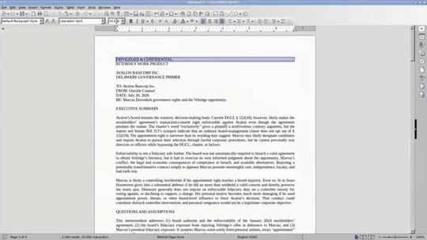

> ⚠️ **注意（仅供阅读）**：此内容为简化版 Markdown，仅供阅读和总结，
> **不可直接用于 createDocument --content 或 updateDocumentByXml**。
> 如需编辑文档，请使用 `getDocumentXml` 获取完整格式后再通过 `updateDocumentByXml` 回传。
> 直接用此内容编辑会丢失样式宏、合并表格、NodeID 等关键信息，导致文档数据损坏。

---

# 前沿模型发展趋势研讨（2026-09 → 2027-01）

---

### 引言

本报告预判未来四个月内（2026-10 → 2027-01）前沿旗舰模型的发展趋势，为技术方案制定提供依据。

方法分两段：先回顾 2024–2026 年旗舰模型能力范式的变化速度与成本结构（第 0–2 章），再沿各能力轴外推到验收时刻（第 3–5 章）。

大语言模型的基础Chat、Math和基础Coding 能力，分别在2024年、2025年与2026年成熟，我们将回顾过去三年这三项基础能力的演进变化，展望2026年年底2027年初的模型，预估前沿模型的哪些基础能力还未成熟，针对2026年底～2027年初的前沿的模型关键技术突破做关键技术储备。

#### 第 0 章 前沿模范式的改变

**表 0-1　范式关键词**

| 年份 | 关键词 | 锚点（月份 + 来源） | 含义 |
| --- | --- | --- | --- |
| 2024 | RLHF + Chat | 2024-07关键词、常识 | 奖励信号为人类QA、传统形式为问答 |
| 2025上半年 | Agent、MCP、Math、Reasoning | MCP 开源；Agentic RL；2025-11 SWE-bench Verified 达 80.9% | 单轮任务完成度；工具调用与上下文协议 |
| 2025下半年～2026上半年 | Agent、Long-horizon Terminal | KernelBench-Verified（[arXiv 2607.16241](https://arxiv.org/abs/2607.16241)）；Long-Horizon-Terminal-Bench（[arXiv 2607.08964](https://arxiv.org/abs/2607.08964)）；2026-09 Terminal Agent RL（[arXiv 2609.11042](https://arxiv.org/abs/2609.11042)）与环境演化（[arXiv 2609.04128](https://arxiv.org/abs/2609.04128)）；2026-09-15 Terminal-Bench 2.0 榜首 91.9% | 奖励信号为真实终端中的长程自主任务；环境执行、判定、合成 |

前沿模型的驱动因素是**可验证环境**的边界扩张：

2024 年可验证的是人类偏好，而主要应用场景是日常对话；
2025 年是MCP工具调用与Agent任务，而主要应用场景是推理性质的对话，如agent，工具调用等；
2026 年主战场是终端长程任务的成败， 主要应用场景是泛coding的Compute-Use场景。
2027年的主要应用场景是什么？

#### 0.3 关键论文时间线

### 第 1 章　智能进化趋势与等智能价格变化

本章回答两个相关问题：开放权重模型落后闭源前沿多少个月，以及同等智能的获取成本如何变化。

#### 1.1 开源权重与闭源前沿的同水平时间差

**图 1-1　前沿模型智能指数阶梯图**

图口径为 AA Intelligence Index v4.3，该benchmark综合衡量代码和通用能力，四条线为 Kimi / DeepSeek / OpenAI / Anthropic

**同一指数档上，开源模型（Kimi / DeepSeek）的到达月份比黑/橙系晚约 3–5 个月**。最典型的对照是 39–40 档：GPT-5.4 于 2026-04 达 39.0，DS V4.1 于 2026-08 达 39.5，相隔约 4 个月

**表 1-1　同水平时间差的三条口径**

| 口径 | 时间差 | 口径定义 |   |
| --- | --- | --- | --- |
| State of Open Source AI | **约 4.4 个月** | 美国闭源前沿模型与中国开放权重模型的性能差距；Kimi K3 在 AAII 上落后 Anthropic Fable 5 约 3 分，成本约为其 30% |   |
| 18 项基准平均（Dborin 分解） | **约 4 个月** | 对 Artificial Analysis 18 项基准逐项外推后的平均缺口；部分基准的差距在扩大 |   |
| METR 长程任务时长 | 约 1 个月 | 二手转述称：最强闭源模型可稳定完成约 12 小时的人类专家任务，最强开源模型约 7 小时 |   |

**表 1-2　分维度差异（Dborin 分解，2026-06-27 转述）**

| 维度 | 2025 | 2026 | 说明 |
| --- | --- | --- | --- |
| 编码 | 落后 10 个月以上 | 落后 1–2 个月 | 唯一显著收窄的维度 |
| 18 项基准平均 | 约 4 个月 | 约 4 个月 | 两年基本持平 |
| 复合智能指数外推 | — | 指向 2026-12-03 归零 | 与逐项分解结论冲突 |

复合指数与逐项分解结论冲突的原因可以定位：编码在复合指数中的权重被其快速进步放大。2026-05，DeepSeek V4-Pro 在 SWE-bench Verified 上取得 80.6%，与 Claude Opus 4.7、GPT-5.5 的约 82% 相差不足 1.5 个百分点；但同期在 GPQA Diamond 上，GPT-5.5 为 93.18%，Kimi K2.6 为 89.14%，差距约 4 个百分点。**"开源追上闭源"这一结论在复合指标上成立与否，取决于编码项的权重。**【文档声明】

**结论：旗舰闭源模型的能力水平，开放权重模型约 3–4 个月可追上。**

拆三个口径（统计对象不同，不矛盾）：**旗舰水平追平 = 3–4 个月**（同分实测：Claude Opus 4.7 发布于 2026-04-16、AAII 57；Kimi K3 于 2026-07 达同分，约 3 个月。另 Mozilla 口径为 4.4 个月）；**全基准平均缺口 ≈ 5 个月**（逐项平均，含开源追得慢的维度）；**编码维度 = 1–2 个月**。

> **使用限制**：AAII 版本已由 v4.0 经 v4.1（2026-06）演进到**图 1-1 所用的 v4.3**——经对图 OCR 核对，该图标题即 "Artificial Analysis Intelligence Index v4.3"，含 **10 项评测**：AA-Briefcase、GDPval-AA v2、AutomationBench-AA、Terminal-Bench 4.0、SciCode、Humanity's Last Exam、GDP.pdf、CritPt、AA-Omniscience、AA-LCR v1.1。跨版本的分数差异同时包含评测变更与模型变化，不可直接比较；本结论只依赖时间差口径，不依赖跨版本 AAII 数值。

---

#### 1.2 【成本】开源与闭源旗舰的缓存命中价格阶梯

｜ 结论，相同智能的模型，其token价格每3个月至少下降1/10

**图 1-2　DeepSeek 与 GPT 旗舰 API 缓存命中输入价格（2024-08 → 2026-09）**

> **图注**：横坐标为月份，阶梯拐点按实际生效日落位；纵坐标为**美元／百万缓存命中输入 token**，采用对数轴，等高距离表示相同比例变化。蓝线为 DeepSeek 所选旗舰序列，黑线为 GPT 常规旗舰序列，橙线为 Claude Opus 主线；虚线段为促销价格。**截至 2026-09-17，GPT-6 Astra 为 **$1.00，Claude Opus 5 为 $**0.50，DeepSeek V4-Pro-0813 高峰价为 ****$0.044，三者单价比约 22.7 : 11.4 : 1**。这表示所选旗舰的缓存读取单价差异，不表示同等能力或完成同一任务的总成本差异。【文档声明：官方定价；核验：1 ÷ 0.044 ≈ 22.7】

> **历史缺口**：DeepSeek V4-Pro Preview 的 $0.145 只表示 2026-04-24 发布公告中的原始牌价。后续促销与降价的完整生效时间未核齐，故该点之后至 2026-08-16 新价生效前断线；不把 $0.145 延长到整个春夏。其余水平线按“上个已知价格延续至下一事件”重建，不代表已获取每日账单或逐月历史快照。

**表 1-3　缓存命中价格的历史节点与来源**

下表价格均为美元／百万缓存命中输入 token，查询日为 **2026-09-17**；报价按【文档声明】处理，来源均为官方文档或公告。GPT API 上线日期与缓存上线日期统一以 [OpenAI API Changelog](https://developers.openai.com/api/docs/changelog) 交叉核对，不用模型快照名中的日期代替 API 可用日。

| 月份／日期 | 所选旗舰或版本 | 缓存命中价 | 事件与限制 | 来源 |
| --- | --- | --- | --- | --- |
| 2024-08（02日） | DeepSeek-V2 | $0.014 | 缓存服务上线 | [官方来源](https://www.deepseek.com/en/news/context-caching/) |
| 2024-09（05日） | DeepSeek-V2.5 | $0.014 | 换代，沿用上个已知价格；非独立调价证据 | [官方来源](https://api-docs.deepseek.com/updates/) |
| 2024-10（01日） | GPT-4o | $1.25 | 缓存服务上线 | [官方来源](https://developers.openai.com/api/docs/models/gpt-4o) |
| 2024-12（26日） | DeepSeek-V3 | $0.014 | 发布促销价；标准价0.07原定2025-02-08生效，主线已于1月转R1 | [官方来源](https://api-docs.deepseek.com/news/news1226/) |
| 2025-01（20日） | DeepSeek-R1 | $0.14 | 旗舰选择转向推理模型，非V3原模型涨价 | [官方来源](https://api-docs.deepseek.com/news/news250120/) |
| 2025-04（14日） | GPT-4.1 | $0.5 | 常规GPT旗舰换代 | [官方来源](https://openai.com/index/gpt-4-1/) |
| 2025-05（22日） | Claude Opus 4 | $1.50 | 发布价 $15 输入 × 缓存读取 10% | [官方来源](https://www.anthropic.com/news/claude-4) |
| 2025-05（28日） | DeepSeek-R1-0528 | $0.14 | 换代，沿用上个已知价格；非独立调价证据 | [官方来源](https://api-docs.deepseek.com/news/news250528/) |
| 2025-08（05日） | Claude Opus 4.1 | $1.50 | 与 Opus 4 同价 | [官方来源](https://www.anthropic.com/news/claude-opus-4-1) |
| 2025-08（07日） | GPT-5 | $0.125 | 型号页定价与发布日交叉核对 | [官方来源](https://developers.openai.com/api/docs/models/gpt-5) |
| 2025-08（21日） | DeepSeek-V3.1 | $0.14 | 沿用reasoner旧价到9月5日；chat旧价不同 | [官方来源](https://api-docs.deepseek.com/news/news250821/) |
| 2025-09（05日） | DeepSeek-V3.1 | $0.07 | 16:00 UTC统一新价 | [官方来源](https://api-docs.deepseek.com/news/news250821/) |
| 2025-09（29日） | DeepSeek-V3.2-Exp | $0.028 | 10:00 UTC生效；公开API实验版 | [官方来源](https://api-docs.deepseek.com/news/news250929/) |
| 2025-11（13日） | GPT-5.1 | $0.125 | 官方说明缓存定价与GPT-5相同 | [官方来源](https://openai.com/index/gpt-5-1-for-developers/) |
| 2025-11（24日） | Claude Opus 4.5 | $0.50 | 输入 $15→$5，缓存读取 10%；较 Opus 4 降 3× | [官方来源](https://www.anthropic.com/news/claude-opus-4-5) |
| 2025-12（01日） | DeepSeek-V3.2 | $0.028 | 正式版，沿用上个已知价格；非独立调价证据 | [官方来源](https://api-docs.deepseek.com/news/news251201/) |
| 2025-12（11日） | GPT-5.2 | $0.175 | 常规GPT旗舰换代 | [官方来源](https://openai.com/index/introducing-gpt-5-2/) |
| 2026-02（05日） | Claude Opus 4.6 | $0.50 | 与 4.5 同价；>200K 上下文另有加价 | [官方来源](https://www.anthropic.com/news/claude-opus-4-6) |
| 2026-03（05日） | GPT-5.4 | $0.25 | Standard，短上下文档 | [官方来源](https://openai.com/index/introducing-gpt-5-4/) |
| 2026-04（16日） | Claude Opus 4.7 | $0.50 | 与 4.6 同价 | [官方来源](https://www.anthropic.com/news/claude-opus-4-7) |
| 2026-04（24日） | GPT-5.5 | $0.5 | API上线日；型号页定价交叉核对 | [官方来源](https://developers.openai.com/api/docs/models/gpt-5.5) |
| 2026-04（24日） | DeepSeek-V4-Pro Preview | $0.145 | 只标发布公告原始牌价；后续促销/降价生效记录未完整核验，不延长此点 | [官方来源](https://api-docs.deepseek.com/news/news260424/) |
| 2026-05（28日） | Claude Opus 4.8 | $0.50 | $5 输入 / $25 输出 | [官方来源](https://www.anthropic.com/news/claude-opus-4-8) |
| 2026-07（09日） | GPT-5.6 Sol | $0.5 | 6月预览价5美元×10%缓存费率；7月9日API发布 | [官方来源](https://openai.com/index/previewing-gpt-5-6-sol/) |
| 2026-07（24日） | Claude Opus 5 | $0.50 | $5/$25，与 4.8 同价 | [官方来源](https://www.anthropic.com/news/claude-opus-5) |
| 2026-08（16日） | DeepSeek-V4-Pro-0813 | $0.044 | 16:00 UTC新价生效；高峰价，错峰0.022 | [官方来源](https://api-docs.deepseek.com/news/news260813/) |
| 2026-08（21日） | GPT-5.6 Sol | $0.4 | 限时促销，官方承诺至少持续至2026-11-21 | [官方来源](https://developers.openai.com/api/docs/models/gpt-5.6-sol) |
| 2026-09（03日） | GPT-6 Astra | $1 | API发布日；Standard，≤272K输入档 | [官方来源](https://developers.openai.com/api/docs/models/gpt-6-astra) |

#### 1.3 等智能 token 贬值率与保值率（估算）

同一智能水平的模型，约 3 个月后 token 价格便宜多少？

**表 1-4　等智能配对与 3 个月等效贬值率**

| 配对 | 口径 | 智能锚点（图 1-1） | 早价 → 晚价 | Δt（月） | 区间贬值 | 3 个月等效贬值率 |
| --- | --- | --- | --- | --- | --- | --- |
| 1a | AA 指数 | GPT-4o 7.3（2024-05）→ DS V3 8.5（2024-12） | $1.25（2024-10 缓存上线）→ $0.014（V3 发布促销） | 2 | −98.9% | **−99.9%** |
| 1b | AA 指数（标准价变体） | 同上，但取 V3 标准价 | $1.25 → $0.07 | 2 | −94.4% | **−98.7%** |
| 2 | AA 指数 | GPT-5.4 39.0（图标注 2026-04；API 发布 2026-03-05）→ DS V4.1 39.5（2026-08） | $0.25 → $0.044（V4-Pro-0813 高峰价） | 5.4 | −82.4% | **−61.9%** |
| 3 | 同模型调价（非等智能配对） | 同一模型调价：DS V4-Pro Preview → V4-Pro-0813 | $0.145（2026-04-24）→ $0.044（2026-08-16） | 3.7 | −69.7% | **−62.0%** |
| 4 | AA 指数（锚点未核验，降级） | DS R1 11.4（2025-01）→ V3.2（智能是否 ≥11.4 未核验） | $0.14 → $0.028（2025-09-29） | 8.3 | −80.0% | **−44.1%** |
| 5 | SWE-bench 配对 | Opus 4/4.1 档（SWE-bench Verified 72.5%，表 2-2）→ Opus 4.5（80.9%） | $1.50（2025-08-05）→ $0.50（2025-11-24） | 3.6 | −66.7% | **−59.5%** |
| 反例 | AA 指数 | GPT-5.1 24.7（2025-11）→ 3 个月后（2026-02）市场最低价 | $0.125 → $0.125（仍是 GPT-5.1 自身） | 3 | 0% | **0%** |

**图 1-3　等智能保值率：闭源旗舰 → 首个严格超过者的价格比与追赶耗时**

> 口径（表 1-4 的图形化）：每个闭源旗舰以其最早可核验缓存命中价为 100%；找其后首个 AA 指数**严格更高**的开放权重模型，在其 API 上线月比较同口径缓存命中价，柱高 = 价格比（越低贬值越快），标注追赶耗时（月）。配对先核验再上图；核验不成立的配对不入图。矢量图 ｜ 逐点数据 ｜ 重绘脚本。

#### 1.4 第一章结论

**结论：**

- **前沿模型每1～1.5个月引领较大的技术进步**

- **等智能 token 价格约每 3 个月贬值 60%（5 个有效配对中位数 ≈62%，三家厂商各至少有 1 个配对落在 −44%～−62% 窄带内；两个 2026 年独立配对几乎重合：−61.9% 与 −62.0%），即旧水平三个月剩约 4 折。**【推断】

---

### 第 2 章 回顾过去三年前沿模型的基础能力：Chat / Math / Code 能力是什么时间成熟的？

#### 大模型基础能力全景图（2022-12 → 2026-09）

> 双轨总图：上三条轨道为旗舰发布（O 厂 / 国内开源 / A 厂），下六条为能力轴（Chat / Math / Code / Long-Horizon / RSI / 多模态），标出每条轴"能力具备 → 能力成熟"的落位——Chat 约 2024-05 成熟、基础 coding 约 2025-11 成熟、IMO 满分约 2025-11、RSI 于 2026-05 起"基础能力具备"、多模态至 2026-09 出现"视频剪辑与 3D 建模"。⚠️ 图上文字为绘制者标注，月份与事件**未经本报告逐条核验**，作【推断】读，仅用于引出后文的问题结构：第 2 章对应图中 Chat / Math / Code 三条"已成熟"轴的核验，第 3–5 章对应 Long-Horizon / RSI / 多模态三条尚未成熟的轴。

#### 　大模型应用时间轴（2022-12 → 2026-09）

> 同系列的第二张总图，视角从"能力"换到"应用与产品"：垂直领域应用（character.ai 发布 → 25 亿被 Google 收购）、Chat（情感对话能力基本成熟）、Math（"没有什么产品"——能力高分未转化为独立产品形态）、Code（Cursor 从发布 → 火爆 → 自训模型 → 云端沙箱 → 2026 年中被收购，是最完整的一条产品生命周期）、多模态（生图 / 流式对话 / 3D 生成，）。同样按【推断】读。两图并置给出本报告的出发点：**能力轴与应用轴并不一一对应**——Math 能力最先刷满却没有独立产品，Code 能力晚熟却孵化出完整的产品与并购周期；后文对每条能力轴的成熟度判定（第 2、3–5 章）与成本判定（第 1 章），即在逐条解释这种错位。

#### 2.1 代码、数学、对话（2026年年中成熟的基础能力）

**表 2-1　三轴位置速览**

| 子轴 | 当前阶段 | 到 2027-判断 |
| --- | --- | --- |
| 代码：CLI/IDE 形态 agent | 产品 | **成熟** |
| 代码：长程自主终端任务 | 产品化进行中 | **依然存在较多空间～** |
| 数学：竞赛题 | 评测失效 | **不算成熟**（榜单刷满只证明评测失效） |
| 数学：研究级 / 形式化 | 前沿实验室成熟 | **成熟** |
| 对话 | 产品成熟、信号失效 | **能力成熟，但选型信号失效** |

#### 2.2 代码

##### 2.2.1 SWE-Bench 模型迭代速度

**图 2-1　代码轴旗舰成绩折线：SWE-bench Verified 与 SWE-bench Pro**

> 横轴为月份，纵轴为 resolve rate；两条线分别为 SWE-bench Verified 与 SWE-bench Pro，取各月可核验的旗舰最佳成绩，节点标模型名；

##### 2.2.2 评测方自己的动作（最强的反向证据）

| 月份 | 动作 | 含义 |
| --- | --- | --- |
| 2026-02 | OpenAI 弃用 SWE-bench Verified[链接](https://www.latent.space/p/swe-bench-dead) | 头部拥挤（85–94%）使其失去区分度 |
| 2026-07 | OpenAI 审计 SWE-bench Pro public 731 题，称约 30% 已损坏 | 基准本身的**正确性**开始被质疑 |

##### 2.2.3 产品线时间表

形态判断：**终端 / CLI 是 2025 年之后 coding agent 的主形态**，每代际题库大约4～10月被刷爆

[terminal bench 数据case](https://hub.harborframework.com/tasks/terminal-bench/pretrain-shard-corruption)

##### 2.2.8 GPT / Claude 旗舰：1.0 → 4.0 的分数变化

**图 2-2　Terminal-Bench 分数 × 模型发布月份（颜色 = 题库版本）**

> 横轴为模型发布（或成绩登记）月份，纵轴为 resolve rate，颜色区分题库版本；灰虚线连接同一模型的跨版本点，可直接读出"换题集重置"（如 Fable 5：2.1 的 83.8% → 3.0 的 33.8%）。竖虚线为各版题库发布日。矢量图 ｜ 逐点数据 ｜ 重绘脚本。

#### 2.3 数学轴

##### 2.3.1 时间轴、数据

**图 2-3　数学能力时间轴（节点图，不连线）**

> 横轴为月份；每个节点标"模型 × 赛事/试卷 × 分数 × 评测方"。不同赛事、不同卷子的分数不可比，**节点之间不连线**，连线的缺失本身就是口径声明。矢量图 ｜ 逐点数据 ｜ 重绘脚本。

###### 成绩时间线数据
竞赛题这一层已无区分度：第三方 harness 下 GPT-5.6 Sol 满分通过 IMO 2026 六题。

- 但该层分数受污染折扣影响显著：公开题换为结构匹配新题后，o3 由 52.4% 降至 15.1%。AIME / HMMT 同属"已公开、年度重复"题式，应作**上界**读。

#### 2.5 三轴合计：到 2027-01 的成熟度判定

**表 2-11　基础能力三轴成熟度判定（判据 ①②③ 三选二）**

| 子轴 | 已命中判据 | 2027-01 判定 | 证伪信号（可观测） |
| --- | --- | --- | --- |
| 编码：CLI / IDE 形态 agent | ① ③ | **成熟** | 主流 CLI agent 的企业采购量公开下滑 |
| 编码：长程自主终端任务 | ② 部分 | **长尾、长程、多模态相关任务仍然不成熟** | TB 官方 harness 头部越过 80% 且跨两版保持 |
| 数学：竞赛题 | — | **几乎成熟** | 防污染基准出现且头部 < 60% |
| 数学：研究级 / 形式化 | — | **在前沿实验室成熟（能力本身未到）** | 出现第三方复现的长程数学研究基准 |
| 对话 | ① ③ | **成熟，且信号失效** | - |

---

回顾过去，展望未来，站在2026年9月这个时间点基础模型哪个能力更值得押注

### 第 3 章　多模态任务（生成、long-horizon方向值得押注）

**引言**：原生多模态以 GPT-Astra 为代表——Blender 建模、3D 建模、以及通用软件的 computer-use（操作复杂建模软件这类重工具）正在成为旗舰标配。

#### 3.1 GPT-6 Astra 演示 case 盘点

GPT-6 Astra 发布页挂了一组 computer-use / 专业工作演示视频，是本章最直观的能力证据。

**图 3-1　发布页 case 轮播实拍：1040 报税与法律文档排版**（描述仅限画面可见信息）

> 画面可见：浏览器内打开本地 W-2 PDF（2025 W-2，Lisa M. Chen），顶部轮播 tab 依次为电路板 / Excel 竞赛 / 游戏开发 / 填写 1040 表格 / 前端质量保证 / Power BI / 汽车变速箱 / 设置法律文档格式；视频全长 45 s，页面标注 "BENCHMARK DEMO - NOT FOR FILING"。【码】

> 画面可见：LibreOffice Writer 中一份 "Avalon Bancorp Inc. — Delaware Governance Primer" 法律备忘录，演示设置标题、间距与页面布局；视频全长 30 s。

**补充演示：电路板布局与报税表填写**（用户提供的演示素材）

**法律文档排版录像**

> 🎬 **视频附件**：[gpt6-astra-video.mp4](https://km.sankuai.com/api/file/cdn/2788430206/256573019008?contentType=video)

#### 3.2 多模态理解

#### 3.3 前端设计（UI 生成）

判"UI 生成是否进主流工作流"。锚点：Kimi K3（2026-07）登顶前端编码榜（1,679 Elo，A15）【文档声明，聚合源】；Astra 发布页演示"创建网站后运行前端 QA、检查所有功能是否可用"（§3.1 case 5）。两个信号分别落在开放权重与闭源旗舰两侧，说明 UI 生成已不是单点能力而是竞争项。缺第三方复现（判据 ②未命中）。

#### 3.4 3D 建模

**3D 建模与 Blender 网站演示**

#### 3.5 游戏设计

判"素材/关卡/玩法生成是否从演示走到可用"。锚点是 §3.1 case 3（创建并运行游戏，前端 QA 自查，混合界面）。除此之外**未找到可核验的公开证据**——无基准、无第三方复现、无非演示产品。本条轴在本报告内不作成熟度判定。

**Blender 建模与 UE5 游戏演示**（用户提供；作为演示展示，不改变本节成熟度判定）

**补充 case：海面与灯塔场景动图**

**应用侧对照素材：Meshy**（此类垂直领域公司将会被通用模型能力吞没）

#### 3.7 Computer-use

terminal 与 GUI agent 的分野已成形：约 70% 的通用问题能被 terminal 方式解决，剩下约 30% 长尾（图形界面里没有对应 CLI 的操作）依赖 GUI agent（引言）。训练侧，V4.1 的多模态预训练明确包含 **image-code 对和 computer-use 轨迹**【原文 p21】。评测侧，OSWorld 2.0 上 Astra 72.6% vs Sol 65.7%、单任务耗时 40 min vs 75 min（省约 47%）——但均为发布方口径【文档声明】，缺独立复现。§3.1 的 8 条演示 case 中至少 5 条落在 GUI 长尾，与"演示预算投向差异化"的读法一致【推断】。

**补充 case：GPT 进行视频剪辑**（用户提供）

#### 

**Computer-use 应用场景展示**

libTV等视频领域垂直应用将会被快速替代

> 该图与辅助证据表中的「Codex比较顶级的应用场景.jpg」为同一素材，仅展示一次；案例说明及证据等级见 §3.1。

#### 

### 第 4 章　Long-horizon 应用场景

**引言**：到 2027-01，旗舰模型在「考试型」单元任务上应能接近满分——leetcode、算子开发这类有判题器、答案确定的任务会先被打满。

但 long-horizon 任务因为算法复杂度高、交互链条长，远未打满：大型软件工程、工业设计仍需持续优化；其难度是指数级的，用户模拟、多智能体、多角色模拟这类任务的 scaling 仍有很大空间。

核心依据：Long-horizon必定是指数场景

#### 4.0 Qwen3.8-Max 官方博客演示 case 盘点

**表 4-0　Qwen3.8-Max 多模态 case**

| 内容 | 本报告口径分类 |
| --- | --- |
| 发布总览混剪：紧随"总参数 2.4T（激活 95B）、Max 级首次开源权重（下周）、编码/办公/科研/长程任务全面升级"的发布文案之后 | 总览，非独立 case |
| 六个职业 case 合辑：企业合规律师（数百份文档单次通读标出 1,284 条条款、一小时内完成，对标法务团队约一周）；UI/UX 设计师（银行 App NOVA 的 8 页高保真可交互原型一次成型，对标 3–5 轮修改）；餐饮品牌主理人（26 道菜菜单、成本率 33.8%）；结构工程师（凭一份图纸在浏览器还原 30 层写字楼抗震模型，对标一周以上）；康复理疗师（2D 评估单转 3D 交互动画，对标外包 2–4 周）；体育数据分析师（每名球员约 8,400 回合解析为战术画像，数十分钟） | 能力广度（小时级交付），非长程 |
| 动态工作流驱动的量化研发闭环：从一句任务描述出发**持续工作数小时**，自主搭数据系统、构建因子、贪心迭代；观察到设计期升/验证期降的过拟合信号时自动剪枝；多路径收敛到同一组信号时增加多种子并集验证；广度演示中调度**约 330 个子智能体、约 6,000 次回测**，入选因子超额夏普 0.64–1.48、日频 Rank IC 0.010–0.014 | **long-horizon**（小时级连续工作 + 大规模并行子智能体） |
| E-Commerce Bench：365 天长周期电商经营模拟（淘宝天猫脱敏数据，12 种店铺 / 60 类目 / 近 600 供应商 / 7,000 商品），¥100,000 启动资金，含博弈论议价、152 家隐蔽欺诈商家、台风断料等随机危机；Qwen3.8-Max 以 **¥416,252（4.16×）** 胜出，超第二名 GLM 5.2 达 38%，较 Qwen3.7-Max 提升 152%，**超过 2,000 轮交互**中持续迭代策略 | **long-horizon**（2,000+ 轮交互的年度尺度模拟）+ 持续学习 |

> 页头总览视频（43.6 s）的 GIF 版（480×270）【码：本地存档；原始 mp4 已归档至工作区外，见文末说明】。

> 职业广度合辑（90.0 s）：六个职业 case 的生产级交付演示【码：本地存档】。

> 量化研发闭环（93.2 s）：端到端 ETF 轮动策略 + 330 子智能体并行因子挖掘【码：本地存档】。

> 🎬 **原始视频附件**（75.75MB）：[o9WMOJ5_YDP8ewmaVJz8HoL1oZLmW8E2ZvCozb7qFWo.mp4](https://km.sankuai.com/api/file/cdn/2788430206/256588874685?contentType=0)

> E-Commerce Bench 365 天经营模拟（70.1 s）。

与本章论断的关系：E-Commerce Bench 这类"长周期经营模拟 + 博弈对手 + 随机事件"的环境，正是 §4.4 所说"用户模拟、多角色模拟"可验证环境的一个实例——它同时给出了量化目标（年末总现金）与对抗性交互（议价、欺诈商家），符合 §6.2（"有环境 ⇒ RL 能灌进去"的终端化判据。但注意其数字全部来自发布方自报，无第三方复现（判据 ② 未命中）；且 E-Commerce Bench 本身未见公开榜单或论文

### 第 4 章　模型基础设施：模型时间延将会进一步下降

**引言**：随着一系列infra等技术的进一步普及的生成速度将会在基模领域技术扩散，其基础架构分为以下几个层级：

第 4 章那些「指数级」任务（多智能体并行、用户模拟、多角色模拟）才变得可负担。本章把效率与"模型参与自身训练"放进同一章：前者是判据 ③（成本可用）的集中地，后者（RSI）是训练侧基础设施的极限形态，两者共用同一套工程底座——可验证环境、教师体系、单位 token 成本。

**图 5-0　旗舰模型输出速度横评（Output tokens per second）**

> 柱状横评（版式与 Artificial Analysis 速度榜一致）：Gemini 3.8 Flash (high) 293、DeepSeek V4.1 Flash (max) 207、Muse Spark 1.3 (max) 200、GPT-5.6 Luna (max) 124、DeepSeek V4 Pro 0813 (max) 80、Claude Fable 5.1 (max with fallback) 68、GLM-5.3 (max) 63、Grok 4.6 (high) 59、GPT-6 Astra (max) 51、Claude Opus 5 (max) 50、Kimi K3 (max) 36。读图限制：输出速度同时取决于测速方 harness、并发与上下文档，**跨来源不可直接比较**；榜上最快的恰是各家 Flash/小模型档，旗舰 max 档全部在 36–124 token/s，而在2025年年中，主流模型的推理时延为30tps上下

#### 5.1 模型推理引擎：

判断：400 token/s 级别的输出速度将从卖点变成旗舰 API 的默认～

**Case：MiMo 高速推理演示**

> 🎬 **视频附件**：[Mimo-1000-token:s的推理速度-6月这样.mp4](https://km.sankuai.com/api/file/cdn/2788430206/256576684379?contentType=video)

*素材文件名标注约 1000 token/s、时间约为 6 月；此处作为高速推理的直观 case 展示，具体模型版本、测速口径与日期待核验，不作为上述 400 token/s 普及判断的独立测量依据。*

#### 5.2 成本结构

V4.1 的成本侧地基【原文】：全局 KV cache 压到 **890 bytes/token**（V4 的 1/4）【p1】；decode 只激活 16B【p1】；Reuse 层 decode 仅 11 个 kernel【p18–19】——decode 的访存与计算开销都被结构性压缩。这些数字的硬件前提见 §5.4。

#### 5.3 加速组件

四个乘数均处半成熟态：① **DSpark**——一次前向并行出 5 个草稿位置 + 按实测吞吐曲线动态调度验证长度【原文 p14】，且同时用于线上 serving 和 RL rollout【p14】，加速模块已是训练-推理共用的标准组件；② 稀疏注意力；③ FP4 KV；④ kernel 融合。单个乘数都不构成数量级，叠起来才是【推断】。

**图 5-1　DSpark 速度前沿（DeepSeek-V4-Flash / V4-Pro）**

- 在相同吞吐条件下TPS*2
- 在相同时验下吞吐增加51%

> 图源已定位：DSpark 论文《DSpark: Confidence-Scheduled Speculative Decoding with Semi-Autoregressive Generation》（DeepSeek × 北大，[arXiv 2607.05147](https://arxiv.org/abs/2607.05147)，编号前缀 2026-07；媒体报道发布于 2026-06-27，两个月份并列记录），图为该文的 V4-Flash / V4-Pro 生产引擎实测前沿【文档声明：经 alphaxiv 镜像与多家媒体报道核对，arxiv.org 本环境不可直连；图上数值未经本报告独立复算】。横轴为单用户速度 TPS（token/s/user），纵轴为单卡吞吐 Throughput（token/s/gpu），每个点是一种"草稿长度 × 验证长度"调度配置；蓝点为 MTP 基线，绿点为 DSpark。两子图分别对应 V4-Flash 与 V4-Pro：在同吞吐约束下 DSpark 将 TPS 提升约 60%–85%（Flash）/ 57%–78%（Pro），在同速度约束下吞吐提升约 51%–661%（Flash）/ 52%–406%（Pro）——Pareto 前沿整体外移，而不是单点优化。读图限制：图面未标注测试卡型、batch 规模与精度，按 §5.4 纪律**不可直接外推到其他硬件**；"按实测吞吐曲线动态调度验证长度"（§5.3 ①）正是这条前沿被逐点扫出来的原因——验证长度随负载变化，静态配置只能取到前沿上的一个点。

#### 除了投机解码技术外，算子融合，框架融合

#### 5.5 RSI（递归自我改进）

**图 5-2　RSI 能力层级划分（L0 Output → L5 Meta）**

> - L1 Execution（执行自动化，如 Eureka 奖励设计、Warp 自改进 skill）
> - L2 Strategy（策略搜索与基于实验的改进，如 Anthropic weak-to-strong、递归训练配方、trace 蒸馏）
> - L3 Experience（数据流水线自动化，Skill自进化，如 Evolvent AI、Qwen-Agent 生成并筛选任务数据、**DeepSeek Co-evolve**）
> - L4 Deployment（部署自动化）
> - L5 Meta（元改进，如 Weco AI、HyperAgents 这类"改进改进策略本身"的 agent）。底部色带标出各环节机制：搜索与优化 / 数据与任务经验 / 训练与持续更新 / 验证与选择 / 在线与元层适应。

> 与本节的对位关系：V4.1 已入账的三个自改进组件——造 RL 任务、建环境、当老师（蒸馏）——在图上落在 **L2–L3**（策略搜索与数据流水线自动化）；本报告的"闭环缺口"判断（组件存在但模型未获授权修改自己的训练流程）对应图上 **L5 Meta 仍几乎只有演示级项目**这一事实。这张图的价值在于给出可观测的分层判据：到 2027-01 若旗舰技术报告出现 L4/L5 级组件的量产描述，§5.6 的"RSI 仍未成熟"判定即应重估。【推断】

**图 5-3　RSI 自主权的逐级内化：人做什么 vs agent 接管什么（L1 → L5）**

> 同一套分层的另一种画法，同为 A43（arXiv 2609.11873）**Figure 2**【文档声明】：每个层级一张流程图，紫框为人力环节（Human Efforts）、绿框为 agent 闭环（Agentic Loop），横轴是"AI 内化的改进责任范围"逐步扩大——L1 只接管执行（人设计任务/环境/更新策略，agent 只做 execute+update）；L2 接管更新策略设计；L3 接管经验获取的规划（"experience design taken over"）；L4 接管环境适配（"environment adaption taken over"）；L5 接管改进系统本身的设计（"improvement system design taken over"），人只剩 Set Boundary。对位本报告：V4.1 现状是 L1–L3 的环节已进 agent 闭环，但每层的流程仍由人编排；图里 L5 的"人退到只设边界"正是本节"闭环缺口"的图形化定义，也是 §5.6 证伪信号（"模型主导配方设计"）对应的层级。

**图 5-4　L3 的两条实现路线：自适应出题 vs 环境中自主练习**

> A43（arXiv 2609.11873）**Figure 4**，原题 "L3: Two Approaches to Learner-Conditioned Future Experience Acquisition"【文档声明】。Approach 1（自适应任务生成与自博弈）：Learner State（已掌握能力、能力缺口、近期失败 trace）→ Task Generator 针对缺口出题 → Solver 解题 → 执行校验产生学习信号 → 更新模型参数与已验证任务缓冲，并回调出题难度——与 V4.1"任务生成器按 difficulty + correctness 迭代训练"【原文 p25】逐环节同构。Approach 2（环境交互式自主练习）：agent 自己决定"下一步练什么"，在 Minecraft / 具身世界 / computer-use 环境中执行、用交互反馈更新 skill library——与 V4.1"模型建自己的环境、五个环节全是专职 agent"【原文 p25–26】同构。这张图说明 V4.1 的两条组件不是孤例，而是 L3 的两条标准路线；缺口不在"有没有"，在"谁授权改流程"。【推断】

**图 5-5　L4 适应与 L5 递归元改进的分野**

> A43（arXiv 2609.11873）**Figure 5**（L4/L5 节配图）【文档声明】。(a) L4 Adaptation：agent 在固定的改进流程内适应环境反馈（"The agent adapts; the improvement process stays fixed"）；(b) L5 Recursive meta-improvement：修订并继承"产生未来改进的流程"本身——诊断改进瓶颈 → 生成候选改进流程 → 打分 → 独立验证 → 验证通过的 meta-update 被后继者继承（"Successors inherit and reuse accepted meta-updates"）。底部列出元层可演化的三类对象：后继生成（修订 agent 构建与训练策略）、候选评估（修订内部测试与打分方法）、研究控制（修订实验选择与资源分配策略）；页脚一行标出人的保留地：任务使命、安全边界、受保护评估、最终验收。这张图把 §5.6 的"闭环缺口"说得更精确：缺的不是改进本身，而是**改进流程的可继承修订权**；同时给出判定 L5 是否发生的三个可观测面（谁写训练策略、谁定评分、谁分配实验资源）。【推断】

**图 5-6　各能力族的"差距闭合"曲线与 RSI-enabled adaptation 阶段（2026 之后）**

> A43（arXiv 2609.11873）中 HCI（Headroom-Closed Index）一节的全景图【文档声明；图号未核验】。HCI 口径（论文自述）：对 393 条"模型 × 基准"观测做归一化——以该基准出现之年的 90 分位前沿为 0、满分为 100，按基准加权威共识加权（基准官方表与公共 harness 权重高、第一方自报降权）。横轴为模型发布日期（2023 → 2026 之后），纵轴为 "Gap closed (HCI)"；按能力族分色：知识与科学评估（MMLU-Pro、GPQA Diamond、HLE、FrontierMath）、软件环境（Cybench、LiveCodeBench、SWE-bench）、专用推理（MMMU-Pro、LegalBench）、工具中介工作流（BFCL、τ-bench、BrowseComp、Terminal-Bench），并标注各族对应的 RSI 层级（L1–L2 / L2–L3 / L3–L4）。曲线上标出各代旗舰（GPT-4o → o1 → GPT-5.6 Sol / Terra → GPT-6 Astra；Claude 3.5 Sonnet → Opus 4.5 → Opus 5 / Fable 5 / 5.1；Kimi K2 / K3；GLM-4.5 / 5.3 等），虚线竖线之后的阴影区标为 "RSI-enabled adaptation / Post-2026 RSI stage"。⚠️ 该图把 2026 年之后画成由 RSI 驱动的上扬，**这是绘制者的外推，不是已发生事实**，且 HCI 归一化口径与数据来源未核验——全图按【推断】读。与本报告的交叉点：知识/科学族曲线已在 80–90 档走平（与第 2 章"数学竞赛题评测失效"一致），而工具中介工作流族（L3–L4）仍在 40–60 档爬坡（与第 2 章 TB 4.0 头部 58.18% 一致）；图的主张等价于"下一程爬坡由 L3+ 自改进组件供给"，这正是本章的押注。

以 GPT-6 Astra 为最小可验证形态：到 2027-01，旗舰模型应能接近 few-shot 地实现简单量化建模（给一段数据与目标，直接产出可用的量化模型）

### 第 6 章　判断与结论

### 什么值得做？什么不值得做？

#### 推论一： 模型能力持续扩张时，值得积累的是能随模型升级而增值的资产；需要谨慎的是依赖模型暂时做不到某件事而成立的产品。

- 下一代模型变得更聪明、更便宜、更泛化之后，我们的产品会更有价值，还是会失去存在的理由？
- 正例：通用harness、业务场景与模型内部链接的桥梁、RSI 基础设施、应用平台、高速推理引擎
- 反例：工作流、业务Skill、垂直领域模型、智能体应用、meshy、LibTV、character AI

  Meshy、LibTV 等应将更具体：当通用模型可以操作专业软件、生成素材并完成编辑时，垂域工作流还保有哪些不可替代的价值？

#### 推论二： 无论是基础设施、产品还是流程，都应该紧紧贴合模型发展的智能曲线进化，模型始终是应用的核心

模型很重要，模型即产品，将极大决定应用的成功率
认识到模型动态发展的特性并提前布局很重要，前沿模型的技术突破间隔为1个月，前沿智能的单位成本每3个月下降为1/10。

- 学习、交流、感知并参与基础模型的训练和进化对业务发展至关重要，跟进前沿模型的变化很重要，对过往缺陷的修补往往是新模型的阻碍。
- 正例：动态进化维护、固定的成本感知机制、
- 反例：静态路由

#### 推论三：推理基础设施值得押注，因为它同时影响模型与应用场景的进化速度

推理基础设施对基模迭代和应用迭代都有巨大收益：

- 随着任务场景越来越长，Long-horizon场景将不断蓬勃发展，未来4个月内对推理基础设施的依赖将会进一步加深
- 更低时延极有可能催生出全新的应用场景，同时推理基础设施与模型的智能相对独立。
- 更高并发能极大提升任务合成与模型蒸馏的速度，未来合成的任务将会越来越复杂，上下文越来越长，推理基础设施的效率将极大影响基模与应用算法团队的迭代效率。

#### 推论四：RSI基础设施值得押注

- 基础模型侧：前沿实验室将会在4个月内大幅度铺开RSI基础设施的建设，预计2026年底将会成为前沿实验室的标配，对应场景的数据准备、基础设施建设有待探索
- 业务侧：模型在训练与研发过程中形成的自迭代能力容易泛化。前沿模型将能够在明确目标、获得必要工具与反馈的条件下，逐步建立快速试错、持续迭代的机制。大量依赖 A/B 测试的业务将是这一能力的重要落地方向：模型有望更快地设计和执行实验、更准确地识别有效改进，并以更低成本推进迭代。

#### 讨论：关注现有业务还是“0亿美元市场”?

- 我们可以关注并服务已有能力与已有业务，也可以提前布局前沿模型涌现的新能力
- 例如：将推理时延迟压到极低，在直播场景将会涌现什么新的业务机会？
- 例如：完善美团GIS系统与compute-use模型的基础设施并建立链接，2026年底模型模型能执行什么样的地理规划能力？

 ### 讨论：应用数据对基座模型的正向反哺有多少？

- 谈到AI ppt，大家会想到有多少AI应用团队？有多少垂域模型？
- 2024年，Chat GPT 数据中绝大多数请求为短日常对话，代码占比不足1%？数据回流应当优化代码还是日常对话？
- 如何提前判断强基座模型对垂直领域应用的降维打击？
- 谈到AI ppt，有多少人记得之前的类似应用？第一个想到的是Kimi还是claude？

---

### 附录 A 引用清单

| 序号 | 月份 | 条目 | 类型 | 链接 |
| --- | --- | --- | --- | --- |
| A1 | 2024-07-16 | "9.11 与 9.9"常识失败 | 媒体报道 | [36氪／量子位](https://www.36kr.com/p/2864588442749833) |
| A2 | 2024-11-25 | Model Context Protocol 开源 | 官方公告 | [Anthropic](https://www.anthropic.com/news/model-context-protocol) |
| A3 | 2025-05 | Terminal-Bench 1.0 发布（80 题） | 官方公告 | [tbench.ai](https://www.tbench.ai/news/announcement) |
| A4 | 2025-07 | IMO 2025：OpenAI 实验模型 35/42（自述） | 媒体报道 | [澎湃／机器之心](https://www.thepaper.cn/newsdetail_forward_31238113) |
| A5 | 2025-09 | Agentic RL for LLMs 综述 | 论文 | [arXiv 2509.02547](https://arxiv.org/abs/2509.02547) |
| A6 | 2025-11 | Terminal-Bench 2.0（89 题）：GPT-5.4 76.0% | 官方公告 | [tbench.ai](https://www.tbench.ai/news/announcement-2-0) |
| A7 | 2025-11 | Claude Opus 4.5：SWE-bench Verified 80.9% | 官方 blog | [Anthropic](https://www.anthropic.com/news/claude-opus-4-5) |
| A8 | 2026-04 | Claude Opus 4.7：SWE-bench Verified 87.6% | 官方 blog | [Anthropic](https://www.anthropic.com/news/claude-opus-4-7) |
| A9 | 2026-05 | Terminal-Bench 2.1（修 28 题）：GPT-5.3 79.1% | 官方公告 | [tbench.ai](https://www.tbench.ai/news/terminal-bench-2-1) |
| A10 | 2026-06 | AA Intelligence Index v4.1 方法说明 | 第三方转述 | [Raschka 图库](https://www.sebastianraschka.com/llm-architecture-gallery/aa-intelligence-index/) |
| A11 | 2026-07 | KernelBench-Verified | 论文 | [arXiv 2607.16241](https://arxiv.org/abs/2607.16241) |
| A12 | 2026-06-27 | Dborin 对 AA 18 项基准的时间差分解 | 转载（页面自述 AI 生成） | [钛媒体](https://www.tmtpost.com/agent/ai-article/18641) |
| A13 | 2026-07 | Ring-Zero（Zero RL 扩至 1T） | 论文 | [arXiv 2607.12395](https://arxiv.org/abs/2607.12395) |
| A14 | 2026-07 | Long-Horizon-Terminal-Bench | 论文 | [arXiv 2607.08964](https://arxiv.org/abs/2607.08964) |
| A15 | 2026-07 | Kimi K3 登顶前端编码榜（1,679 Elo） | 榜单聚合 | [swfte](https://www.swfte.com/lmsys-leaderboard) |
| A16 | 2026-07 | Terminal-Bench 3.0（74 题）：GPT-5.6 Sol 34.4% | 官方公告 | [tbench.ai](https://www.tbench.ai/news/terminal-bench-3-0) |
| A17 | 2026-07（17–23） | IMO 2026 第三方复现：GPT-5.6 Sol 42/42 | 第三方 harness | [deedy/imo-2026](https://raw.githubusercontent.com/deedy/imo-2026/main/README.md) |
| A18 | 2026-07-13 | GPT-5.4 在 AIME 2026 达 100%（与 BenchLM 榜冲突） | 媒体／聚合 | [AgentMarketCap](https://agentmarketcap.ai/blog/2026/07/13/aime-2026-saturation-frontiermath-novel-problem-cliff) |
| A19 | 2026-08-28 | Terminal-Bench 4.0（66 题）：GPT-6 Astra 58.18% | 官方公告 | [tbench.ai](https://www.tbench.ai/news/terminal-bench-4-0) |
| A20 | 2026-05-08 | METR time-horizons（末次更新）：TH1.1 最强值 Opus 4.5 = 320 分钟 | 官方页 | [metr.org](https://metr.org/time-horizons/) |
| A21 | 2025-04 | The Leaderboard Illusion | 论文 | [arXiv 2504.20879](https://arxiv.org/abs/2504.20879) |
| A22 | 2026-09-11 | LMArena 前五名置信区间重叠（横向区分度丧失） | 榜单转载 | [DataLearner](https://www.datalearner.com/en/leaderboards/external/text-generation) |
| A23 | 2026-09-15 | SWE-bench Verified 聚合快照（Opus 5 = 96%） | 榜单聚合 | [BenchLM](https://benchlm.ai/benchmarks/swe-bench-verified) |
| A24 | 2026-09-16 | Mozilla《State of Open Source AI》：差距约 4.4 个月 | 二手转述 | [ChainCatcher](https://www.chaincatcher.com/article/2290139) |
| A25 | — | SWE-bench Verified 逐模型登记 | 榜单聚合 | [CodeSOTA](https://www.codesota.com/browse/computer-code/code-generation/swe-bench-verified) |
| A26 | 2026-02 | OpenAI 弃用 SWE-bench Verified（经播客转述） | 播客转述 | [Latent Space](https://www.latent.space/p/swe-bench-dead) |
| A27 | 2026-09-16（抓取） | 任务 `terminal-bench/video-processing`（revision 3，§2.2.7 附记用） | 任务页 | [Harbor Hub](https://hub.harborframework.com/tasks/terminal-bench/video-processing) |
| A28 | 2025-10-28（建档）→ 2026-04-30 | `terminal-bench-2` 的 `video-processing/` 目录 | 任务源码 | [GitHub](https://github.com/harbor-framework/terminal-bench-2/tree/main/video-processing) |
| A29 | 2026-05-06 | TB 2.1 公告：2.0→2.1 的 28 题逐个变化（`filter-js-from-html +4.2%`；Opus 4.6 58.0%→70.1%） | 官方公告 | [tbench.ai](https://www.tbench.ai/news/terminal-bench-2-1) |
| A30 | 2026-06-09 | Claude Fable 5（与 Mythos 5 同日） | AWS model card | [AWS](https://docs.aws.amazon.com/bedrock/latest/userguide/model-card-anthropic-claude-fable-5.md) |
| A31 | 2026-09-01 | Claude Fable 5.1（与 Mythos 5.1 同日） | AWS model card | [AWS](https://docs.aws.amazon.com/bedrock/latest/userguide/model-card-anthropic-claude-fable-5-1.md) |
| A32 | 2026-09（传闻） | Claude Fable 5.2：AWS model card 404，仅博客传闻 | 博客（传闻） | [OrcaRouter](https://www.orcarouter.ai/zh-CN/blog/claude-fable-5-2-leak) |
| A33 | 2026-09-16（抓取） | 五版发布日期（1.0=2025-05-19、2.0=2025-11-07、2.1=2026-05-06、3.0=2026-07-30、4.0=2026-08-28） | 官方页面 | [tbench.ai/benchmarks](https://www.tbench.ai/benchmarks) |
| A34 | 2025-05-19 | TB 1.0 官方公告：发布 80 题；同版 case `filter-js-from-html/task.yaml`（medium，agent 900 s） | 公告＋任务源码 | [公告](https://www.tbench.ai/news/announcement) ／ [task.yaml](https://raw.githubusercontent.com/laude-institute/terminal-bench/main/original-tasks/filter-js-from-html/task.yaml) |
| A35 | 2025-11-07 | TB 2.0：`filter-js-from-html/task.toml`（medium，agent 1800 s） | 任务源码 | [GitHub](https://raw.githubusercontent.com/harbor-framework/terminal-bench-2/main/filter-js-from-html/task.toml) |
| A36 | 2026-07-30 | TB 3.0：`tasks/html-js-filter`（Security/AppSec，agent 3600 s） | 任务源码 | [GitHub](https://raw.githubusercontent.com/harbor-framework/terminal-bench/v3.0.0/tasks/html-js-filter/task.toml) |
| A37 | 2026-08-28 | TB 4.0：`tasks/html-js-filter`（agent 28800 s）＋ release 删除 8 题名单 | Release notes | [GitHub](https://github.com/harbor-framework/terminal-bench/releases/tag/v4.0.0) |
| A38 | 2026-09-10（榜单更新） | TB 4.0 官方 leaderboard：18 行，含 accuracy、token、成本 | 官方榜单 | [tbench.ai/leaderboard](https://www.tbench.ai/leaderboard) |
| A39 | 2025-05-23 | Claude 4 Opus 在 T-Bench-Core 得 43.2%，当时 SOTA | 官方博客 | [tbench.ai](https://www.tbench.ai/news/claude-4) |
| A40 | 2025（约 07） | GPT-4.1 + Terminus 在 TB 1.0 上约 30%（二手，非官方） | 第三方博客 | [tessl.io](https://tessl.io/blog/terminal-bench-benchmarking-ai-agents-on-cli-tasks) |
| A41 | 2026-05-06 | TB 2.1 数据集 README 称"修 26 题"，与官方 A29 的 28 题冲突 | 数据集 README | [Harbor Hub](https://hub.harborframework.com/datasets/terminal-bench/terminal-bench-2-1) |
| A42 | 2026-07（编号前缀；媒体报道发布 2026-06-27） | DSpark：Confidence-Scheduled Speculative Decoding with Semi-Autoregressive Generation（DeepSeek × 北大；图 5-1 出处） | 论文 | [arXiv 2607.05147](https://arxiv.org/abs/2607.05147)（经 [alphaxiv 镜像](https://www.alphaxiv.org/overview/2026.dspark)与 [MarkTechPost 报道](https://www.marktechpost.com/2026/06/27/deepseek-releases-dspark-a-speculative-decoding-framework-that-accelerates-deepseek-v4-per-user-generation-60-85-over-mtp-1/)核对） |
| A43 | 2026-09（编号前缀；alphaxiv 页标 Submitted 15 Sept 2026） | The Last AI Built by Humans: Toward Genuine Recursive Self-Improvement（图 5-2 / 5-3 / 5-4 / 5-5 / 5-6 出处；提出 HCI 指标与 B0–L5 改进自主分层） | 论文（综述） | [arXiv 2609.11873](https://arxiv.org/abs/2609.11873)（经 [alphaxiv 镜像](https://www.alphaxiv.org/abs/2609.11873)核对，2026-09-18 访问） |
| A44 | 2026-09（2026-09-18 访问） | Qwen3.8-Max 发布博客：6 条视频演示（编程/办公/长程任务/多模态）；§4.0 入账 4 条，含 E-Commerce Bench（¥416,252 / 4.16×）与量化研发闭环（330 子智能体 / 约 6,000 回测）的官方口径数字 | 官方博客 | [qwen.ai](https://qwen.ai/blog?id=qwen3.8)（CSR 页面，经浏览器渲染访问；原始视频已归档至工作区外 `~/Desktop/qwen3.8-视频存档/`，GIF 版在 `charts/qwen3.8-*.gif`） |

> A42 / A43 取证说明（2026-09-18）：arxiv.org 在本环境 DNS 不可达，两文均经 alphaxiv 镜像页实际访问核对（A43 的图序 Figure 1/2/4/5 与本地四张截图逐张比对一致；A42 的 V4-Flash / V4-Pro 前沿图与本地 `Dspark示意图.png` 一致），另以 MarkTechPost、AILog 等 2026-06 底报道交叉确认 DSpark 发布时点。图面数值未经独立复算，正文引用一律标【文档声明】。

---

### 附录 B 证据分级定义（沿用 `../../../AGENTS.md` §2.1）

| 标记 | 含义 |
| --- | --- |
| **【原文】** | 论文／报告的直接引用（附行号或页码） |
| **【码】** | 源码直接证实（附 `文件:行号`） |
| **【核验】** | 独立复算／核对过（数值、公式、跨文件一致性） |
| **【文档声明】** | 来自 README／博客／论文自述／媒体转述，未独立验证 |
| **【推断】** | 本报告的推理，非原文 |
| **无法确认** | 证据不足，不做猜测 |

**原则：【文档声明】不等于事实；【推断】必须当推断用。**
